GVI Part 2

(‘25. 10.’)

Part 2

検증대상 振호알고리즘 구현안내서


---

GVI Part 2

Guide for Vendor Implementations

---

## Contents


1장 개요 2 2장 블록암호 운명모드(일반) 3장 블록암호 운명모드(인증암호화) 4장 블록암호 기반 매시지인증코드 5장 해시help수 기반 매시지인증코드 6장 블록암호 기반 난수발생기 7장 해시help수 기반 난수발생기 8장 RSA 기반 공개키 약호 9장 RSA 기반 전자서명 10장 이산대수 기반 전자서명 11장 타원국선 기반 전자서명 12장 이산대수 기반 키 설정 13장 타원국선 기반 키 설정 14장 財스워드 기반 키 유도 15장 의시난수 함수 기반 키 유도 부록 186

---


---


---

---

## 85 用어 정의 몰 약어


8

---


(日卩)

---


가 本 文사에서는 브luck암호 운명모드 중 암·보hot호 전용 운명모드를 구현기为了确认 과사항을 기술한다。

<table><tr><td>안·부호화 전용 운임모드</td></tr><tr><td>ECB, CBC, CFB, OFB, CTR</td></tr></table>


- ● [KS X ISO/IEC 10116] n.bit 블록 았모 온영모드 (2021)
● [ISO/IEC 10116] Modes of operation for an n-bit block cipher (2017)


<table><tr><td>语句</td><td>语句</td></tr><tr><td>Len(X)</td><td>比特열 X의 비트 길이</td></tr><tr><td>blocklen</td><td>block로 harmo；앞고리중에한 번의 연산으로 처리할 수 있는 1블록의 길이 (比特)</td></tr><tr><td>PT[i]</td><td>;í면暫分名；블록 (Len(PT[i])) == blocklen</td></tr><tr><td>CT[i]</td><td>;í면暫分名；블록 (Len(CT[i]) == blocklen)</td></tr><tr><td>Key</td><td>암보호와 시 사용하는 키</td></tr><tr><td>ENC</td><td>암호와 알고리증</td></tr><tr><td>DEC</td><td>암호와 알고리증</td></tr><tr><td>IV</td><td>CBC, CFB, OFB；운임드에서 사용되는 초가</td></tr><tr><td>s</td><td>CFB；운임드에서 사용되는 피드백 길이</td></tr><tr><td>CTR</td><td>CTR；운임드에서 사용되는 초가</td></tr><tr><td>inc(x)</td><td>比特열 X의 하위；n比特를 1명크 증가시키는 함수（상의 Len(X) - n比特는 고정）※ inc_(X) = MSB_{enc(X - X)}((LSB_{x}(X) + 1) mod 2^)</td></tr><tr><td>MSB(x)</td><td>주어진比特열 x의 상위(원쪽) :개 비트열</td></tr><tr><td>LSB(x)</td><td>주어진比特열 x의 하위(원쪽) :개 비트열</td></tr></table>


12

---

<table><tr><td></td><td>ECB 운임모</td></tr><tr><td>槿정</td><td>- 동일한 명에 대하여 동일한 말로가 생성형- 어드화/복화로 무도 뒤벌지능力建- 뒤벌의 몰스를 뒤벌히 비록가 가능- 매자 길가지 1주게 미인한 경우 퍼가 필요</td></tr><tr><td>권고사장</td><td>- 불break히 알고리며 차르히 수는 보니즘으로 잘어지니 폰문 기입 길가</td></tr></table>


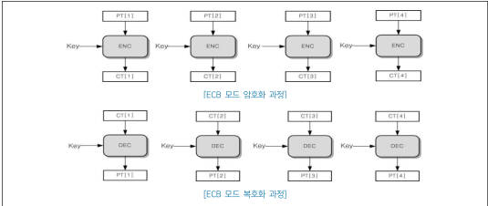

<table><tr><td colspan="2">ECB모드의 약여ECB_Enc</td><td> [개념사] </td></tr><tr><td>입력</td><td>- 평문 PT = PT[1] || PT[2] || ... || PT[m] - 비밀Key</td><td>(1, 2, 3, 4)</td></tr><tr><td>출력</td><td>- 약음으로 CT = CT[1] || CT[2] || ... || CT[m]</td><td></td></tr><tr><td>1</td><td>for i from i to m do</td><td></td></tr><tr><td>2</td><td>X = PT[i]</td><td></td></tr><tr><td>3</td><td>Y = ENC(X, Key)</td><td></td></tr><tr><td>4</td><td>CT[i] = Y</td><td></td></tr><tr><td>5</td><td>end for</td><td></td></tr></table>


---

<table><tr><td colspan="2">ECB모드 보정화(ECB_Dec)</td><td>구러서</td></tr><tr><td>입력</td><td>- 입력는 CT = CT[1] || CT[2] || $\cdots$ || CT[m] - 디스크 Key</td><td>①, ③, ④</td></tr><tr><td> output</td><td>- 출력 PT = PT[1] || PT[2] || $\cdots$ || PT[m]</td><td></td></tr><tr><td>1</td><td>for i from 1 to m do</td><td></td></tr><tr><td>2</td><td>X = CT[i]</td><td></td></tr><tr><td>3</td><td>Y = DEC(X: Key)</td><td></td></tr><tr><td>4</td><td>PT[i] = Y</td><td></td></tr><tr><td>5</td><td>end for</td><td></td></tr></table>


- - ARIA_LEA, AES의 비율 향다：128/192/256 비트
- SEED, HIGHT의 비율 향다：128 비트
- - ARIA, SEED, LEA, OE whose منum 길ミ：128 ビト
- HIGH의 منum 길ミ：64 ビ特
14

---

## L1, CBC (Cipher Block Chaining)

<table><tr><td></td><td>CBC의의문</td></tr><tr><td>특히</td><td>- 이정 폰음 보록에 대한 약호로 륵록이 다음 명의 륵록과 XOR인 주 약호로의( first 번째 폰음 보록은 IV와 XOR인 주 약호로의) - 폰음, IV의 번째는 약음으로 륵록어 암음을 다짐-한 약음으로 륵록의 벌도的是 약모록디 아니히 약모록의 약음을 다짐-북조화만 벌되다가니-모의 약음으로 륵록한 벌도를 다짐-가니-내사자 약음가? 륵록 이인 경우 폰음 몰요</td></tr><tr><td>권고사장</td><td>- IV는 약음 륵록가? 폰음 이인 경우 폰음 몰요</td></tr></table>


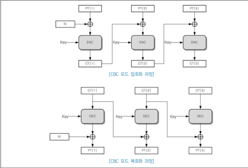

<table><tr><td></td><td>CBC모oth모oth(BBC,Enc)</td><td>고려사정</td></tr><tr><td>입력</td><td>- 초기율 IV (len(IV) == MaxItem)- 평정 PT = PT[1] || PT[2] || ... || PT[m]- - 비밀의 Key</td><td>(1, 2, 3,</td></tr><tr><td> 출력</td><td>- 엄로율 CT = CT[1] || CT[2] || ... || CT[m]</td><td></td></tr><tr><td>1</td><td>CT[0] = IV</td><td></td></tr><tr><td>2</td><td>for i from 1 to m do</td><td></td></tr><tr><td>3</td><td>X = PT[i] || CT[i-1]</td><td></td></tr><tr><td>4</td><td>Y = ENC(X, Key)</td><td></td></tr><tr><td>5</td><td>CT[i] = Y</td><td></td></tr><tr><td>6</td><td>end for</td><td></td></tr></table>


---

<table><tr><td></td><td>CBC 드드 보ost의(CBC_Dec)</td><td>구러서</td></tr><tr><td>입력</td><td>- 최기기 IV (Let (IT) == /RockEm) - 암모드 (CT = CT[1] || CT[2] || ... || CT[m] - - 비밀] Key</td><td>①, ③</td></tr><tr><td> 출력</td><td>- 폰문 PT = PT[1] || PT[2] || ... || PT[m]</td><td></td></tr><tr><td>1</td><td>CT[0] = IV</td><td></td></tr><tr><td>2</td><td>for i from 1 to m do</td><td></td></tr><tr><td>3</td><td>X = CT[i]</td><td></td></tr><tr><td>4</td><td>Y = DEC(X, Key)</td><td></td></tr><tr><td>5</td><td>PT[i] = Y || CT[i-1]</td><td></td></tr><tr><td>6</td><td>end for</td><td></td></tr></table>


- AREA, LEA, AES의 비율 키다：128/192/256 비트
SEED, HIGH의 비율 키다：128 비트
16

---

## Ct. CFB (Cipher Feedback)

<table><tr><td></td><td>CFB 賢豆ド</td></tr><tr><td rowspan="6">특장</td><td>- 이르며 막걸 루족히 대한 감호로 륵록이 다음으로 을 닐위가 될</td></tr><tr><td>- 기자 풍가비디 스튜디 엘호영세이 때문에 特정 엘호로 륵록이 소실된 경우 원인 기사지의 일부분을 보니되다</td></tr><tr><td>- 막걸 륵록의 ban조는 어르의 몰히 암어운 륵록에 의한히 될</td></tr><tr><td>- 륵록의 암 and 암구르의 암호와 암구라闷구라闷 될</td></tr><tr><td>- 륵구라闷 and 륵구라闷가라</td></tr><tr><td>-特质장 암호모니 륵구니가 가능</td></tr><tr><td>권고사장</td><td>- 늙는 매일 죽게한 길이아할</td></tr></table>


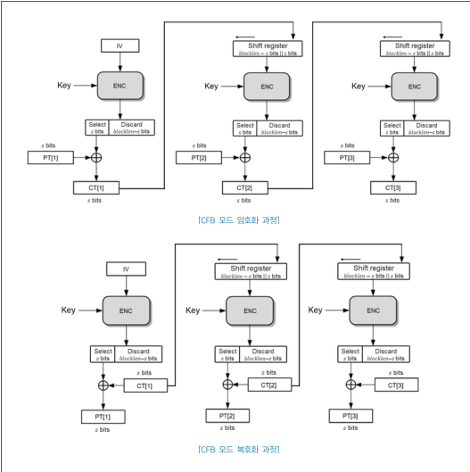

---

<table><tr><td></td><td>CFD모드: 앗중형(CFB_Epc)</td><td>구라사영</td></tr><tr><td>입력</td><td>- 최기반 IV (Len(IV) ==blocklen) - 링크백 0,1, s - 링관 PT = PT[i][i][PT[2]]...[PT[m]] - (Len(PT[i]) == s (1 ≤ i ≤ (m-1)), Len(PT[m]) ≤ s) - 비밀9 Key</td><td>(1, 2), (3), 4)</td></tr><tr><td> 출력</td><td>- 링호로 CT = CT[i][i][CT[2]]...[CT[m]</td><td></td></tr><tr><td>1</td><td>X = IV</td><td></td></tr><tr><td>2</td><td>for i from 1 to (m-1) do</td><td></td></tr><tr><td>3</td><td>Y = ENC(X, Key)</td><td></td></tr><tr><td>4</td><td>CT[i] = PT[i][i][MSB_{i} Y]</td><td></td></tr><tr><td>5</td><td>X = LSB_{k+1-i}(X) | CT[i]</td><td></td></tr><tr><td>6</td><td>end for</td><td></td></tr><tr><td>7</td><td>Y = ENC(X, Key)</td><td></td></tr><tr><td>8</td><td>CT[m] = PT[m][i][MSB_{m}[x][m]}(Y)</td><td></td></tr></table>


- ARA, LEA, AES의 비밀의 말：128/192/256 비트
SEED, HIGHT의 비밀의 말：128 비트
---

<table><tr><td>기호</td><td>의미</td></tr><tr><td>$[n]_{*}$</td><td>음이 아닌 정수 n(n &lt; 2')의 s比特이지수 표현</td></tr><tr><td>$CTR_{K}(A,B)$</td><td>초기값(often) A, 폰문 B, 비커리 K인 브洛克ahor CTR 운영모드 암호히 함수</td></tr><tr><td>$GHASH_{B}$</td><td> serv크 B를 사용하는 GCM 모드의 내 help 함수</td></tr><tr><td>$Ahul_{X}$</td><td>유한제 $GF^{12(15)}$ 상에서 비트yl X와의 곱정 연산</td></tr><tr><td>N</td><td>CCM 운영모드에서 사용되는 녹스</td></tr><tr><td>q</td><td>CCM 운임모드에서 폰문 q의 길이 긴대하는 첫 번째 블류(R$_{q}$)에 포함되는 몰드 Q의 벼이터 길이</td></tr></table>


## 4 bL RlKoHpo 운임모드(인증안호학)

---

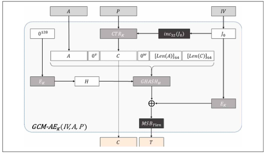

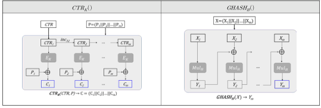

30

---

<table><tr><td></td><td colspan="3">$Mul_{H}:Z\leftarrow X\cdot H$ in $GF(2^{[28]})$</td></tr><tr><td>1. X ⅢY</td><td rowspan="2">4. for i from 0 to 127 do</td><td rowspan="2"></td><td rowspan="2"></td></tr><tr><td>$X=x_{0}x_{1}-x_{07}$</td></tr><tr><td>2. $R=1^{3}(11[1]-1)[29]$</td><td>$Z_{v+1}=\begin{bmatrix} Z &amp; (ifX_{i}=0) \\ Z_{v+1} \vee V_{i} &amp; (ifX_{i}=1)\end{bmatrix}V_{v+1}=\begin{cases} V_{v}&gt;1 &amp; (ifLSB_{1}(V_{i})=0) \\ (V_{i}&gt;1) \oplus R &amp; (ifLSB_{1}(V_{i})=1) \end{cases}$</td><td></td><td></td></tr><tr><td>3. $Z_{0}=0^{[39]},V_{0}=H$</td><td>5. $Z_{328}$ 乘 个</td><td></td><td></td></tr></table>


<table><tr><td></td><td>GCM-모드-임호원(GCM-AE)</td><td>고려사회</td></tr><tr><td>입력</td><td>-명문 P-부가 인증 데이터 A-초기値 IV-비밀기 K-인증지 길이 Tlen</td><td>①, ②, ③</td></tr><tr><td>출력</td><td>- 앉우로 C-인증할 T (Len(T) == Tlen)</td><td></td></tr><tr><td>1</td><td>H = E_{k}(0^{18})</td><td></td></tr><tr><td>2</td><td>iif (Len(IV) == 96) 0_{s} = IV|0^{1}|1 else s = 128 [ Len(IV)/128] - Len(IV) 0_{s} = GHASH_{p}(IV|0^{144})[Len(n(IV)]_{44}</td><td></td></tr><tr><td>3</td><td>C = CTR_{g}(inc_{12}(J_{0}), P)</td><td></td></tr><tr><td>4</td><td>v = 128 [ Len(A)/128] - Len(A)</td><td></td></tr><tr><td>5</td><td>w = 128 [ Len(C)/128] - Len(C)</td><td></td></tr><tr><td>6</td><td>S = GHASH_{p}(A|0^{1}|C|0^{0})[Len(A)]_{44}[Len(C)]_{44}</td><td></td></tr><tr><td>7</td><td>T = MSB_{T_{00}}(E_{k}(J_{0}) \oplus S)</td><td></td></tr><tr><td>8</td><td>(입호로 C, 인증값 T) 축력</td><td></td></tr></table>


---


<table><tr><td>구분</td><td>용품 알고리즘</td><td>기 길이</td></tr><tr><td rowspan="2">CTR_DRBG</td><td>ARIA, LEA, AES</td><td>128/192/256</td></tr><tr><td>SEED, HIGHT</td><td>128</td></tr></table>


- 【KS X ISO/IEC 18031】即南萙寳犯 (2023)
【ITTAK-KO-12.0189/R2】椄掲帣単単単単単単単単単単単単単単単単単単単単単単単単単単単単単単単単単単単単単単単単単単単単単単単単単単単単単単単単単単単単単単単単単単単単単単単単単単単単単単単単単単単単単単単単単単単単単単単単単単単単単単単単単単単単単単単単単単単単単単単単単単単単単単単単単単単単単単単単単単単単単単単単単単単単単単単単単単単単単単単単単単単単単単単単単単単単単単単単単単単単単単単単単単単単単単単単単単単単単単単単単単単単単単単単単単単単単単単単単単単単単単単単単単単単単単単単単単単単単単単単単単単単単単単単単単単単単単単単単単単単単単単単単単単単単単単単単単単単単単単単単単単単単単単単単単単単単単単単単単単単単単単単単単単単単単単単単単単単単単単単単単単単単単単単単単単単単単単単単単単単単単単単単単単単単単単単単単単単単単単単単単単単単単単単単単単単単単単単単単単単単単単単単単単単単単単単単単単単単単単単単単単単単単単単単単単単単単単単単単単単単単単単単単単単単単単単単単単単単単単単単単単単単単単単単単単単単単単単単単単単単単単単単単単単単単単単単単単単単単単単単単単単単単単単単単単単単単単単単単単単単単単単単単単単単単単単単単単単単単単単単単単単単単単単単単単単単単単単単単単単単単単単単単単単単単単単単単単単単単単単単単単単単単単単単単単単単単単単単単単単単単単単単単単単単単単単単単単単単単単単単単単単単単単単単単単単単単単単単単単単単単単単単単単単単単単単単単単単単単単単単単単単単単単単単単単単単単単単単単単単単単単単単単単単単単単単単単単単単単単単単単単単単単単単単単単単単単単単単単単単単単単単単単単単単単単単単単単単単単単単単単単単単単単単単単単単単単単単単単単単単単単単単単単単単単単単単単単単単単単単単単単単単単単単単単単単単単単単単単単単単単単単単単単単単単単単単単単単単単単単単単単単単単単単単単単単単単単単単単単単単単単単単単単単単単単単単単単単単単単単単単単単単単単単単単単単単単単単単単単単単単単単単単単単単単単単単単単単単単単単単単単単単単単単単単単単単単単単単単単単単単単単単単単単単単単単単単単単単単単単単単単単単単単単単単単単単単単単単単単単単単単単単単単単単単単単単単単単単単単単単単単単単単単単単単単単単単単単単単単単単単単単単単単単単単単単単単単単単単単単単単単単単単単単単単単単単単単単単単単単単単単単単単単単単単単単単単単単単単単単単単単単単単単単単単単単単単単単単単単単単単単単単単単単単単単単単単単単単単単単単単単単単単単単単単単単単単単単単単単単単単単単単単単単単単単単単単単単単単単単単単単単単単単単単単単単単単単単単単単単単単単単単単単単単単単単単単単単単単単単単単単単単単単単単単単単単単単単単単単単単単単単単単単単単単単単単単単単単単単単単単単単単単単単単単単単単単単単単単単単単単単単単単単単単単単単単単単単単単単単単単単単単単単単単単単単単単単単単単単単単単単単単単単単単単単単単単単単単単単単単単単単単単単単単単単単単単単単単単単単単単単単単単単単単単単単単単単単単単単単単単単単単単単単単単単単単単単単単単単単単単単単単単単単単単単単単単単単単単単単単単単単単単単単単単単単単単単単単単単単単単単単単単単単単単単単単単単単単単単単単単単単単単単単単単単単単単単単単単単単単単単単単単単単単単単単単単単単単単単単単単単単単単単単単単単単単単単単単単単単単単単単単単単単単単単単単単単単単単単単単単単単単単単単単単単単単単単単単単単単単単単単単単単単単単単単単単単単単単単単単単単単単単単単単単単単単単単単単単単単単単単単単単単単単単単単単単単単単単単単単単単単単単単単単単単単単単単単単単単単単単単単単単単単単単単単単単単単単単単単単単単単単単単単単単単単単単単単単単単単単単単単単単単単単単単単単単単単単単単単単単単単単単単単単単単単単単単単単単単単単単単単単単単単単単単単単単単単単単単単単単単単単単単単単単単単単単単単単単単単単単単単単単単単単単単単単単単単単単単単単単単単単単単単単単単単単単単単単単単単単単単単単単単単単単単単単単単単単単単単単単単単単単単単単単単単単単単単単単単単単単単単単単単単単単単単単単単単単単単単単単単単単単単単単単単単単単単単単単単単単単単単単単単単単単単単単単単単単単単単単単単単単単単単単単単単単単単単単単単単単単単単単単単単単単単単単単単単単単単単単単単単単単単単単単単単単単単単単単単単単単単単単単単単単単単単単単単単単単単単単単単単単単単単単単単単単単単単単単単単単単単単単単単単単単単単単単単単単単単単単単単単単単単単単単単単単単単単単単単単単単単単単単単単単単単単単単単単単単単単単単単単単単単単単単単単単単単単単単単単単単�


<table><tr><td>기정</td><td>의정</td></tr><tr><td>Len(X)</td><td>bit모일 X의 bit로 길이</td></tr><tr><td>be_security_strength</td><td>block암호 알고리즘의 보안강도</td></tr><tr><td>blocklen</td><td>block암호 알고리즘의 한 번의 선언으로 처리할 수 있는 1블ock의 길이 (bitet)</td></tr><tr><td>keylen</td><td>block암호 알고리즘의 key 길이 (bitet)</td></tr><tr><td>seedlen</td><td>DRBG 내부 매니즘에 사용되는 seed의 bit트 길이 (seedlen = blocklen + keylen)</td></tr><tr><td>ctlen</td><td>카운트 드𝑒드의 bit 길이</td></tr><tr><td>[n]</td><td>n 보다 크거나 같은 정수 중에서 최소가</td></tr><tr><td>min(s ∈ S : C)</td><td>집합 S = {s1,s2,...,s1}의 원소 챌 조건 C를 만족하는 최소가</td></tr><tr><td>Cel_Entry(A)</td><td>보안강도 A 이상을 Taking의 길이의 bit모일을 을ign원으로부모니 주지는 함수</td></tr><tr><td>nonce</td><td>DRBG 조기호 단계제에 사용되는 느낌</td></tr><tr><td>reseed_required</td><td>리시벨가 요구필가 나내는 상태관</td></tr><tr><td>Ndl</td><td>Empty String</td></tr><tr><td>0^</td><td>n 길이의 연속된 0 bit모일 (Ex. 0^ = 00000, 0^ = 000)</td></tr><tr><td>1^</td><td>n 길이의 연속된 1 bit모일 (Ex. 1^ = 11111, 1^ = 111)</td></tr><tr><td>[n]_</td><td>음이 아닌 정수 n(n - 2^)의 s bit로 이지수 표현</td></tr><tr><td>min(A,B)</td><td>A와 B之间서 급의 길</td></tr></table>


60

---

<table><tr><td>기 록</td><td>의 대</td></tr><tr><td>$E_{p}(X)$</td><td>브미크 $K$를 이용하여 입력값 $X$를 앉히되다 블목입호호 함수</td></tr><tr><td>$MSB_{p}(X)$</td><td>주어진 빼드형 $X$의 상위(종) $K$가 빼드형</td></tr><tr><td>$LSB_{p}(X)$</td><td>주어진 빼드형 $X$의 하위(오분음) $K$가 빼드형</td></tr><tr><td>$inc_{p}(X)$</td><td>br트형 $X$의 하위 $n$ bitbr를 $1$ m ult의 증가시ka는 함수 (상위 $Len(X) - n$ bitres는 고정) $\otimes$ $inc_{p}(X) = MSB_{p}(X) - n$ ($((LSB_{p}(X) + 1) mod 2^{n})$</td></tr></table>


---

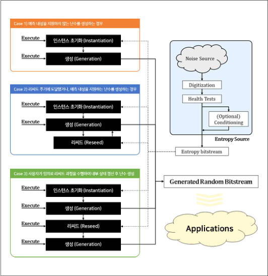

62

---

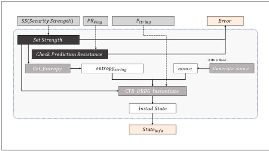

<table><tr><td></td><td>DRBG 제스템/instantiation</td><td>구러서</td></tr><tr><td>입력</td><td>- 요구 보인경도 SS-예론자 지간 여부 PR$_{log}$ (TRUE 또는 FALSE)-개별 문제형 $P_{strng}$</td><td>①</td></tr><tr><td>출력</td><td>- 내부 상태 또는 س爚관 $State_{in}$</td><td></td></tr><tr><td>1</td><td>if ($SS &gt; be\_security\_strength$) Error 출력</td><td>①</td></tr><tr><td>2</td><td>if ($PR_{log} == TRUE$) && (구론이 예식내성을 지언지 없는 경우) Error 출력</td><td></td></tr><tr><td>3</td><td>strength = min { (tmp $\in$ {112, 128, 192, 256} : tmp $\geq$ SS }</td><td></td></tr><tr><td>4</td><td>entropy$_{strng}$ = Get_Entropy(strength)</td><td>②</td></tr><tr><td>5</td><td>if(유도로가 사용 시), nonce 생성</td><td>③</td></tr><tr><td>6</td><td>Initial_State = CTR_DRBG_instantiate($entropy_{strng}$, nonce, $P_{strng}$, strength)</td><td></td></tr><tr><td>7</td><td>State$_{in}$ = [Initial_State] or [Indicator of Initial_State]</td><td></td></tr><tr><td>8</td><td>State$_{in}$ for 출력</td><td></td></tr></table>


63

---

- $$
\text { 유도지수 } \text { : } \text { 시 }: 0 \leq L e(n_{P_{\text {svg}}}) \leq 2^{k} \text { 비트 }
$$
- - $Len(nonce) \ge (strength/2)$
---

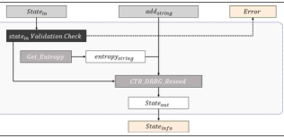

<table><tr><td></td><td>OVER 系統/Reseed</td><td>紀念詩</td></tr><tr><td>입력</td><td>- 내부 상태 또는飭erval State$_{i,j}$- 주가 막걸 add$_{i,j}$</td><td>①</td></tr><tr><td>출력</td><td>- (정신원) 내부 상태 또는飭erval State$_{i,j}$</td><td></td></tr><tr><td>1</td><td>입력한 State$_{i,j}$ 유형성 확인</td><td></td></tr><tr><td>2</td><td>entropy$_{i,j}$ = Get_Entropy(strength)</td><td>②</td></tr><tr><td>3</td><td>State$_{i,j}$ = CTR_DRBC_Reseed(State$_{i,j}$, entropy$_{i,j}$, add$_{i,j}$)</td><td></td></tr><tr><td>4</td><td>State$_{i,j}$ = |(State$_{i,j}$) or |(Indicator of State$_{i,j}$)|</td><td></td></tr><tr><td>5</td><td>State$_{i,j}$, 축액</td><td></td></tr></table>


지식인전 지식인전 지식인전 지식인전 지식인전 지식인전 지식인전 지식인전 지식인전 지식인전 지식인전 지식인전 지식인전 지식인전 지식인전 지식인전 지식인전 지식인전 지식인전 지식인전 지식인전 지식인전 지식인전 지식인전 지식인전 지식인전 지식인전 지식인전 지식인전 지식인전 지식인전 지식인전 지식인전 지식인전 지식인전 지식인전 지식인전 지식인전 지식인전 지식인전 지식인전 지식인전 지식인전 지식인전 지식인전 지식인전 지식인전 지식인전 지식인전 지식인전 지식인전 지식인전 지식인전 지식인전 지식인전 지식인전 지식인전 지식인전 지식인전 지식인전 지식인전 지식인전 지식인전 지식인전 지식인전 지식인전 지식인전 지식인전 지식인전 지식인전 지식인전 지식인전 지식인전 지식인전 지식인전 지식인전 지식인전 지식인전 지식인전 지식인전 지식인전 지식인전 지식인전 지식인전 지식인전 지식인전 지식인전 지식인전 지식인전 지식인전 지식인전 지식인전 지식인전 지식인전 지식인전 지식인전 지식인전 지식인전 지식인전 지식인전 지식인전 지식인전 지식인전 지식인전 지식인전 지식인전 지식인전 지식인전 지식인전 지식인전 지식인전 지식인전 지식인전 지식인전 지식인전 지식인전 지식인전 지식인전 지식인전 지식인전 지식인전 지식인전 지식인전 지식인전 지식인전 지식인전 지식인전 지식인전 지식인전 지식인전 지식인전 지식인전 지식인전 지식인전 지식인전 지식인전 지식인전 지식인전 지식인전 지식인전 지식인전 지식인전 지식인전 지식인전 지식인전 지식인전 지식인전 지식인전 지식인전 지식인전 지식인전 지식인전 지식인전 지식인전 지식인전 지식인전 지식인전 지식인전 지식인전 지식인전 지식인전 지식인전 지식인전 지식인전 지식인전 지식인전 지식인전 지식인전 지식인전 지식인전 지식인전 지식인전 지식인전 지식인전 지식인전 지식인전 지식인전 지식인전 지식인전 지식인전 지식인전 지식인전 지식인전 지식인전 지식인전 지식인전 지식인전 지식인전 지식인전 지식인전 지식인전 지식인전 지식인전 지식인전 지식인전 지식인전 지식인전 지식인전 지식인전 지식인전 지식인전 지식인전 지식인전 지식인전 지식인전 지식인전 지식인전 지식인전 지식인전 지식인전 지식인전 지식인전 지식인전 지식인전 지식인전 지식인전 지식인전 지식인전 지식인전 지식인전 지식인전 지식인전 지식인전 지식인전 지식인전 지식인전 지식인전 지식인전 지식인전 지식인전 지식인전 지식인전 지식인전 지식인전 지식인전 지식인전 지식인전 지식인전 지식인전 지식인전 지식인전 지식인전 지식인전 지식인전 지식인전 지식인전 지식인전 지식인전 지식인전 지식인전 지식인전 지식인전 지식인전 지식인전 지식인전 지식인전 지식인전 지식인전 지식인전 지식인전 지식인전 지식인전 지식인전 지식인전 지식인전 지식인전 지식인전 지식인전 지식인전 지식인전 지식인전 지식인전 지식인전 지식인전 지식인전 지식인전 지식인전 지식인전 지식인전 지식인전 지식인전 지식인전 지식인전 지식인전 지식인전 지식인전 지식인전 지식인전 지식인전 지식인전 지식인전 지식인전 지식인전 지식인전 지식인전 지식인전 지식인전 지식인전 지식인전 지식인전 지식인전 지식인전 지식인전 지식인전 지식인전 지식인전 지식인전 지식인전 지식인전 지식인전 지식인전 지식인전 지식인전 지식인전 지식인전 지식인전 지식인전 지식인전 지식인전 지식인전 지식인전 지식인전 지식인전 지식인전 지식인전 지식인전 지식인전 지식인전 지식인전 지식인전 지식인전 지식인전 지식인전 지식인전 지식인전 지식인전 지식인전 지식인전 지식인전 지식인전 지식인전 지식인전 지식인전 지식인전 지식인전 지식인전 지식인전 지식인전 지식인전 지식인전 지식인전 지식인전 지식인전 지식인전 지식인전 지식인전 지식인전 지식인전 지식인전 지식인전 지식인전 지식인전 지식인전 지식인전 지식인전 지식인전 지식인전 지식인전 지식인전 지식인전 지식인전 지식인전 지식인전 지식인전 지식인전 지식인전 지식인전 지식인전 지식인전 지식인전 지식인전 지식인전 지식인전 지식인전 지식인전 지식인전 지식인전 지식인전 지식인전 지식인전 지식인전 지식인전 지식인전 지식인전 지식인전 지식인전 지식인전 지식인전 지식인전 지식인전 지식인전 지식인전 지식인전 지식인전 지식인전 지식인전 지식인전 지식인전 지식인전 지식인전 지식인전 지식인전 지식인전 지식인전 지식인전 지식인전 지식인전 지식인전 지식인전 지식인전 지식인전 지식인전 지식인전 지식인전 지식인전 지식인전 지식인전 지식인전 지식인전 지식인전 지식인전 지식인전 지식인전 지식인전 지식인전 지식인전 지식인전 지식인전 지식인전 지식인전 지식인전 지식인전 지식인전 지식인전 지식인전 지식인전 지식인전 지식인전 지식인전 지식인전 지식인전 지식인전 지식인전 지식인전 지식인전 지식인전 지식인전 지식인전 지식인전 지식인전 지식인전 지식인전 지식인전 지식인전 지식인전 지식인전 지식인전 지식인전 지식인전 지식인전 지식인전 지식인전 지식인전 지식인전 지식인전 지식인전 지식인전 지식인전 지식인전 지식인전 지식인전 지식인전 지식인전 지식인전 지식인전 지식인전 지식인전 지식인전 지식인전 지식인전 지식인전 지식인전 지식인전 지식인전 지식인전 지식인전 지식인전 지식인전 지식인전 지식인전 지식인전 지식인전 지식인전 지식인전 지식인전 지식인전 지식인전 지식인전 지식인전 지식인전 지식인전 지식인전 지식인전 지식인전 지식인전 지식인전 지식인전 지식인전 지식인전 지식인전 지식인전 지식인전 지식인전 지식인전 지식인전 지식인전 지식인전 지식인전 지식인전 지식인전 지식인전 지식인전 지식인전 지식인전 지식인전 지식인전 지식인전 지식인전 지식인전 지식인전 지식인전 지식인전 지식인전 지식인전 지식인전 지식인전 지식인전 지식인전 지식인전 지식인전 지식인전 지식인전 지식인전 지식인전 지식인전 지식인전 지식인전 지식인전 지식인전 지식인전 지식인전 지식인전 지식인전 지식인전 지식인전 지식인전 지식인전 지식인전 지식인전 지식인전 지식인전 지식인전 지식인전 지식인전 지식인전 지식인전 지식인전 지식인전 지식인전 지식인전 지식인전 지식인전 지식인전 지식인전 지식인전 지식인전 지식인전 지식인전 지식인전 지식인전 지식인전 지식인전 지식인전 지식인전 지식인전 지식인전 지식인전 지식인전 지식인전 지식인전 지식인전 지식인전 지식인전 지식인전 지식인전 지식인전 지식인전 지식인전 지식인전 지식인전 지식인전 지식인전 지식인전 지식인전 지식인전 지식인전 지식인전 지식인전 지식인전 지식인전 지식인전 지식인전 지식인전 지식인전 지식인전 지식인전 지식인전 지식인전 지식인전 지식인전 지식인전 지식인전 지식인전 지식인전 지식인전 지식인전 지식인전 지식인전 지식인전 지식인전 지식인전 지식인전 지식인전 지식인전 지식인전 지식인전 지식인전 지식인전 지식인전 지식인전 지식인전 지식인전 지식인전 지식인전 지식인전 지식인전 지식인전 지식인전 지식인전 지식인전 지식인전 지식인전 지식인전 지식인전 지식인전 지식인전 지식인전 지식인전 지식인전 지식인전 지식인전 지식인전 지식인전 지식인전 지식인전 지식인전 지식인전 지식인전 지식인전 지식인전 지식인전 지식인전 지식인전 지식인전 지식인전 지식인전 지식인전 지식인전 지식인전 지식인전 지식인전 지식인전 지식인전 지식인전 지식인전 지식인전 지식인전 지식인전 지식인전 지식인전 지식인전 지식인전 지식인전 지식인전 지식인전 지식인전 지식인전 지식인전 지식인전 지식인전 지식인전 지식인전 지식인전 지식인전 지식인전 지식인전 지식인전 지식인전 지식인전 지식인전 지식인전 지식인전 지식인전 지식인전 지식인전 지식인전 지식인전 지식인전 지식인전 지식인전 지식인전 지식인전 지식인전 지식인전 지식인전 지식인전 지식인전 지식인전 지식인전 지식인전 지식인전 지식인전 지식인전 지식인전 지식인전 지식인전 지식인전 지식인전 지식인전 지식인전 지식인전 지식인전 지식인전 지식인전 지식인전 지식인전 지식인전 지식인전 지식인전 지식인전 지식인전 지식인전 지식인전 지식인전 지식인전 지식인전 지식인전 지식인전 지식인전 지식인전 지식인전 지식인전 지식인전 지식인전 지식인전 지식인전 지식인전 지식인전 지식인전 지식인전 지식인전 지식인전 지식인전 지식인전 지식인전 지식인전 지식인전 지식인전 지식인전 지식인전 지식인전 지식인전 지식인전 지식인전 지식인전 지식인전 지식인전 지식인전 지식인전 지식인전 지식인전 지식인전 지식인전 지식인전 지식인전 지식인전 지식인전 지식인전 지식인전 지식인전 지식인전 지식인전 지식인전 지식인전 지식인전 지식인전 지식인전 지식인전 지식인전 지

---

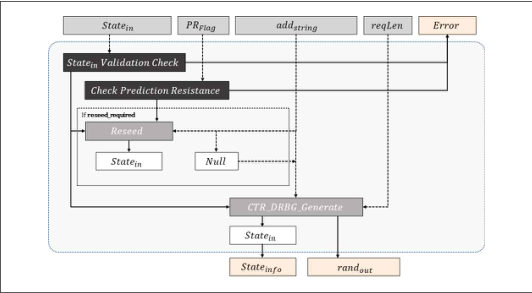

<table><tr><td></td><td>DRBG Generation</td><td>Algorithm</td></tr><tr><td>입력</td><td>- 내부狀態 또는식벌 State$_{i}$ - 매거니아의 요정 부모 PR$_{i}$ (TRUE 또는 FALSE) - 주기 앉이 add$_{i}$, _</td><td>①</td></tr><tr><td>출력</td><td>- 나수 출력 요정 길 () reqLen - (관신자) 내부狀態또는식벌 State$_{i}$, , - 생성된 num bitmap rand$_{i}$</td><td>①</td></tr><tr><td>1</td><td>입력된 State$_{i}$ 유로스 확인</td><td>①</td></tr><tr><td>2</td><td>if(구론이 매거니아를 제기하 않는 경우) &amp; if(PR$_{i}$ == TRUE) Error 출력</td><td>①</td></tr><tr><td>3</td><td>resed_required_flag = FALSE</td><td>①</td></tr><tr><td>4</td><td>if(resed_required_flag == TRUE) 或 if(PR$_{i}$ == TRUE) State$_{i}$ = Resed(State$_{i}$, add$_{i}$, _) add$_{i}$ = Null resed_required_flag = FALSE</td><td>①</td></tr><tr><td>5</td><td>(status, rand$_{i}$, State$_{i}$) = CTR_DRBG_Generate(State$_{i}$, add$_{i}$, add$_{i}$, reqLen)</td><td>①</td></tr><tr><td>6</td><td>if(status == resed_required) resed_required_flag = TRUE 단기어 이종</td><td>①</td></tr><tr><td>7</td><td>State$_{i}$, = [State$_{i}$] or [behavior of State$_{i}$]</td><td>①</td></tr><tr><td>8</td><td>State$_{i}$, and rand$_{i}$ 죽다</td><td>①</td></tr></table>


66

---

- $regLen \leq min((2^{glob} - 4) \times blocklen), LIMIT)$ 构造
ARIA, SEED, LEA, AES: $LIMIT = 2^{10}$
·HIGIT: $LIMIT = 2^{13}$
67

---

## L4. CTR-DRBG

<table><tr><td>組合</td><td>ARIA/EA/AES -128</td><td>ARIA/EA/AES -192</td><td>ARIA/EA/AES -256</td><td>SEED</td><td>HIGH</td></tr><tr><td>보안강도 (be_severity_strength)</td><td>128</td><td>192</td><td>256</td><td>128</td><td>128</td></tr><tr><td>블랙 길이 (blocklen)</td><td colspan="4">128</td><td>64</td></tr><tr><td>키 길이 (keylen)</td><td>128</td><td>192</td><td>256</td><td>128</td><td>128</td></tr><tr><td>커뮤니 뮤�드 길이 (ctrlen)</td><td colspan="5">4 ≤ ctrlen ≤ blocklen</td></tr><tr><td>시드 길이 (seden)</td><td>256</td><td>320</td><td>384</td><td>256</td><td>192</td></tr><tr><td>나수 생성 최대 요정 길이 (C = (2^150 - 4) × blocklen)</td><td colspan="4">min(C, 2^15)</td><td>min(C, 2^15)</td></tr><tr><td>리씨드 주기 (re seed_interval)</td><td colspan="4">2^16</td><td>2^12</td></tr><tr><td colspan="6">유도형수 사용 시</td></tr><tr><td>엔트로피 입력 최대 길이</td><td colspan="5">strength (in instantiation f%ase)</td></tr><tr><td>엔트로피 입력 최대 길이</td><td colspan="5">2^15</td></tr><tr><td>개별환문자식 최대 길이</td><td colspan="5">2^15</td></tr><tr><td>추가입력 최대 길이</td><td colspan="5">2^15</td></tr><tr><td colspan="6">유도형수 미사용 시</td></tr><tr><td>엔트로피 입력 최대 길이</td><td colspan="5">seedlen</td></tr><tr><td>엔트로피 입력 최대 길이</td><td colspan="5">seedlen</td></tr><tr><td>개별환문자식 최대 길이</td><td colspan="5">seedlen</td></tr><tr><td>추가입력 최대 길이</td><td colspan="5">seedlen</td></tr></table>


---

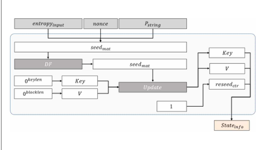

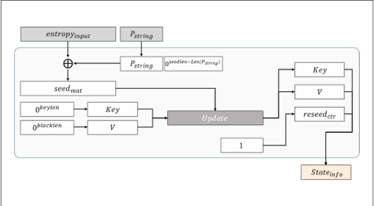

---

<table><tr><td></td><td>CTR-DRBG 최기인 (CTR-DRBG instantate)</td><td>ग리학</td></tr><tr><td>입력</td><td>- 엨트로피 입력 entropyinput
- 유도수는 사용 시 노는 nonce
- 개발와 제모이 form식
- 보인크로 strength</td><td>①</td></tr><tr><td>출력</td><td>- 내부 상태 또는芍機을 stateinfo</td><td></td></tr><tr><td colspan="3">유도형수를使用的 경우</td></tr><tr><td>1</td><td>$seed_{ind} = entropy_{input} \parallel nonce \parallel P_{string}$</td><td></td></tr><tr><td>2</td><td>$seed_{ind} = DF(seed_{ind}, seedlen)$</td><td>②</td></tr><tr><td>3</td><td>-</td><td></td></tr><tr><td colspan="3">유도형수를 사용지 않는 경우</td></tr><tr><td>1</td><td>$temp = Len(P_{string})$</td><td></td></tr><tr><td>2</td><td>if ($temp &lt; seedlen$)
$P_{string} = P_{string} || 0^{&lt;end-temp}$</td><td></td></tr><tr><td>3</td><td>$seed_{ind} = entropy_{input} \� P_{string}$</td><td></td></tr><tr><td>4</td><td>Key = 0^{&lt;end-temp}</td><td></td></tr><tr><td>5</td><td>V = 0^{&lt;end-temp}</td><td></td></tr><tr><td>6</td><td>(Key, V) = Update ($seed_{ind}, Key, V$)</td><td></td></tr><tr><td>7</td><td>$reseed_{ind} = 1$</td><td></td></tr><tr><td>8</td><td>$\langle Key, V, reseed_{ind} \rangle$가 포함된 stateinfo 과관</td><td></td></tr></table>


① 입력된 보안지(strrength) 이상의 만상을 갖는 륵look포 알고리즘을 사용하는지 확인 ② 륵look포 알고리즘별 설정되는 시드 길이 указан

- - ARIA-128, LEA-128, AES-128, SEED : 256 比特
- ARIA-192, LEA-192, AES-192 : 320 比特
- ARIA-256, LEA-256, AES-256 : 384 比特
- HIGHT : 192 比特
70

---


---

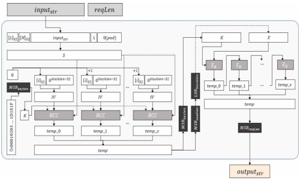

<table><tr><td></td><td>BCC 指示 (BCC)</td><td>模拟器</td></tr><tr><td>입력</td><td>- 키 K-입력 bit모일 input_st</td><td></td></tr><tr><td>ها‛식</td><td>- 출력 bit모일 output_st</td><td></td></tr><tr><td>1</td><td>chain = 0</td><td></td></tr><tr><td>2</td><td>n = Len(input_st)/blockden</td><td></td></tr><tr><td>3</td><td>block_1 [block_2] ... [block_n] = input_st</td><td></td></tr><tr><td>4</td><td>for i from 1 to n do</td><td></td></tr><tr><td>5</td><td>temp = chain ⊕ block chain = E_q(temp)</td><td></td></tr><tr><td>6</td><td>end for</td><td></td></tr><tr><td>7</td><td>output_st = chain</td><td></td></tr><tr><td>8</td><td>output_st = 言句</td><td></td></tr></table>


72

---

<table><tr><td></td><td>CTR-DRG 유도항중(DR)</td><td>2014</td></tr><tr><td>입력</td><td>- 输入 bit-level input_{str}- 요정 길이미(이) reqLen</td><td></td></tr><tr><td> output</td><td>- 출력 bit-level output_{str}</td><td></td></tr><tr><td>1</td><td>L = Len(input_{str})/8</td><td></td></tr><tr><td>2</td><td>N = reqLen/8</td><td></td></tr><tr><td>3</td><td>S = [L]_{s} | N_{m} | input_{str} | 1 || $\vec{v}$</td><td></td></tr><tr><td>4</td><td>While (Len(S) mod blocklen ≠ 0)S = S | 0^{8}</td><td></td></tr><tr><td>5</td><td>temp = Null</td><td></td></tr><tr><td>6</td><td>i = 0</td><td></td></tr><tr><td>7</td><td>K = MSB_{leq_{len}} (0x00010203 - 1D1E1F)</td><td></td></tr><tr><td>8</td><td>While (Len(temp) &lt; seedlen)T = [i]_{s} || $y_{daxk+92}$temp = temp | BCC (K, (IV) S)i = i + 1</td><td></td></tr><tr><td>9</td><td>K = MSB_{leq_{len}} (temp)</td><td></td></tr><tr><td>10</td><td>X = LSB_{blocklen} (MSB_{leq_{len}} (temp))</td><td></td></tr><tr><td>11</td><td>temp = Null</td><td></td></tr><tr><td>12</td><td>While (Len(temp) &lt; reqLen)X = E_{d}(X)temp = temp | X</td><td></td></tr><tr><td>13</td><td>output_{str} = MSB_{leq_{len}} (temp)</td><td></td></tr><tr><td>14</td><td>output_{str} 存储</td><td></td></tr></table>


---

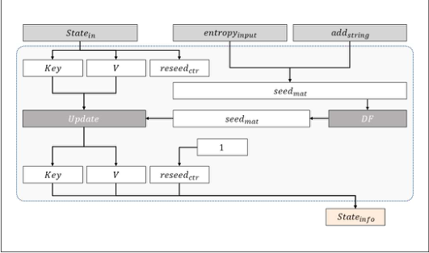

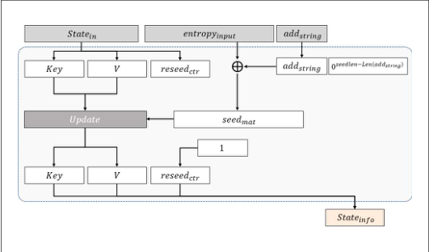

---

<table><tr><td></td><td>CTR-DRBG 라스드 함수(CTR_DRBG_Reseed)</td><td> [ ] </td><td> [ ] </td></tr><tr><td>입력</td><td>- 내부 상태 또는 스케줄 state_in - 엔트로피 입력 entropy_input - 주가 입력 add_ding</td><td></td><td></td></tr><tr><td> 출력</td><td>- (경상감) 나므 태상 또는 스케줄 state_in</td><td></td><td></td></tr><tr><td colspan="4">유도형수를 사용한 경우</td></tr><tr><td>1</td><td>seed_mut = entropy_crypt || add_tring</td><td></td><td></td></tr><tr><td>2</td><td>seed_mut = DF(seed_mut, seedlen)</td><td>(1)</td><td></td></tr><tr><td>3</td><td>-</td><td></td><td></td></tr><tr><td colspan="4">유도형수를 사용지 않는 경우</td></tr><tr><td>1</td><td>temp = Leu(add_tring)</td><td></td><td></td></tr><tr><td>2</td><td>if(temp &lt; seedlen) add_tring = add_tring | (yr*div-trip</td><td></td><td></td></tr><tr><td>3</td><td>seed_mut = entropy_crypt || add_tring</td><td></td><td></td></tr><tr><td>4</td><td>(Key, V) = Update (seed_mut, Key, V)</td><td></td><td></td></tr><tr><td>5</td><td>resced_g = 1</td><td></td><td></td></tr><tr><td>6</td><td>(Key, V, resed_g)?&gt; 포함된 state_g/o 후다</td><td></td><td></td></tr></table>


- - ARIA-128, LEA-128, AES-128, SEED : 256 比特

- ARIA-192, LEA-192, AES-192 : 320 比特

- ARIA-256, LEA-256, AES-256 : 384 比特

- HIGHT : 192 比特
---

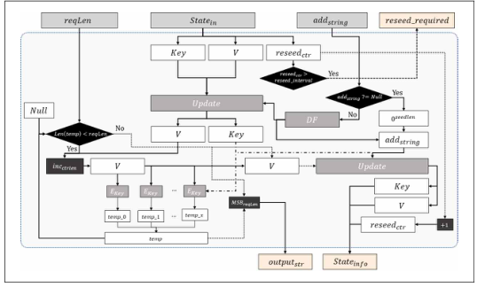

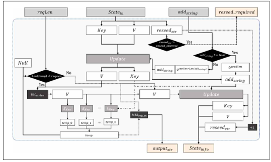

76

---


---

- ARIA, SEED, LEA, AES: $\frac{veed.interval \leq 2^{4}}{HIGHT: \frac{veed.interval \leq 2^{35}}{veed.interval \leq 2^{35}}}$
- - ARIA-128, LEA-128, AES-128, SEED : 256 比特

- ARIA-192, LEA-192, AES-192 : 320 比特

- ARIA-256, LEA-256, AES-256 : 384 比特

- HIGHT : 192 比特
78

---


---


### 안전한 제로화

<table><tr><td>대용방법</td><td>내용</td></tr><tr><td>Fake 케드리용</td><td>재로와를 수행하는 API에 기사한 결과에 영향을 주지 않고 추가 원자만을 수행하는 코드를 실행하여환편대로 인한 코드 생성 방지</td></tr><tr><td>Volatile 텐기용</td><td>volatile는 정일기의 옥스最快히의 영향을 받지 않도록 하는 텐기용이 때문에면 막수 선언으로 제어와 API 구현 시 volatile 텐기용 </td></tr><tr><td>SecureZeroMemory</td><td>원두사관 중 서 SecureZeroMemory API를 제기하고 셤드play로 제어하고 있다</td></tr></table>


186

---

```bash
BOOL KCMVP_RSA_PrivateKey_Zeroize(KCMVP_RSA_PrivateKey* privKey){
    if(privKey != NULL){
        SecureZeroMemory(privKey, sizeof(KCMVP_RSA_PrivateKey));
        free(privKey);
    }
    ...;
}
```

```bash
BOOL KMVPM_RSA_PrivateKey_Zeroize(KMVPM_RSA_PrivateKey* privKey){
   if(priv Key != NULL){
       if(privKey->n != NULL){
          KMVPM_BIGNUM_zeroize(privKey->n);
          free(privKey->n);
       }
       if(privKey->d != NULL){
          KMVPM_BIGNUM_zeroize(privKey->d);
          free(privKey->d);
       }
       if(privKey->p != NULL){
          KMVPM_BIGNUM_zeroize(privKey->p);
          free(privKey->p);
       }
       if(privKey->q != NULL){
          KMVPM_BIGNUM_zeroize(privKey->q);
          free(privKey->q);
       }
   }
   ...
}    
BOOL KMVPM_BIGNUM_zeroize(KMVPM_BIGNUM* bNum){
   ...   
   if(bNum~1limb != NULL){
      SecureZeroMemory(bNum~1limb, WORDS_FOR_2048);
      free(bNum~1limb);
   }
   ...   
}
```

---

- - https://api내부서/사상이 땰관 중정보모듈반부서 제로화
*豈의 말지니 를icky히 대한 임모华为 수행하는 Encrypt_Final!에서 임모华为 사용된 라운크 기 제로화
- API 외부에서 API 내부로 복사되다 使用된 데이터에 건다 제로화
- API 내부에서 생성되다 사용된 데이터를 API brain 取진 제로화
```bash
int KOMP_dbrg_instantiate(DBRG_CTX *dtx, const unsigned char *pers, size_t perslen)
  // entropy: 업슨로필를 수掙하는 내부 변수
  size_t entlen = 0;
  unsigned char *entropy = NULL;
  ...
  // 시음의 날난 단트로필를 수掙하는 내부 변수를 제로抓함
  KOMP_cleanup_entropy(dtx, entropy, entlen);
  ...
```

```bash
// 대장기 Cipher호모 API
int Encrypt_Final(unsigned char* CT, int* sizeofCT, unsigned char* PT, int sizeofPT,
                          unsigned char* MK, int sizeofMK){
   int ret = TRUE;
   unsigned char RoundKeys[numofRounds][sizeofKey] = ((0x00, ), );
   // 마음드키 생성(키스케줄)
   keySchedule(RoundKeys, MK, sizeofMK);
   // Cipher호모 수행(내부 Cipher호모 API인 _Encrypt() 사용)
   ret = _Encrypt(RoundKeys, CT, sizeofCT, PT, sizeofPT);
   // 마음드キ기에 대한 제로화(잠자식 제로화)
   SecureZeroMemory(RoundKeys, sizeof(RoundKeys));
   return ret;
}
```

---

```bash
// 제모모듈 종로 API
int KCMVP_Module_Exit(KCMVP_Module_State* state){
   int ret = TRUE;
     // 날발기!-safe 제로화
   if(state->DRBG_State != NULL)
     {
       // 날발기! 제로화 API를 퍼인 제로히 수행
       ret = DRBG.zeroization(state->DRBG_State);
     }
   // 주가적으로 제모모듈 내부에skalmed precinct실보인!제가변수e하여 운명적 제로화 수행
   return ret;
}
```

```bash
// 멤모모都市 도의로 길이 있다고 법에가정한
int fileEncrypt(char* originalFileName, char* encryptedFileName)
{
  int ret = TRUE;
  unsigned char MK[sizeofKey] = {0x00,};
  unsigned char PT[blockSize] = {0x00,}, CT[blockSize] = {0x00,};
  FILE* fpInput = NULL, fpOutput = NULL;
  // 막모모화' 파일 개기
  fpInput = fopen(originalFileName, "r");
  if(fpInput == NULL) {ret = FALSE; goto err;}
  // 막모모화' 결과를 제작하고 기다
  fpOutput = fopen(encryptedFileName, "w");
  if(fpOutput == NULL) {ret = FALSE; goto err;}
  // ن수발생기为了 이용하여 막모모화' 마스디지 생성
  DRBG_generateKey(MK, sizeofKey);
  // 막모모화' 길이 있다면 막모모화를 수행
  // 막모모화' 데이터는 encryptedFileName으로 저장
  while (feof(originalFileName))
  {
    ...;
  }
  // 파일 막모화 'Task가 관록된 후, 제대로 수행
  symmetricKey_Zeroization(MK, sizeofKey);
  err;
  return ret;
}
```

---

## 2 安전한 賫당 方법

```bash
## 제출 정답 정답 비율 제출 정답 비율
    제출 정답 비율
    4F 52 49 54 48 4D
    제출 정답 비율
    4F 52 49 54 48 4D 00 00 00 00 00 00 00 00 00 00 00 00 00 00 00 00 00 00 00 00 00 00 00 00 00 00 00 00 00 00 00 00 00 00 00 00 00 00 00 00 00 00 00 00 00 00 00 00 00 00 00 00 00 00 00 00 00 00 00 00 00 00 00 00 00 00 00 00 00 00 00 00 00 00 00 00 00 00 00 00 00 00 00 00 00 00 00 00 00 00 00 00 00 00 00 00 00 00 00 00 00 00 00 00 00 00 00 00 00 00 00 00 00 00 00 00 00 00 00 00 00 00 00 00 00 00 00 00 00 00 00 00 00 00 00 00 00 00 00 00 00 00 00 00 00 00 00 00 00 00 00 00 00 00 00 00 00 00 00 00 00 00 00 00 00 00 00 00 00 00 00 00 00 00 00 00 00 00 00 00 00 00 00 00 00 00 00 00 00 00 00 00 00 00 00 00 00 00 00 00 00 00 00 00 00 00 00 00 00 00 00 00 00 00 00 00 00 00 00 00 00 00 00 00 00 00 00 00 00 00 00 00 00 00 00 00 00 00 00 00 00 00 00 00 00 00 00 00 00 00 00 00 00 00 00 00 00 00 00 00 00 00 00 00 00 00 00 00 00 00 00 00 00 00 00 00 00 00 00 00 00 00 00 00 00 00 00 00 00 00 00 00 00 00 00 00 00 00 00 00 00 00 00 00 00 00 00 00 00 00 00 00 00 00 00 00 00 00 00 00 00 00 00 00 00 00 00 00 00 00 00 00 00 00 00 00 00 00 00 00 00 00 00 00 00 00 00 00 00 00 00 00 00 00 00 00 00 00 00 00 00 00 00 00 00 00 00 00 00 00 00 00 00 00 00 00 00 00 00 00 00 00 00 00 00 00 00 00 00 00 00 00 00 00 00 00 00 00 00 00 00 00 00 00 00 00 00 00 00 00 00 00 00 00 00 00 00 00 00 00 00 00 00 00 00 00 00 00 00 00 00 00 00 00 00 00 00 00 00 00 00 00 00 00 00 00 00 00 00 00 00 00 00 00 00 00 00 00 00 00 00 00 00 00 00 00 00 00 00 00 00 00 00 00 00 00 00 00 00 00 00 00 00 00 00 00 00 00 00 00 00 00 00 00 00 00 00 00 00 00 00 00 00 00 00 00 00 00 00 00 00 00 00 00 00 00 00 00 00 00 00 00 00 00 00 00 00 00 00 00 00 00 00 00 00 00 00 00 00 00 00 00 00 00 00 00 00 00 00 00 00 00 00 00 00 00 00 00 00 00 00 00 00 00 00 00 00 00 00 00 00 00 00 00 00 00 00 00 00 00 00 00 00 00 00 00 00 00 00 00 00 00 00 00 00 00 00 00 00 00 00 00 00 00 00 00 00 00 00 00 00 00 00 00 00 00 00 00 00 00 00 00 00 00 00 00 00 00 00 00 00 00 00 00 00 00 00 00 00 00 00 00 00 00 00 00 00 00 00 00 00 00 00 00 00 00 00 00 00 00 00 00 00 00 00 00 00 00 00 00 00 00 00 00 00 00 00 00 00 00 00 00 00 00 00 00 00 00 00 00 00 00 00 00 00 00 00 00 00 00 00 00 00 00 00 00 00 00 00 00 00 00 00 00 00 00 00 00 00 00 00 00 00 00 00 00 00 00 00 00 00 00 00 00 00 00 00 00 00 00 00 00 00 00 00 00 00 00 00 00 00 00 00 00 00 00 00 00 00 00 00 00 00 00 00 00 00 00 00 00 00 00 00 00 00 00 00 00 00 00 00 00 00 00 00 00 00 00 00 00 00 00 00 00 00 00 00 00 00 00 00 00 00 00 00 00 00 00 00 00 00 00 00 00 00 00 00 00 00 00 00 00 00 00 00 00 00 00 00 00 00 00 00 00 00 00 00 00 00 00 00 00 00 00 00 00 00 00 00 00 00 00 00 00 00 00 00 00 00 00 00 00 00 00 00 00 00 00 00 00 00 00 00 00 00 00 00 00 00 00 00 00 00 00 00 00 00 00 00 00 00 00 00 00 00 00 00 00 00 00 00 00 00 00 00 00 00 00 00 00 00 00 00 00 00 00 00 00 00 00 00 00 00 00 00 00 00 00 00 00 00 00 00 00 00 00 00 00 00 00 00 00 00 00 00 00 00 00 00 00 00 00 00 00 00 00 00 00 00 00 00 00 00 00 00 00 00 00 00 00 00 00 00 00 00 00 00 00 00 00 00 00 00 00 00 00 00 00 00 00 00 00 00 00 00 00 00 00 00 00 00 00 00 00 00 00 00 00 00 00 00 00 00 00 00 00 00 00 00 00 00 00 00 00 00 00 00 00 00 00 00 00 00 00 00 00 00 00 00 00 00 00 00 00 00 00 00 00 00 00 00 00 00 00 00 00 00 00 00 00 00 00 00 00 00 00 00 00 00 00 00 00 00 00 00 00 00 00 00 00 00 00 00 00 00 00 00 00 00 00 00 00 00 00 00 00 00 00 00 00 00 00 00 00 00 00 00 00 00 00 00 00 00 00 00 00 00 00 00 00 00 00 00 00 00 00 00 00 00 00 00 00 00 00 00 00 00 00 00 00 00 00 00 00 00 00 00 00 00 00 00 00 00 00 00 00 00 00 00 00 00 00 00 00 00 00 00 00 00 00 00 00 00 00 00 00 00 00 00 00 00 00 00 00 00 00 00 00 00 00 00 00 00 00 00 00 00 00 00 00 00 00 00 00 00 00 00 00 00 00 00 00 00 00 00 00 00 00 00 00 00 00 00 00 00 00 00 00 00 00 00 00 00 00 00 00 00 00 00 00 00 00 00 00 00 00 00 00 00 00 00 00 00 00 00 00 00 00 00 00 00 00 00 00 00 00 00 00 00 00 00 00 00 00 00 00 00 00 00 00 00 00 00 00 00 00 00 00 00 00 00 00 00 00 00 00 00 00 00 00 00 00 00 00 00 00 00 00 00 00 00 00 00 00 00 00 00 00 00 00 00 00 00 00 00 00 00 00 00 00 00 00 00 00 00 00 00 00 00 00 00 0
```

```bash
## 제출 정답 (예제 출력) 
import sys, os, sys.setlocale('韩语')  import sys, os, sys.setlocale('韩语')  import sys, os, sys.setlocale('韩语')  import sys, os, sys.setlocale('韩语')  import sys, os, sys.setlocale('韩语')  import sys, os, sys.setlocale('韩语')  import sys, os, sys.setlocale('韩语')  import sys, os, sys.setlocale('韩语')  import sys, os, sys.setlocale('韩语')  import sys, os, sys.setlocale('韩语')  import sys, os, sys.setlocale('韩语')  import sys, os, sys.setlocale('韩语')  import sys, os, sys.setlocale('韩语')  import sys, os, sys.setlocale('韩语')  import sys, os, sys.setlocale('韩语')  import sys, os, sys.setlocale('韩语')  import sys, os, sys.setlocale('韩语')  import sys, os, sys.setlocale('韩语')  import sys, os, sys.setlocale('韩语')  import sys, os, sys.setlocale('韩语')  import sys, os, sys.setlocale('韩语')  import sys, os, sys.setlocale('韩语')  import sys, os, sys.setlocale('韩语')  import sys, os, sys.setlocale('韩语')  import sys, os, sys.setlocale('韩语')  import sys, os, sys.setlocale('韩语')  import sys, os, sys.setlocale('韩语')  import sys, os, sys.setlocale('韩语')  import sys, os, sys.setlocale('韩语')  import sys, os, sys.setlocale('韩语')  import sys, os, sys.setlocale('韩语')  import sys, os, sys.setlocale('韩语')  import sys, os, sys.setlocale('韩语')  import sys, os, sys.setlocale('韩语')  import sys, os, sys.setlocale('韩语')  import sys, os, sys.setlocale('韩语')  import sys, os, sys.setlocale('韩语')  import sys, os, sys.setlocale('韩语')  import sys, os, sys.setlocale('韩语')  import sys, os, sys.setlocale('韩语')  import sys, os, sys.setlocale('韩语')  import sys, os, sys.setlocale('韩语')  import sys, os, sys.setlocale('韩语')  import sys, os, sys.setlocale('韩语')  import sys, os, sys.setlocale('韩语')  import sys, os, sys.setlocale('韩语')  import sys, os, sys.setlocale('韩语')  import sys, os, sys.setlocale('韩语')  import sys, os, sys.setlocale('韩语')  import sys, os, sys.setlocale('韩语')  import sys, os, sys.setlocale('韩语')  import sys, os, sys.setlocale('韩语')  import sys, os, sys.setlocale('韩语')  import sys, os, sys.setlocale('韩语')  import sys, os, sys.setlocale('韩语')  import sys, os, sys.setlocale('韩语')  import sys, os, sys.setlocale('韩语')  import sys, os, sys.setlocale('韩语')  import sys, os, sys.setlocale('韩语')  import sys, os, sys.setlocale('韩语')  import sys, os, sys.setlocale('韩语')  import sys, os, sys.setlocale('韩语')  import sys, os, sys.setlocale('韩语')  import sys, os, sys.setlocale('韩语')  import sys, os, sys.setlocale('韩语')  import sys, os, sys.setlocale('韩语')  import sys, os, sys.setlocale('韩语')  import sys, os, sys.setlocale('韩语')  import sys, os, sys.setlocale('韩语')  import sys, os, sys.setlocale('韩语')  import sys, os, sys.setlocale('韩语')  import sys, os, sys.setlocale('韩语')  import sys, os, sys.setlocale('韩语')  import sys, os, sys.setlocale('韩语')  import sys, os, sys.setlocale('韩语')  import sys, os, sys.setlocale('韩语')  import sys, os, sys.setlocale('韩语')  import sys, os, sys.setlocale('韩语')  import sys, os, sys.setlocale('韩语')  import sys, os, sys.setlocale('韩语')  import sys, os, sys.setlocale('韩语')  import sys, os, sys.setlocale('韩语')  import sys, os, sys.setlocale('韩语')  import sys, os, sys.setlocale('韩语')  import sys, os, sys.setlocale('韩语')  import sys, os, sys.setlocale('韩语')  import sys, os, sys.setlocale('韩语')  import sys, os, sys.setlocale('韩语')  import sys, os, sys.setlocale('韩语')  import sys, os, sys.setlocale('韩语')  import sys, os, sys.setlocale('韩语')  import sys, os, sys.setlocale('韩语')  import sys, os, sys.setlocale('韩语')  import sys, os, sys.setlocale('韩语')  import sys, os, sys.setlocale('韩语')  import sys, os, sys.setlocale('韩语')  import sys, os, sys.setlocale('韩语')  import sys, os, sys.setlocale('韩语')  import sys, os, sys.setlocale('韩语')  import sys, os, sys.setlocale('韩语')  import sys, os, sys.setlocale('韩语')  import sys, os, sys.setlocale('韩语')  import sys, os, sys.setlocale('韩语')  import sys, os, sys.setlocale('韩语')  import sys, os, sys.setlocale('韩语')  import sys, os, sys.setlocale('韩语')  import sys, os, sys.setlocale('韩语')  import sys, os, sys.setlocale('韩语')  import sys, os, sys.setlocale('韩语')  import sys, os, sys.setlocale('韩语')  import sys, os, sys.setlocale('韩语')  import sys, os, sys.setlocale('韩语')  import sys, os, sys.setlocale('韩语')  import sys, os, sys.setlocale('韩语')  import sys, os, sys.setlocale('韩语')  import sys, os, sys.setlocale('韩语')  import sys, os, sys.setlocale('韩语')  import sys, os, sys.setlocale('韩语')  import sys, os, sys.setlocale('韩语')  import sys, os, sys.setlocale('韩语')  import sys, os, sys.setlocale('韩语')  import sys, os, sys.setlocale('韩语')  import sys, os, sys.setlocale('韩语')  import sys, os, sys.setlocale('韩语')  import sys, os, sys.setlocale('韩语')  import sys, os, sys.setlocale('韩语')  import sys, os, sys.setlocale('韩语')  import sys, os, sys.setlocale('韩语')  import sys, os, sys.setlocale('韩语')  import sys, os, sys.setlocale('韩语')  import sys, os, sys.setlocale('韩语')  import sys, os, sys.setlocale('韩语')  import sys, os, sys.setlocale('韩语')  import sys, os, sys.setlocale('韩语')  import sys, os, sys.setlocale('韩语')  import sys, os, sys.setlocale('韩语')  import sys, os, sys.setlocale('韩语')  import sys, os, sys.setlocale('韩语')  import sys, os, sys.setlocale('韩语')  import sys, os, sys.setlocale('韩语')  import sys, os, sys.setlocale('韩语')  import sys, os, sys.setlocale('韩语')  import sys, os, sys.setlocale('韩语')  import sys, os, sys.setlocale('韩语')  import sys, os, sys.setlocale('韩语')  import sys, os, sys.setlocale('韩语')  import sys, os, sys.setlocale('韩语')  import sys, os, sys.setlocale('韩语')  import sys, os, sys.setlocale('韩语')  import sys, os, sys.setlocale('韩语')  import sys, os, sys.setlocale('韩语')  import sys, os, sys.setlocale('韩语')  import sys, os, sys.setlocale('韩语')  import sys, os, sys.setlocale('韩语')  import sys, os, sys.setlocale('韩语')  import sys, os, sys.setlocale('韩语')  import sys, os, sys.setlocale('韩语')  import sys, os, sys.setlocale('韩语')  import sys, os, sys.setlocale('韩语')  import sys, os, sys.setlocale('韩语')  import sys, os, sys.setlocale('韩语')  import sys, os, sys.setlocale('韩语')  import sys, os, sys.setlocale('韩语')  import sys, os, sys.setlocale('韩语')  import sys, os, sys.setlocale('韩语')  import sys, os, sys.setlocale('韩语')  import sys, os, sys.setlocale('韩语')  import sys, os, sys.setlocale('韩语')  import sys, os, sys.setlocale('韩语')  import sys, os, sys.setlocale('韩语')  import sys, os, sys.setlocale('韩语')  import sys, os, sys.setlocale('韩语')  import sys, os, sys.setlocale('韩语')  import sys, os, sys.setlocale('韩语')  import sys, os, sys.setlocale('韩语')  import sys, os, sys.setlocale('韩语')  import sys, os, sys.setlocale('韩语')  import sys, os, sys.setlocale('韩语')  import sys, os, sys.setlocale('韩语')  import sys, os, sys.setlocale('韩语')  import sys, os, sys.setlocale('韩语')  import sys, os, sys.setlocale('韩语')  import sys, os, sys.setlocale('韩语')  import sys, os, sys.setlocale('韩语')  import sys, os, sys.setlocale('韩语')  import sys, os, sys.setlocale('韩语')  import sys, os, sys.setlocale('韩语')  import sys, os, sys.setlocale('韩语')  import sys, os, sys.setlocale('韩语')  import sys, os, sys.setlocale('韩语')  import sys, os, sys.setlocale('韩语')  import sys, os, sys.setlocale('韩语')  import sys, os, sys.setlocale('韩语')  import sys, os, sys.setlocale('韩语')  import sys, os, sys.setlocale('韩语')  import sys, os, sys.setlocale('韩语')  import sys, os, sys.setlocale('韩语')  import sys, os, sys.setlocale('韩语')  import sys, os, sys.setlocale('韩语')  import sys, os, sys.setlocale('韩语')  import sys, os, sys.setlocale('韩语')  import sys, os, sys.setlocale('韩语')  import sys, os, sys.setlocale('韩语')  import sys, os, sys.setlocale('韩语')  import sys, os, sys.setlocale('韩语')  import sys, os, sys.setlocale('韩语')  import sys, os, sys.setlocale('韩语')  import sys, os, sys.setlocale('韩语')  import sys, os, sys.setlocale('韩语')  import sys, os, sys.setlocale('韩语')  import sys, os, sys.setlocale('韩语')  import sys, os, sys.setlocale('韩语')  import sys, os, sys.setlocale('韩语')  import sys, os, sys.setlocale('韩语')  import sys, os, sys.setlocale('韩语')  import sys, os, sys.setlocale('韩语')  import sys, os, sys.setlocale('韩语')  import sys, os, sys.setlocale('韩语')  import sys, os, sys.setlocale('韩语')  import sys, os, sys.setlocale('韩语')  import sys, os, sys.setlocale('韩语')  import sys, os, sys.setlocale('韩语')  import sys, os, sys.setlocale('韩语')  import sys, os, sys.setlocale('韩语')  import sys, os, sys.setlocale('韩语')  import sys, os, sys.setlocale('韩语')  import sys, os, sys.setlocale('韩语')  import sys, os, sys.setlocale('韩语')  import sys, os, sys.setlocale('韩语')  import sys, os, sys.setlocale('韩语')  import sys, os, sys.setlocale('韩语')  import sys, os, sys.setlocale('韩语')  import sys, os, sys.setlocale('韩语')  import sys, os, sys.setlocale('韩语')  import sys, os, sys.setlocale('韩语')  import sys, os, sys.setlocale('韩语')  import sys, os, sys.setlocale('韩语')  import sys, os, sys.setlocale('韩语')  import sys, os, sys.setlocale('韩语')  import sys, os, sys.setlocale('韩语')  import sys, os, sys.setlocale('韩语')  import sys, os, sys.setlocale('韩语')  import sys, os, sys.setlocale('韩语')  import sys, os, sys.setlocale('韩语')  import sys, os, sys.setlocale('韩语')  import sys, os, sys.setlocale('韩语')  import sys, os, sys.setlocale('韩语')  import sys, os, sys.setlocale('韩语')  import sys, os, sys.setlocale('韩语')  import sys, os, sys.setlocale('韩语')  import sys, os, sys.setlocale('韩语')  import sys, os, sys.setlocale('韩语')  import sys, os, sys.setlocale('韩语')  import sys, os, sys.setlocale('韩语')  import sys, os, sys.setlocale('韩语')  import sys, os, sys.setlocale('韩语')  import sys, os, sys.setlocale('韩语')  import sys, os, sys.setlocale('韩语')  import sys, os, sys.setlocale('韩语')  import sys, os, sys.setlocale('韩语')  import sys, os, sys.setlocale('韩语')  import sys, os, sys.setlocale('韩语')  import sys, os, sys.setlocale('韩语')  import sys, os, sys.setlocale('韩语')  import sys, os, sys.setlocale('韩语')  import sys, os, sys.setlocale('韩语')  import sys, os, sys.setlocale('韩语')  import sys, os, sys.setlocale('韩语')  import sys, os, sys.setlocale('韩语')  import sys, os, sys.setlocale('韩语')  import sys, os, sys.setlocale('韩语')  import sys, os, sys.setlocale('韩语')  import sys, os, sys.setlocale('韩语')  import sys, os, sys.setlocale('韩语')  import sys, os, sys.setlocale('韩语')  import sys, os, sys.setlocale('韩语')  import sys, os, sys.setlocale('韩语')  import sys, os, sys.setlocale('韩语')  import sys, os, sys.setlocale('韩语')  import sys, os, sys.setlocale('韩语')  import sys, os, sys.setlocale('韩语')  import sys, os, sys.setlocale('韩语')  import sys, os, sys.setlocale('韩语')  import sys, os, sys.setlocale('韩语')  import sys, os, sys.setlocale('韩语')  import sys, os, sys.setlocale('韩语')  import sys, os, sys.setlocale('韩语')  import sys, os, sys.setlocale('韩语')  import sys, os, sys.setlocale('韩语')  import sys, os, sys.setlocale('韩语')  import sys, os, sys.setlocale('韩语')  import sys, os, sys.setlocale('韩语')  import sys, os, sys.setlocale('韩语')  import sys, os, sys.setlocale('韩语')  import sys, os, sys.setlocale('韩语')  import sys, os, sys.setlocale('韩语')  import sys, os, sys.setlocale('韩语')  import sys, os, sys.setlocale('韩语')  import sys, os, sys.setlocale('韩语')  import sys, os, sys.setlocale('韩语')  import sys, os, sys.setlocale('韩语')  import sys, os, sys.setlocale('韩语')  import sys, os, sys.setlocale('韩语')  import sys, os, sys.setlocale('韩语')  import sys, os, sys.setlocale('韩语')  import sys, os, sys.setlocale('韩语')  import sys, os, sys.setlocale('韩语')  import sys, os, sys.setlocale('韩语')  import sys, os, sys.setlocale('韩语')  import sys, os, sys.setlocale('韩语')  import sys, os, sys.setlocale('韩语')  import sys, os, sys.setlocale('韩语')  import sys, os, sys.setlocale('韩语')  import sys, os, sys.setlocale('韩语')  import sys,
```

---

2) Serge Vaudenay. Security flaws induced by CBE padding - Applications to SSL, IPSEC, WTL,. Advances in Cryptology – EUROCRYPT 2002. Lecture Notes in Computer Science, vol. 2332, pp. 534-546, 2002

191

---


GVI 2025. 10.


↑. 中国植物物种信息数据库 . [2013-01-15].

