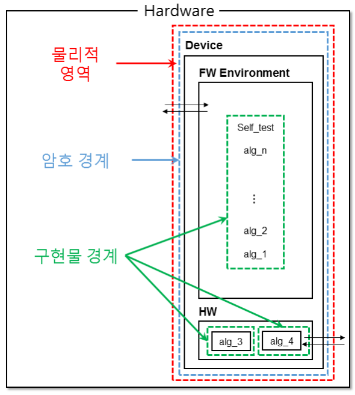
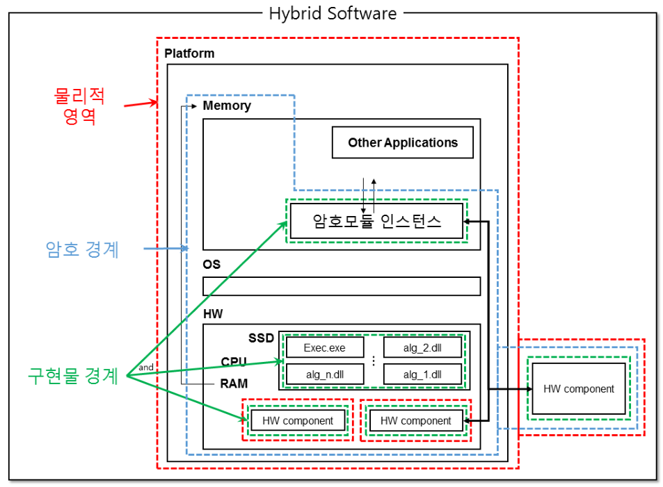
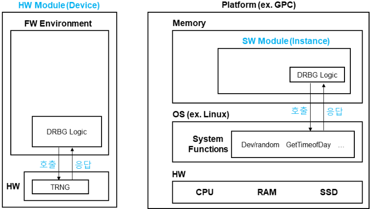
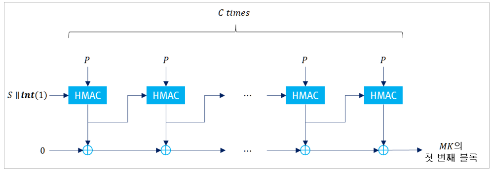

GVI Part 1 ('25.12)

Part 1

---

GVI Part 1

Guide for Vendor Implementations

---

Preface

본 앉호모듈 구현안내서는 기본적으로 개발업체와 시험기관의 질의 응답 형식으로 구성된 보조 문서의 성질을 지 np니다. 본 안내서에 포함된 각 항목은 시험進行중 발생한 개발업체의 질과 의견을 바탕으로 하고, 해당 주제의 해결을 위해 그동안 축적되었던 시험기관의 노하우 및 내부연구 결과에 대한 다년간의 검討과정을 통해답변을 엔선, 작성하였습니다.

감사합니다.

---

## Contents

1.1  按호모듈  재검증  시험  종류  及  方법      2 1.2  미적용  가능  보안요구사항      3 1.3  에브러лей터  및  시물레이터를  활용한  시험방법      4

2.1  按호모듈   기계      6 2.2  다중  検증대상   동작모드      10 2.3  HW   암호모듈   부품별   시험   요구사항   적용   방법      11 2.4  프로세서   기속   기능(PAA/PAI)      13

4.1  值가带来的 역할      18 4.2  다중 운영자 인증  메커니즘      20 4.3  现시 운영자      22 4.4  우회기능      23 4.5  운영체제 인증  메커니즘 활용      24

7.1  보안수준 2 이상의 HW 암호모듈 탐침 방지 시험 방법      30 7.2 태피發揮자 봇인 및 코팅 시험 방법      32 7.3 보안수준 3 이상의 코팅 시험 방법      33 7.4 보안수준 2 이하의 EFP/EFT 시험 방법      34

9.1  小수  生成방법      38 9.2  엔트로피  관련  보안정책서  안내문구      39 9.3  중요요  보안매개변수(SSP)  管리  표  작성  方법      42 9.4  SSP  察荘  方법      45 9.5  날수발생기가  지원해야  하는  최대  보안강도      46

---

10.1  条件부  암호algo리즘  시험方法(KAT)      50 10.2  KAT  시험 간소화 方法 1 – 내부 aligo리즘의 KAT      52 10.3  KAT  시험 간소화 方法 2 – 무결성 검사를 통한 KAT      54 10.4  라이브러리的情形 암호모듈의 동작 전 자가시험 방법      56 10.5  Non-reconfigurable 메모리 상의 구성요소에 대한 무결성 검증방법      57 10.6  소프트웨어/ pemwe어 무결성 시험      58 10.7  条件부 암호키 셤 일치시험      59 10.8  条件부 수동 주입 시험      61 10.9  주기적 자가시험      62

12.1 기타 공격에 대한 대응      66 12.2 기타 공격(비ceipt모 공격) 大응기술      67

C.1  GCM  운영모드  使用  시  주의사항  74 C.2  메시지  패딩방법  76 C.3  검증대상  암호aligo리즘  인증값  길이  77 C.4  PBKDF  使用  시  주의사항  78 C.5  암자내성  암호를  활용한  하이브리드  方식  79

D.1  自동화된 SSP 设置 방법      84 D.2  검증대상 SSP 생성방법      85

## 참고문헌

92

---

GVI Part 1

Guide for Vendor Implementations

---

<table><tr><td>일자</td><td>주요 변경内容</td></tr><tr><td>2022.5.17.</td><td>최초 작성</td></tr><tr><td>2024.11.18.</td><td>내용 개정 및 신구 항목 추가</td></tr><tr><td>2025.12.10.</td><td>내용개정 및 신구항목 추가</td></tr><tr><td></td><td></td></tr><tr><td></td><td></td></tr><tr><td></td><td></td></tr><tr><td></td><td></td></tr><tr><td></td><td></td></tr><tr><td></td><td></td></tr><tr><td></td><td></td></tr><tr><td></td><td></td></tr><tr><td></td><td></td></tr><tr><td></td><td></td></tr><tr><td></td><td></td></tr><tr><td></td><td></td></tr><tr><td></td><td></td></tr><tr><td></td><td></td></tr><tr><td></td><td></td></tr><tr><td></td><td></td></tr><tr><td></td><td></td></tr></table>

---

GVI Part 1

Guide for Vendor Implementations

---

결정론적 난수발생기(deterministic random bit generator, DRBG)

기밀성(confidentiality)

単単単単単単単単単単単単単単単単単単単単単単単単単単単単単単単単単単単単単単単単単単単単単単単単単単単単単単単単単単単単単単単単単単単単単単単単単単単単単単単単単単単単単単単単単単単単単単単単単単単単単単単単単単単単単単単単単単単単単単単単単単単単単単単単単単単単単単単単単単単単単単単単単単単単単単単単単単単単単単単単単単単単単単単単単単単単単単単単単単単単単単単単単単単単単単単単単単単単単単単単単単単単単単単単単単単単単単単単単単単単単単単単単単単単単単単単単単単単単単単単単単単単単単単単単単単単単単単単単単単単単単単単単単単単単単単単単単単単単単単単単単単単単単単単単単単単単単単単単単単単単単単単単単単単単単単単単単単単単単単単単単単単単単単単単単単単単単単単単単単単単単単単単単単単単単単単単単単単単単単単単単単単単単単単単単単単単単単単単単単単単単単単単単単単単単単単単単単単単単単単単単単単単単単単単単単単単単単単単単単単単単単単単単単単単単単単単単単単単単単単単単単単単単単単単単単単単単単単単単単単単単単単単単単単単単単単単単単単単単単単単単単単単単単単単単単単単単単単単単単単単単単単単単単単単単単単単単単単単単単単単単単単単単単単単単単単単単単単単単単単単単単単単単単単単単単単単単単単単単単単単単単単単単単単単単単単単単単単単単単単単単単単単単単単単単単単単単単単単単単単単単単単単単単単単単単単単単単単単単単単単単単単単単単単単単単単単単単単単単単単単単単単単単単単単単単単単単単単単単単単単単単単単単単単単単単単単単単単単単単単単単単単単単単単単単単単単単単単単単単単単単単単単単単単単単単単単単単単単単単単単単単単単単単単単単単単単単単単単単単単単単単単単単単単単単単単単単単単単単単単単単単単単単単単単単単単単単単単単単単単単単単単単単単単単単単単単単単単単単単単単単単単単単単単単単単単単単単単単単単単単単単単単単単単単単単単単単単単単単単単単単単単単単単単単単単単単単単単単単単単単単単単単単単単単単単単単単単単単単単単単単単単単単単単単単単単単単単単単単単単単単単単単単単単単単単単単単単単単単単単単単単単単単単単単単単単単単単単単単単単単単単単単単単単単単単単単単単単単単単単単単単単単単単単単単単単単単単単単単単単単単単単単単単単単単単単単単単単単単単単単単単単単単単単単単単単単単単単単単単単単単単単単単単単単単単単単単単単単単単単単単単単単単単単単単単単単単単単単単単単単単単単単単単単単単単単単単単単単単単単単単単単単単単単単単単単単単単単単単単単単単単単単単単単単単単単単単単単単単単単単単単単単単単単単単単単単単単単単単単単単単単単単単単単単単単単単単単単単単単単単単単単単単単単単単単単単単単単単単単単単単単単単単単単単単単単単単単単単単単単単単単単単単単単単単単単単単単単単単単単単単単単単単単単単単単単単単単単単単単単単単単単単単単単単単単単単単単単単単単単単単単単単単単単単単単単単単単単単単単単単単単単単単単単単単単単単単単単単単単単単単単単単単単単単単単単単単単単単単単単単単単単単単単単単単単単単単単単単単単単単単単単単単単単単単単単単単単単単単単単単単単単単単単単単単単単単単単単単単単単単単単単単単単単単単単単単単単単単単単単単単単単単単単単単単単単単単単単単単単単単単単単単単単単単単単単単単単単単単単単単単単単単単単単単単単単単単単単単単単単単単単単単単単単単単単単単単単単単単単単単単単単単単単単単単単単単単単単単単単単単単単単単単単単単単単単単単単単単単単単単単単単単単単単単単単単単単単単単単単単単単単単単単単単単単単単単単単単単単単単単単単単単単単単単単単単単単単単単単単単単単単単単単単単単単単単単単単単単単単単単単単単単単単単単単単単単単単単単単単単単単単単単単単単単単単単単単単単単単単単単単単単単単単単単単単単単単単単単単単単単単単単単単単単単単単単単単単単単単単単単単単単単単単単単単単単単単単単単単単単単単単単単単単単単単単単単単単単単単単単単単単単単単単単単単単単単単単単単単単単単単単単単単単単単単単単単単単単単単単単単単単単単単単単単単単単単単単単単単単単単単単単単単単単単単単単単単単単単単単単単単単単単単単単単単単単単単単単単単単単単単単単単単単単単単単単単単単単単単単単単単単単単単単単単単単単単単単単単単単単単単単単単単単単単単単単単単単単単単単単単単単単単単単単単単単単単単単単単単単単単単単単単単単単単単単単単単単単単単単単単単単単単単単単単単単単単単単単単単単単単単単単単単単単単単単単単単単単単単単単単単単単単単単単単単単単単単単単単単単単単単単単単単単単単単単単単単単単単単単単単単単単単単単単単単単単単単単単単単単単単単単単単単単単単単単単単単単単単単単単単単単単単単単単

동작 전 자가시 harm(pre-operational self-test)

무결실(integrity)

밀러-라인 소수판정법(Miller-Rabin primality test, MR test)

비참투 공격(non-invasive attack)

서비스(service)

---

소프트웨어(software)

소프트웨어/펌웨어 로드 시험(software/firmware module load test)

신리채널(trusted path)

암호경계(cryptographic boundary)

엔트로피(entropy)

역할(role)

오류담지코드(error detection code, EDC)

운영자(operator)

유한상태모델(finite state model, FSM)

자가시험(self-tests)

전자적 주입(electronic entry)

제로화(zeroisation)

条件부 자가사 harm(conditional self-test)

지식 分산(split knowledge)

---

키 합의(key agreement)

탈부초 栽개(removable cover)

temperatures 检査(tamper detection)

tamper 大同(tamper response)

tamper 官거(tamper evidence)

펌祎어(firmware)

하드웨어(hardware)

하이브리드 모듈(hybrid module)

노출되거나 변경되면 암호모듈의 보안을 손상시킬 수 있는 보안 관련 정보(예: 比밀키/개인키, 赫스워드나 개인식별번호와 같은 인증 데이터)

환경장애보호(environmental failure protection, EFP)

환경장애시험(environment failure testing, EFT)

---

GVI Part 1

Guide for Vendor Implementations

---

1장  日반사항

---

<table><tr><td>해당 보안수준(Applicable Levels)</td><td colspan="3">■ 1, 2, 3, 4</td></tr><tr><td>관련 키워드(Keywords)</td><td colspan="3">■ 전체 보안 요구사항</td></tr><tr><td>최초 작성일</td><td>2022년 5월 17일</td><td>최종 수정일</td><td>2022년 5월 17일</td></tr></table>

<table><tr><td>구분</td><td>내용</td></tr><tr><td>보안기능 변경 재검증</td><td>개발업체는 검증필 앉호모듈의 보안기능을 변경하고자할 경우, 이 재검증을 신청할 수 있다. 이 재검증은 최신 검증 기준에 따라 수행된다.</td></tr><tr><td>비보안기능 변경 재검증</td><td>개발업체는 검증필 앉호모듈의 보안과 연관되다 많은 기능을 변경하고자할 경우, 이 재검증을 신청할 수 있다. 이 재검증은 변경 내역이 앉호모듈의 보안 기능에 영향을 미치지 않을 을 검증함으로써 수행된다.</td></tr><tr><td>검증 유效기간 만료 재검증</td><td>개발업체는 검증필 앉호모듈의 기존 형상을 유지하면서 검증 유效기간만을 연장하고자할 경우, 이 재검증을 신청할 수 있으며, 반드시 기존의 검증 유效기간이 만료되기 전에 신청해야 한다.</td></tr><tr><td> 취약点 보완 재검증</td><td>개발업체는 검증필 앉호모듈 및 적용환경에 발생한 취약점을 길급하게 수정-보완하기 위하여 이 재검증을 신청할 수 있다.</td></tr></table>

2

---

<table><tr><td>해당 보안수준(Applicable Levels)</td><td colspan="3">■ 1, 2, 3, 4</td></tr><tr><td>관련 키워드(Keywords)</td><td colspan="3">■ 전체 보안 요구사항</td></tr><tr><td>최초 작성일</td><td>2022년 5월 17일</td><td>최종 수정일</td><td>2024년 11월 18일</td></tr></table>

3

---

<table><tr><td>해당 보안수준(Applicable Levels)</td><td colspan="3">■ 1, 2, 3, 4</td></tr><tr><td>관련 키워드(Keywords)</td><td colspan="3">■ 동작 시험</td></tr><tr><td>최초 작성일</td><td>2022년 5월 17일</td><td>최종 수정일</td><td>2022년 5월 17일</td></tr></table>

- ■  [KS X ISO/IEC 24759]에는 보안 요구사항 만족을 위해 수행어야 할 시험의 점차, 검증을 위한 코드 및 문서 리布局
 과정에 대한 내용이 명세되어 있다.
### 回答

<table><tr><td>구분</td><td>내용</td></tr><tr><td>에스케이터</td><td>안호모듈의 동작을 '모델' 하거나 '복제'할 수 있는 도구를 의미한다. 에스케이터 동작의 정확성은 输入값맞설게된 구조에 의존하지, 모든 변수에 대해 정확히 모델링지 않을 가능성이 존재하므로 에스케이터의 정상동작이根據으로安호모듈의 실제 정상동작을 완히 보증하고나고볼 수는 없다.</td></tr><tr><td>시스케이터</td><td>HDL 코드의 물리적 구현(FPGA, ASIC) 이전 시전 동작 점검을 위한 도구를 의미한다. 동작적 관점에서 보았을때, 시스케이터에서 정상적인 동작을 하는 코드는 실제로 구현되었을때에도 같은 논리적 동작을 한다고볼 수 있다. 하지만 다양한 외부 요인(path delay, 데드 에러, 노이자, 동작환경 등)에 의해 실제로 구현되었을 after 홍경当中와 완히한 정상 동작을 보증하고나고 보기는 어럽다.</td></tr></table>

<table><tr><td>구분</td><td>내용</td></tr><tr><td>동작 시험</td><td>- 암호모듈의 실제 동작을 검증하기 위한 시험이다.- 이 시험은 개발 문서에 정의된 인터�esis를 통해 실제 암호모듈을 동작시키고 그 결과를 확인함으로써進行되며, 에클레이터와 시물레이터를 사용할 수 있다.</td></tr><tr><td>오류 시험</td><td>- 암호모듈의 오류 처리와 관련된 시험으로 일반적으로 negative test라고 명한다.- 코드 건트에서 확인한 오류와 관련된 예외 처리 동작을 검증하기 위하여 임의의 홍경이 요구될 수 있으며, 이때 에클레이터 또는 시물레이터의 사용이 흰용된다(예: 내부 레지스터 CSP 제로화 시험).</td></tr><tr><td>알고리즘 시험</td><td>- 암호알고리즘 구현물의 구현 적합성을 확인하는 시험이다.- 이 시험을 위하여 에클레이터 또는 시물레이터가 아닌, 개발 문서에 정의된 인ter�esis와 실제 암호모듈을 사용할 것을 권장한다. 단, 정의된 포트에서 직접적으로 암호알고리즘에 접근하지 못하도록 구현된 경우(HW 등) 아래 방법을 사용할 수 있다.1) 시험기관에서 암호모듈을 임의로 수정(API 등)하여 직접 접근할 수 있도록 함2) 시물레이터使用</td></tr></table>

4

---

---

<table><tr><td>해당 보안수준(Applicable Levels)</td><td colspan="3">■ 1, 2, 3, 4</td></tr><tr><td>관련 키워드(Keywords)</td><td colspan="3">■ 암호모듈 유형■ 암호모듈 경계</td></tr><tr><td>최초 작성일</td><td>2022년 5월 17일</td><td>최종 수정일</td><td>2022년 5월 17일</td></tr></table>

■ [KS X ISO/IEC 19790]과 [KS X ISO/IEC 24759]는 표준의 전 벌위에 적용되는 단 하나의 통합 계정인 "암호 계정"를 표방하고>, 약지면,>, 제조로는>, , , , , , , , , , , , , , , , , , , , , , , , , , , , , , , , , , , , , , , , , , , , , , , , , , , , , , , , , , , , , , , , , , , , , , , , , , , , , , , , , , , , , , , , , , , , , , , , , , , , , , , , , , , , , , , , , , , , , , , , , , , , , , , , , , , , , , , , , , , , , , , , , , , , , , , , , , , , , , , , , , , , , , , , , , , , , , , , , , , , , , , , , , , , , , , , , , , , , , , , , , , , , , , , , , , , , , , , , , , , , , , , , , , , , , , , , , , , , , , , , , , , , , , , , , , , , , , , , , , , , , , , , , , , , , , , , , , , , , , , , , , , , , , , , , , , , , , , , , , , , , , , , , , , , , , , , , , , , , , , , , , , , , , , , , , , , , , , , , , , , , , , , , , , , , , , , , , , , , , , , , , , , , , , , , , , , , , , , , , , , , , , , , , , , , , , , , , , , , , , , , , , , , , , , , , , , , , , , , , , , , , , , , , , , , , , , , , , , , , , , , , , , , , , , , , , , , , , , , , , , , , , , , , , , , , , , , , , , , , , , , , , , , , , , , , , , , , , , , , , , , , , , , , , , , , , , , , , , , , , , , , , , , , , , , , , , , , , , , , , , , , , , , , , , , , , , , , , , , , , , , , , , , , , , , , , , , , , , , , , , , , , , , , , , , , , , , , , , , , , , , , , , , , , , , , , , , , , , , , , , , , , , , , , , , , , , , , , , , , , , , , , , , , , , , , , , , , , , , , , , , , , , , , , , , , , , , , , , , , , , , , , , , , , , , , , , , , , , , , , , , , , , , , , , , , , , , , , , , , , , , , , , , , , , , , , , , , , , , , , , , , , , , , , , , , , , , , , , , , , , , , , , , , , , , , , , , , , , , , , , , , , , , , , , , , , , , , , , , , , , , , , , , , , , , , , , , , , , , , , , , , , , , , , , , , , , , , , , , , , , , , , , , , , , , , , , , , , , , , , , , , , , , , , , , , , , , , , , , , , , , , , , , , , , , , , , , , , , , , , , , , , , , , , , , , , , , , , , , , , , , , , , , , , , , , , , , , , , , , , , , , , , , , , , , , , , , , , , , , , , , , , , , , , , , , , , , , , , , , , , , , , , , , , , , , , , , , , , , , , , , , , , , , , , , , , , , , , , , , , , , , , , , , , , , , , , , , , , , , , , , , , , , , , , , , , , , , , , , , , , , , , , , , , , , , , , , , , , , , , , , , , , , , , , , , , , , , , , , , , , , , , , , , , , , , , , , , , , , , , , , , , , , , , , , , , , , , , , , , , , , , , , , , , , , , , , , , , , , , , , , , , , , , , , , , , , , , , , , , , , , , , , , , , , , , , , , , , , , , , , , , , , , , , , , , , , , , , , , , , , , , , , , , , , , , , , , , , , , , , , , , , , , , , , , , , , , , , , , , , , , , , , , , , , , , , , , , , , , , , , , , , , , , , , , , , , , , , , , , , , , , , , , , , , , , , , , , , , , , , , , , , , , , , , , , , , , , , , , , , , , , , , , , , , , , , , , , , , , , , , , , , , , , , , , , , , , , , , , , , , , , , , , , , , , , , , , , , , , , , , , , , , , , , , , , , , , , , , , , , , , , , , , , , , , , , , , , , , , , , , , , , , , , , , , , , , , , , , , , , , , , , , , , , , , , , , , , , , , , , , , , , , , , , , , , , , , , , , , , , , , , , , , , , , , , , , , , , , , , , , , , , , , , , , , , , , , , , , , , , , , , , , , , , , , , , , , , , , , , , , , , , , , , , , , , , , , , , , , , , , , , , , , , , , , , , , , , , , , , , , , , , , , , , , , , , , , , , , , , , , , , , , , , , , , , , , , , , , , , , , , , , , , , , , , , , , , , , , , , , , , , , , , , , , , , , , , , , , , , , , , , , , , , , , , , , , , , , , , , , , , , , , , , , , , , , , , , , , , , , , , , , , , , , , , , , , , , , , , , , , , , , , , , , , , , , , , , , , , , , , , , , , , , , , , , , , , , , , , , , , , , , , , , , , , , , , , , , , , , , , , , , , , , , , , , , , , , , , , , , , , , , , , , , , , , , , , , , , , , , , , , , , , , , , , , , , , , , , , , , , , , , , , , , , , , , , , , , , , , , , , , , , , , , , , , , , , , , , , , , , , , , , , , , , , , , , , , , , , , , , , , , , , , , , , , , , , , , , , , , , , , , , , , , , , , , , , , , , , , , , , , , , , , , , , , , , , , , , , , , , , , , , , , , , , , , , , , , , , , , , , , , , , , , , , , , , , , , , , , , , , , , , , , , , , , , , , , , , , , , , , , , , , , , , , , , , , , , , , , , , , , , , , , , , , , , , , , , , , , , , , , , , , , , , , , , , , , , , , , , , , , , , , , , , , , , , , , , , , , , , , , , , , , , , , , , , , , , , , , , , , , , , , , , , , , , , , , , , , , , , , , , , , , , , , , , , , , , , , , , , , , , , , , , , , , , , , , , , , , , , , , , , , , , , , , , , , , , , , , , , , , , , , , , , , , , , , , , , , , , , , , , , , , , , , , , , , , , , , , , , , , , , , , , , , , , , , , , , , , , , , , , , , , , , , , , , , , , , , , , , , , , , , , , , , , , , , , , , , , , , , , , , , , , , , , , , , , , , , , , , , , , , , , , , , , , , , , , , , , , , , , , , , , , , , , , , , , , , , , , , , , , , , , , , , , , , , , , , , , , , , , , , , , , , , , , , , , , , , , , , , , , , , , , , , , , , , , , , , , , , , , , , , , , , , , , , , , , , , , , , , , , , , , , , , , , , , , , , , , , , , , , , , , , , , , , , , , , , , , , , , , , , , , , , , , , , , , , , , , , , , , , , , , , , , , , , , , , , , , , , , , , , , , , , , , , , , , , , , , , , , , , , , , , , , , , , , , , , , , , , , , , , , , , , , , , , , , , , , , , , , , , , , , , , , , , , , , , , , , , , , , , , , , , , , , , , , , , , , , , , , , , , , , , , , , , , , , , , , , , , , , , , , , , , , , , , , , , , , , , , , , , , , , , , , , , , , , , , , , , , , , , , , , , , , , , , , , , , , , , , , , , , , , , , , , , , , , , , , , , , , , , , , , , , , , , , , , , , , , , , , , , , , , , , , , , , , , , , , , , , , , , , , , , , , , , , , , , , , , , , , , , , , , , , , , , , , , , , , , , , , , , , , , , , , , , , , , , , , , , , , , , , , , , , , , , , , , , , , , , , , , , , , , , , , , , , , , , , , , , , , , , , , , , , , , , , , , , , , , , , , , , , , , , , , , , , , , , , , , , , , , , , , , , , , , , , , , , , , , , , , , , , , , , , , , , , , , , , , , , , , , , , , , , , , , , , , , , , , , , , , , , , , , , , , , , , , , , , , , , , , , , , , , , , , , , , , , , , , , , , , , , , , , , , , , , , , , , , , , , , , , , , , , , , , , , , , , , , , , , , , , , , , , , , , , , , , , , , , , , , , , , , , , , , , , , , , , , , , , , , , , , , , , , , , , , , , , , , , , , , , , , , , , , , , , , , , , , , , , , , , , , , , , , , , , , , , , , , , , , , , , , , , , , , , , , , , , , , , , , , , , , , , , , , , , , , , , , , , , , , , , , , , , , , , , , , , , , , , , , , , , , , , , , , , , , , , , , , , , , , , , , , , , , , , , , , , , , , , , , , , , , , , , , , , , , , , , , , , , , , , , , , , , , , , , , , , , , , , , , , , , , , , , , , , , , , , , , , , , , , , , , , , , , , , , , , , , , , , , , , , , , , , , , , , , , , , , , , , , , , , , , , , , , , , , , , , , , , , , , , , , , , , , , , , , , , , , , , , , , , , , , , , , , , , , , , , , , , , , , , , , , , , , , , , , , , , , , , , , , , , , , , , , , , , , , , , , , , , , , , , , , , , , , , , , , , , , , , , , , , , , , , , , , , , , , , , , , , , , , , , , , , , , , , , , , , , , , , , , , , , , , , , , , , , , , , , , , , , , , , , , , , , , , , , , , , , , , , , , , , , , , , , , , , , , , , , , , , , , , , , , , , , , , , , , , , , , , , , , , , , , , , , , , , , , , , , , , , , , , , , , , , , , , , , , , , , , , , , , , , , , , , , , , , , , , , , , , , , , , , , , , , , , , , , , , , , , , , , , , , , , , , , , , , , , , , , , , , , , , , , , , , , , , , , , , , , , , , , , , , , , , , , , , , , , , , , , , , , , , , , , , , , , , , , , , , , , , , , , , , , , , , , , , , , , , , , , , , , , , , , , , , , , , , , , , , , , , , , , , , , , , , , , , , , , , , , , , , , , , , , , , , , , , , , , , , , , , , , , , , , , , , , , , , , , , , , , , , , , , , , , , , , , , , , , , , , , , , , , , , , , , , , , , , , , , , , , , , , , , , , , , , , , , , , , , , , , , , , , , , , , , , , , , , , , , , , , , , , , , , , , , , , , , , , , , , , , , , , , , , , , , , , , , , , , , , , , , , , , , , , , , , , , , , , , , , , , , , , , , , , , , , , , , , , , , , , , , , , , , , , , , ,

암호모듈 (Cryptographic Module)

6

---

[스프트웨어 암호모듈]

[砰喲어 암호모듈]

7

---

8

---

9

---

<table><tr><td>해당 보안수준(Applicable Levels)</td><td colspan="3">■ 1, 2, 3, 4</td></tr><tr><td>관련 키워드(Keywords)</td><td colspan="3">■ 다중 검증대상 동작모드</td></tr><tr><td>최초 작성일</td><td>2022년 5월 17일</td><td>최종 수정일</td><td>2024년 11월 18일</td></tr></table>

10

---

<table><tr><td>해당 보안수준(Applicable Levels)</td><td colspan="3">■ 1, 2, 3, 4</td></tr><tr><td>관련 키워드(Keywords)</td><td colspan="3">■ 암호모듈 명세 관련 항목</td></tr><tr><td>최초 작성일</td><td>2022년 5월 17일</td><td>최종 수정일</td><td>2022년 5월 17일</td></tr></table>

11

---

<table><tr><td>구분</td><td>설명</td></tr><tr><td>비교 시험</td><td>각 항목에 해당하는 “다른” 세부 부품이 실제로 存재하는지 여부에 대해서만 확인하고, 하나의 부품에 대한 모든 동작시험이 이루어졌을 경우 다른 부품에 대한 동작시험을 모두생식할 수 있다.</td></tr><tr><td>별도 시험</td><td>각 항목에 해당하는 “다른” 세부 부품이 실제로 存재하는지 여부를 확인하고, 기존 부품에 시험되었던 모든 동작시험을별도로 수행해야 한다.</td></tr></table>

12

---

<table><tr><td>head보안수준(Applicable Levels)</td><td colspan="3">■ 1, 2, 3, 4</td></tr><tr><td>관련 키워드(Keywords)</td><td colspan="3">■ Processor Algorithm Accelerator(PAA)■ Processor Algorithm Implementation(PAI)</td></tr><tr><td>최초 작성일</td><td>2024년 9월 13일</td><td>최종 수정일</td><td>2024년 11월 18일</td></tr></table>

13

---

14

---

---

GVI Part 1

Guide for Vendor Implementations

---

---

<table><tr><td>해당 보안수준(Applicable Levels)</td><td colspan="3">■ 2, 3, 4</td></tr><tr><td>관련 키워드(Keywords)</td><td colspan="3">■ 인가된 역할■ 인증이 필요없는 서비스</td></tr><tr><td>최초 작성일</td><td>2022년 5월 17일</td><td>최종 수정일</td><td>2022년 5월 17일</td></tr></table>

■  [KS X ISO/IEC 19790] 7.4.1 역할, 서비스와 인증 일반 요구사항에 따라 암호모듈은 운동자에게 인가된 역할을 지원함과 동시에 각 역할에 大응하는 서비스를 제공해야 한다. 만약 모듈의 보안에 영향을 주지 않는 서비스를 수행하는 等情况에 인가된 역할을 막을 필요가 없다.

18

---

Boundary) 内 운동환경에 포함되어 있는 알려진 엔트로피 소스여아 한다. 미인증 운동자가 엔트로피를 암호모듈의 경계(Cryptographic Boundary) 밌에서 输入할 수 있다면 이는 암호모듈의 CSP로 관리되는 DRBG의 내부 상태 정보값에 적절적인 영향력을行使할 수 있는 것이며, 동일한 DRBG 서비스를 사용하는 인증된 使用자’s 보안성이 손실(loss)되거나 약화(weakening)되는 결과를 기기하는 것이기 때문에다.

19

---

<table><tr><td>해당 보안수준(Applicable Levels)</td><td colspan="3">■ 2, 3, 4</td></tr><tr><td>관련 키워드(Keywords)</td><td colspan="3">■ 운영자 인증■ 역할 기반 인증■ 신원 기반 인증</td></tr><tr><td>최초 작성일</td><td>2022년 5월 17일</td><td>최종 수정일</td><td>2022년 5월 17일</td></tr></table>

20

---

21

---

<table><tr><td>해당 보안수준(Applicable Levels)</td><td colspan="3">■ 1, 2, 3, 4</td></tr><tr><td>관련 키워드(Keywords)</td><td colspan="3">■ 복수 운영자■동시 운영자 (Concurrent Operator)</td></tr><tr><td>최초 작성일</td><td>2022년 5월 17일</td><td>최종 수정일</td><td>2022년 5월 17일</td></tr></table>

■ [KS X ISO/IEC 19790] 7.4.1 역할, 서비스`와`인증`일반`요구사항에`나라`다수의`운영주체가`암호모듈을`‘‘‘ ‘‘‘ ‘‘‘‘‘‘‘‘‘‘‘‘‘‘‘‘‘‘‘‘‘‘‘‘‘‘‘‘‘‘‘‘‘‘‘‘‘‘‘‘‘‘‘‘‘‘‘‘‘‘‘‘‘‘‘‘‘‘‘‘‘‘‘‘‘‘‘‘‘‘‘‘‘‘‘‘‘‘‘‘‘‘‘‘‘‘‘‘‘‘‘‘‘‘‘‘‘‘‘‘‘‘‘‘‘‘‘‘‘‘‘‘‘‘‘‘‘‘‘‘‘‘‘‘‘‘‘‘‘‘‘‘‘‘‘‘‘‘‘‘‘‘‘‘‘‘‘‘‘‘‘‘‘‘‘‘‘‘‘‘‘‘‘‘‘‘‘‘‘‘‘‘‘‘‘‘‘‘‘‘‘‘‘‘‘‘‘‘‘‘‘‘‘‘‘‘‘‘‘‘‘‘‘‘‘‘‘‘‘‘‘‘‘‘‘‘‘‘‘‘‘‘‘‘‘‘‘‘‘‘‘‘‘‘‘‘‘‘‘‘‘‘‘‘‘‘‘‘‘‘‘‘‘‘‘‘‘‘‘‘‘‘‘‘‘‘‘‘‘‘‘‘‘‘‘‘‘‘‘‘‘‘‘‘‘‘‘‘‘‘‘‘‘‘‘‘‘‘‘‘‘‘‘‘‘‘‘‘‘‘‘‘‘‘‘‘‘‘‘‘‘‘‘‘‘‘‘‘‘‘‘‘‘‘‘‘‘‘‘‘‘‘‘‘‘‘‘‘‘‘‘‘‘‘‘‘‘‘‘‘‘‘‘‘‘‘‘‘‘‘‘‘‘‘‘‘‘‘‘‘‘‘‘‘‘‘‘‘‘‘‘‘‘‘‘‘‘‘‘‘‘‘‘‘‘‘‘‘‘‘‘‘‘‘‘‘‘‘‘‘‘‘‘‘‘‘‘‘‘‘‘‘‘‘‘‘‘‘‘‘‘‘‘‘‘‘‘‘‘‘‘‘‘‘‘‘‘‘‘‘‘‘‘‘‘‘‘‘‘‘‘‘‘‘‘‘‘‘‘‘‘‘‘‘‘‘‘‘‘‘‘‘‘‘‘‘‘‘‘‘‘‘‘‘‘‘‘‘‘‘‘‘‘‘‘‘‘‘‘‘‘‘‘‘‘‘‘‘‘‘‘‘‘‘‘‘‘‘‘‘‘‘‘‘‘‘‘‘‘‘‘‘‘‘‘‘‘‘‘‘‘‘‘‘‘‘‘‘‘‘‘‘‘‘‘‘‘‘‘‘‘‘‘‘‘‘‘‘‘‘‘‘‘‘‘‘‘‘‘‘‘‘‘‘‘‘‘‘‘‘‘‘‘‘‘‘‘‘‘‘‘‘‘‘‘‘‘‘‘‘‘‘‘‘‘‘‘‘‘‘‘‘‘‘‘‘‘‘‘‘‘‘‘‘‘‘‘‘‘‘‘‘‘‘‘‘‘‘‘‘‘‘‘‘‘‘‘‘‘‘‘‘‘‘‘‘‘‘‘‘‘‘‘‘‘‘‘‘‘‘‘‘‘‘‘‘‘‘‘‘‘‘‘‘‘‘‘‘‘‘‘‘‘‘‘‘‘‘‘‘‘‘‘‘‘‘‘‘‘‘‘‘‘‘‘‘‘‘‘‘‘‘‘‘‘‘‘‘‘‘‘‘‘‘‘‘‘‘‘‘‘‘‘‘‘‘‘‘‘‘‘‘‘‘‘‘‘‘‘‘‘‘‘‘‘‘‘‘‘‘‘‘‘‘‘‘‘‘‘‘‘‘‘‘‘‘‘‘‘‘‘‘‘‘‘‘‘‘‘‘‘‘‘‘‘‘‘‘‘‘‘‘‘‘‘‘‘‘‘‘‘‘‘‘‘‘‘‘‘‘‘‘‘‘‘‘‘‘‘‘‘‘‘‘‘‘‘‘‘‘‘‘‘‘‘‘‘‘‘‘‘‘‘‘‘‘‘‘‘‘‘‘‘‘‘‘‘‘‘‘‘‘‘‘‘‘‘‘‘‘‘‘‘‘‘‘‘‘‘‘‘‘‘‘‘‘‘‘‘‘‘‘‘‘‘‘‘‘‘‘‘‘‘‘‘‘‘‘‘‘‘‘‘‘‘‘‘‘‘‘‘‘‘‘‘‘‘‘‘‘‘‘‘‘‘‘‘‘‘‘‘‘‘‘‘‘‘‘‘‘‘‘‘‘‘‘‘‘‘‘‘‘‘‘‘‘‘‘‘‘‘‘‘‘‘‘‘‘‘‘‘‘‘‘‘‘‘‘‘‘‘‘‘‘‘‘‘‘‘‘‘‘‘‘‘‘‘‘‘‘‘‘‘‘‘‘‘‘‘‘‘‘‘‘‘‘‘‘‘‘‘‘‘‘‘‘‘‘‘‘‘‘‘‘‘‘‘‘‘‘‘‘‘‘‘‘‘‘‘‘‘‘‘‘‘‘‘‘‘‘‘‘‘‘‘‘‘‘‘‘‘‘‘‘‘‘‘‘‘‘‘‘‘‘‘‘‘‘‘‘‘‘‘‘‘‘‘‘‘‘‘‘‘‘‘‘‘‘‘‘‘‘‘‘‘‘‘‘‘‘‘‘‘‘‘‘‘‘‘‘‘‘‘‘‘‘‘‘‘‘‘‘‘‘‘‘‘‘‘‘‘‘‘‘‘‘‘‘‘‘‘‘‘‘‘‘‘‘‘‘‘‘‘‘‘‘‘‘‘‘‘‘‘‘‘‘‘‘‘‘‘‘‘‘‘‘‘‘‘‘‘‘‘‘‘‘‘‘‘‘‘‘‘‘‘‘‘‘‘‘‘‘‘‘‘‘‘‘‘‘‘‘‘‘‘‘‘‘‘‘‘‘‘‘‘‘‘‘‘‘‘‘‘‘‘‘‘‘‘‘‘‘‘‘‘‘‘‘‘‘‘‘‘‘‘‘‘‘‘‘‘‘‘‘‘‘‘‘‘‘‘‘‘‘‘‘‘‘‘‘‘‘‘‘‘‘‘‘‘‘‘‘‘‘‘‘‘‘‘‘‘‘‘‘‘‘‘‘‘‘‘‘‘‘‘‘‘‘‘‘‘‘‘‘‘‘‘‘‘‘‘‘‘‘‘‘‘‘‘‘‘‘‘‘‘‘‘‘‘‘‘‘‘‘‘‘‘‘‘‘‘‘‘‘‘‘‘‘‘‘‘‘‘‘‘‘‘‘‘‘‘‘‘‘‘‘‘‘‘‘‘‘‘‘‘‘‘‘‘‘‘‘‘‘‘‘‘‘‘‘‘‘‘‘‘‘‘‘‘‘‘‘‘‘‘‘‘‘‘‘‘‘‘‘‘‘‘‘‘‘‘‘‘‘‘‘‘‘‘‘‘‘‘‘‘‘‘‘‘‘‘‘‘‘‘‘‘‘‘‘‘‘‘‘‘‘‘‘‘‘‘‘‘‘‘‘‘‘‘‘‘‘‘‘‘‘‘‘‘‘‘‘‘‘‘‘‘‘‘‘‘‘‘‘‘‘‘‘‘‘‘‘‘‘‘‘‘‘‘‘‘‘‘‘‘‘‘‘‘‘‘‘‘‘‘‘‘‘‘‘‘‘‘‘‘‘‘‘‘‘‘‘‘‘‘‘‘‘‘‘‘‘‘‘‘‘‘‘‘‘‘‘‘‘‘‘‘‘‘‘‘‘‘‘‘‘‘‘‘‘‘‘‘‘‘‘‘‘‘‘‘‘‘‘‘‘‘‘‘‘‘‘‘‘‘‘‘‘‘‘‘‘‘‘‘‘‘‘‘‘‘‘‘‘‘‘‘‘‘‘‘‘‘‘‘‘‘‘‘‘‘‘‘‘‘‘‘‘‘‘‘‘‘‘‘‘‘‘‘‘‘‘‘‘‘‘‘‘‘‘‘‘‘‘‘‘‘‘‘‘‘‘‘‘‘‘‘‘‘‘‘‘‘‘‘‘‘‘‘‘‘‘‘‘‘‘‘‘‘‘‘‘‘‘‘‘‘‘‘‘‘‘‘‘‘‘‘‘‘‘‘‘‘‘‘‘‘‘‘‘‘‘‘‘‘‘‘‘‘‘‘‘‘‘‘‘‘‘‘‘‘‘‘‘‘‘‘‘‘‘‘‘‘‘‘‘‘‘‘‘‘‘‘‘‘‘‘‘‘‘‘‘‘‘‘‘‘‘‘‘‘‘‘‘‘‘‘‘‘‘‘‘‘‘‘‘‘‘‘‘‘‘‘‘‘‘‘‘‘‘‘‘‘‘‘‘‘‘‘‘‘‘‘‘‘‘‘‘‘‘‘‘‘‘‘‘‘‘‘‘‘‘‘‘‘‘‘‘‘‘‘‘‘‘‘‘‘‘‘‘‘‘‘‘‘‘‘‘‘‘‘‘‘‘‘‘‘‘‘‘‘‘‘‘‘‘‘‘‘‘‘‘‘‘‘‘‘‘‘‘‘‘‘‘‘‘‘‘‘‘‘‘‘‘‘‘‘‘‘‘‘‘‘‘‘‘‘‘‘‘‘‘‘‘‘‘‘‘‘‘‘‘‘‘‘‘‘‘‘‘‘‘‘‘‘‘‘‘‘‘‘‘‘‘‘‘‘‘‘‘‘‘‘‘‘‘‘‘‘‘‘‘‘‘‘‘‘‘‘‘‘‘‘‘‘‘‘‘‘‘‘‘‘‘‘‘‘‘‘‘‘‘‘‘‘‘‘‘‘‘‘‘‘‘‘‘‘‘‘‘‘‘‘‘‘‘‘‘‘‘‘‘‘‘‘‘‘‘‘‘‘‘‘‘‘‘‘‘‘‘‘‘‘‘‘‘‘‘‘‘‘‘‘‘‘‘‘‘‘‘‘‘‘‘‘‘‘‘‘‘‘‘‘‘‘‘‘‘‘‘‘‘‘‘‘‘‘‘‘‘‘‘‘‘‘‘‘‘‘‘‘‘‘‘‘‘‘‘‘‘‘‘‘‘‘‘‘‘‘‘‘‘‘‘‘‘‘‘‘‘‘‘‘‘‘‘‘‘‘‘‘‘‘‘‘‘‘‘‘‘‘‘‘‘‘‘‘‘‘‘‘‘‘‘‘‘‘‘‘‘‘‘‘‘‘‘‘‘‘‘‘‘‘‘‘‘‘‘‘‘‘‘‘‘‘‘‘‘‘‘‘‘‘‘‘‘‘‘‘‘‘‘‘‘‘‘‘‘‘‘‘‘‘‘‘‘‘‘‘‘‘‘‘‘‘‘‘‘‘‘‘‘‘‘‘‘‘‘‘‘‘‘‘‘‘‘‘‘‘‘‘‘‘‘‘‘‘‘‘‘‘‘‘‘‘‘‘‘‘‘‘‘‘‘‘‘‘‘‘‘‘‘‘‘‘‘‘‘‘‘‘‘‘‘‘‘‘‘‘‘‘‘‘‘‘‘‘‘‘‘‘‘‘‘‘‘‘‘‘‘‘‘‘‘‘‘‘‘‘‘‘‘‘‘‘‘‘‘‘‘‘‘‘‘‘‘‘‘‘‘‘‘‘‘‘‘‘‘‘‘‘‘‘‘‘‘‘‘‘‘‘‘‘‘‘‘‘‘‘‘‘‘‘‘‘‘‘‘‘‘‘‘‘‘‘‘‘‘‘‘‘‘‘‘‘‘‘‘‘‘‘‘‘‘‘‘‘‘‘‘‘‘‘‘‘‘‘‘‘‘‘‘‘‘‘‘‘‘‘‘‘‘‘‘‘‘‘‘‘‘‘‘‘‘‘‘‘‘‘‘‘‘‘‘‘‘‘‘‘‘‘‘‘‘‘‘‘‘‘‘‘‘‘‘‘‘‘‘‘‘‘‘‘‘‘‘‘‘‘‘‘‘‘‘‘‘‘‘‘‘‘‘‘‘‘‘‘‘‘‘‘‘‘‘‘‘‘‘‘‘‘‘‘‘‘‘‘‘‘‘‘‘‘‘‘‘‘‘‘‘‘‘‘‘‘‘‘‘‘‘‘‘‘‘‘‘‘‘‘‘‘‘‘‘‘‘‘‘‘‘‘‘‘‘‘‘‘‘‘‘‘‘‘‘‘‘‘‘‘‘‘‘‘‘‘‘‘‘‘‘‘‘‘‘‘‘‘‘‘‘‘‘‘‘‘‘‘‘‘‘‘‘‘‘‘‘‘‘‘‘‘‘‘‘‘‘‘‘‘‘‘‘‘‘‘‘‘‘‘‘‘‘‘‘‘‘‘‘‘‘‘‘‘‘‘‘‘‘‘‘‘‘‘‘‘‘‘‘‘‘‘‘‘‘‘‘‘‘‘‘‘‘‘‘‘‘‘‘‘‘‘‘‘‘‘‘‘‘‘‘‘‘‘‘‘‘‘‘‘‘‘‘‘‘‘‘‘‘‘‘‘‘‘‘‘‘‘‘‘‘‘‘‘‘‘‘‘‘‘‘‘‘‘‘‘‘‘‘‘‘‘‘‘‘‘‘‘‘‘‘‘‘‘‘‘‘‘‘‘‘‘‘‘‘‘‘‘‘‘‘‘‘‘‘‘‘‘‘‘‘‘‘‘‘‘‘‘‘‘‘‘‘‘‘‘‘‘‘‘‘‘‘‘‘‘‘‘‘‘‘‘‘‘‘‘‘‘‘‘‘‘‘‘‘‘‘‘‘‘‘‘‘‘‘‘‘‘‘‘‘‘‘‘‘‘‘‘‘‘‘‘‘‘‘‘‘‘‘‘‘‘‘‘‘‘‘‘‘‘‘‘‘‘‘‘‘‘‘‘‘‘‘‘‘‘‘‘‘‘‘‘‘‘‘‘‘‘‘‘‘‘‘‘‘‘‘‘‘‘‘‘‘‘‘‘‘‘‘‘‘‘‘‘‘‘‘‘‘‘‘‘‘‘‘‘‘‘‘‘‘‘‘‘‘‘‘‘‘‘‘‘‘‘‘‘‘‘‘‘‘‘‘‘‘‘‘‘‘‘‘‘‘‘‘‘‘‘‘‘‘‘‘‘‘‘‘‘‘‘‘‘‘‘‘‘‘‘‘‘‘‘‘‘‘‘‘‘‘‘‘‘‘‘‘‘‘‘‘‘‘‘‘‘‘‘‘‘‘‘‘‘‘‘‘‘‘‘‘‘‘‘‘‘‘‘‘‘‘‘‘‘‘‘‘‘‘‘‘‘‘‘‘‘‘‘‘‘‘‘‘‘‘‘‘‘‘‘‘‘‘‘‘‘‘‘‘‘‘‘‘‘‘‘‘‘‘‘‘‘‘‘‘‘‘‘‘‘‘‘‘‘‘‘‘‘‘‘‘‘‘‘‘‘‘‘‘‘‘‘‘‘‘‘‘‘‘‘‘‘‘‘‘‘‘‘‘‘‘‘‘‘‘‘‘‘‘‘‘‘‘‘‘‘‘‘‘‘‘‘‘‘‘‘‘‘‘‘‘‘‘‘‘‘‘‘‘‘‘‘‘‘‘‘‘‘‘‘‘‘‘‘‘‘‘‘‘‘‘‘‘‘‘‘‘‘‘‘‘‘‘‘‘‘‘‘‘‘‘‘‘‘‘‘‘‘‘‘‘‘‘‘‘‘‘‘‘‘‘‘‘‘‘‘‘‘‘‘‘‘‘‘‘‘‘‘‘‘‘‘‘‘‘‘‘‘‘‘‘‘‘‘‘‘‘‘‘‘‘‘‘‘‘‘‘‘‘‘‘‘‘‘‘‘‘‘‘‘‘‘‘‘‘‘‘‘‘‘‘‘‘‘‘‘‘‘‘‘‘‘‘‘‘‘‘‘‘‘‘‘‘‘‘‘‘‘‘‘‘‘‘‘‘‘‘‘‘‘‘‘‘‘‘‘‘‘‘‘‘‘‘‘‘‘‘‘‘‘‘‘‘‘‘‘‘‘‘‘‘‘‘‘‘‘‘‘‘‘‘‘‘‘‘‘‘‘‘‘‘‘‘‘‘‘‘‘‘‘‘‘‘‘‘‘‘‘‘‘‘‘‘‘‘‘‘‘‘‘‘‘‘‘‘‘‘‘‘‘‘‘‘‘‘‘‘‘‘‘‘‘‘‘‘‘‘‘‘‘‘‘‘‘‘‘‘‘‘‘‘‘‘‘‘‘‘‘‘‘‘‘‘‘‘‘‘‘‘‘‘‘‘‘‘‘‘‘‘‘‘‘‘‘‘‘‘‘‘‘‘‘‘‘‘‘‘‘‘‘‘‘‘‘‘‘‘‘‘‘‘‘‘‘‘‘‘‘‘‘‘‘‘‘‘‘‘‘‘‘‘‘‘‘‘‘‘‘‘‘‘‘‘‘‘‘‘‘‘‘‘‘‘‘‘‘‘‘‘‘‘‘‘‘‘‘‘‘‘‘‘‘‘‘‘‘‘‘‘‘‘‘‘‘‘‘‘‘‘‘‘‘‘‘‘‘‘‘‘‘‘‘‘‘‘‘‘‘‘‘‘‘‘‘‘‘‘‘‘‘‘‘‘‘‘‘‘‘‘‘‘‘‘‘‘‘‘‘‘‘‘‘‘‘‘‘‘‘‘‘‘‘‘‘‘‘‘‘‘‘‘‘‘‘‘‘‘‘‘‘‘‘‘‘‘‘‘‘‘‘‘‘‘‘‘‘‘‘‘‘‘‘‘‘‘‘‘‘‘‘‘‘‘‘‘‘‘‘‘‘‘‘‘‘‘‘‘‘‘‘‘‘‘‘‘‘‘‘‘‘‘‘‘‘‘‘‘‘‘‘‘‘‘‘‘‘‘‘‘‘‘‘‘‘‘‘‘‘‘‘‘‘‘‘‘‘‘‘‘‘‘‘‘‘‘‘‘‘‘‘‘‘‘‘‘‘‘‘‘‘‘‘‘‘‘‘‘‘‘‘‘‘‘‘‘‘‘‘‘‘‘‘‘‘‘‘‘‘‘‘‘‘‘

### 답변

■ [KS X ISO/IEC 19790]과 [KS X ISO/IEC 24759] 시기기준의 "복수 운임자"는 다수의 운임자(Multiple Operator)가 아니 동시 운임자(Concurrent Operator)를 의미한다. 즉, 동시 운임자(Concurrent Operators)는 특정 시점에 암호모듈을 동시에 이용하는 다수의 운임주체를 의미하며, 아래 예시와 같은 케이스가 존재할 수 있다.

22

---

<table><tr><td>해당 보안수준(Applicable Levels)</td><td colspan="3">■ 1, 2, 3, 4</td></tr><tr><td>관련 키워드(Keywords)</td><td colspan="3">■ 우회기능</td></tr><tr><td>최초 작성일</td><td>2022년 5월 17일</td><td>최종 수정일</td><td>2022년 5월 17일</td></tr></table>

23

---

<table><tr><td>해당 보안수준(Applicable Levels)</td><td colspan="3">■ 1, 2</td></tr><tr><td>관련 키워드(Keywords)</td><td colspan="3">■ 소프트웨어 암호모듈■ 인증</td></tr><tr><td>최초 작성일</td><td>2024년 9월 13일</td><td>최종 수정일</td><td>2024년 11월 18일</td></tr></table>

### 답변

24

---

---

GVI Part 1

Guide for Vendor Implementations

---

---

GVI Part 1

Guide for Vendor Implementations

---

---

<table><tr><td>해당 보안수준(Applicable Levels)</td><td colspan="3">■ 2, 3, 4</td></tr><tr><td>관련 키워드(Keywords)</td><td colspan="3">■ 물리적 보안 탐침 관련 요구사항</td></tr><tr><td>최초 작성일</td><td>2022년 5월 17일</td><td>최종 수정일</td><td>2022년 5월 17일</td></tr></table>

<table><tr><td rowspan="2">요구사항</td><td>·상용 등급의 금속 혹은 단단한 플라스틱으로 제작된 외장은 개페부가 적용될 수도 있다.</td></tr><tr><td>·암호모듈의 외장은 가시광선 영역에서 불투명아야 한다.</td></tr></table>

30

---

31

---

<table><tr><td>해당 보안수준(Applicable Levels)</td><td colspan="3">■ 2, 3, 4</td></tr><tr><td>관련 키워드(Keywords)</td><td colspan="3">■ 탑퍼 증거 봇인 및 코팅 관련 요구사항</td></tr><tr><td>최초 작성일</td><td>2022년 5월 17일</td><td>최종 수정일</td><td>2022년 5월 17일</td></tr></table>

### 答案

32

---

<table><tr><td>해당 보안수준(Applicable Levels)</td><td colspan="3">■ 3, 4</td></tr><tr><td>관련 키워드(Keywords)</td><td colspan="3">■ 탑fer 증거 코팅관련 요구사항</td></tr><tr><td>최초 작성일</td><td>2022년 5월 17일</td><td>최종 수정일</td><td>2022년 5월 17일</td></tr></table>

33

---

<table><tr><td>해당 보안수준(Applicable Levels)</td><td colspan="3">■ 1, 2</td></tr><tr><td>관련 키워드(Keywords)</td><td colspan="3">■ EFP/EFT관련 요구사항</td></tr><tr><td>최초 작성일</td><td>2022년 5월 17일</td><td>최종 수정일</td><td>2022년 5월 17일</td></tr></table>

34

---

8장  비침투 보안

---

GVI Part 1

Guide for Vendor Implementations

---

---

<table><tr><td>해당 보안수준(Applicable Levels)</td><td colspan="3">■ 1, 2, 3, 4</td></tr><tr><td>관련 키워드(Keywords)</td><td colspan="3">■ 小수 생성방법■ 小수 판단방법</td></tr><tr><td>최초 작성일</td><td>2022년 5월 17일</td><td>최종 수정일</td><td>2024년 11월 18일</td></tr></table>

- - FIPS 186-5 A.1.4(Provable prime with conditions based on auxiliary provable primes)
- 적용 大상: RSAES 2048(SHA2-256), RSA-PSS 3072(SHA2-256)
38

---

<table><tr><td>해당 보안수준(Applicable Levels)</td><td colspan="3">■ 1, 2, 3, 4</td></tr><tr><td>관련 키워드(Keywords)</td><td colspan="3">■ 날수발생기, 셸드, 잡음원, 엔트로피, 보안강도, 키■ 보안정책서</td></tr><tr><td>최초 작성일</td><td>2022년 5월 17일</td><td>최종 수정일</td><td>2022년 5월 17일</td></tr></table>

39

---

1) 사용자로부터 API를 통해씨드를 전달받는 소ipro트웨어 암호모듈

40

---

이 앉호모듈이 생성하는 난수 및 텰의 보안강도는 앉호모듈이 보증지하지 않으며, 난수발생기 운임을 위해 운임자가 주입한 케 드의 엨트로피에 의존한다。 운임자는 난수발생기 초기화 또는 라씨당용 찬드를 TTAK.KO-12.0235 완전 TTAK.KO-12.0341 에 준하여 목표 보안강도를 만족しておく 관리해야 하고, 이를 앉호모듈에게 안전하게 전달해야 한다。

1) 앉호경계 내의 TRNG를 使用해 엔트로피를直接 수집하고 운임자가 추가적인 엔트로피를 输入할 수 있도록 별도의 물리적 포트를 제공하는 하드웨어 앉호모듈

41

---

<table><tr><td>해당 보안수준(Applicable Levels)</td><td colspan="3">■ 1, 2, 3, 4</td></tr><tr><td>관련 키워드(Keywords)</td><td colspan="3">■ SSP 생성/설정/주입 및 출력/저장/제로화</td></tr><tr><td>최초 작성일</td><td>2022년 5월 17일</td><td>최종 수정일</td><td>2024년 11월 18일</td></tr></table>

- ■  SSP 관리의 여러 항목 중 암호모듈이 제공하는 기능이 어떤 항목에 해당하는지 어떻게 판단할 수 있는가? 기본 и/, 상세
설계서의 SSP 관리 표는 어떤 기준으로 작성해야 하는가?

●  어떤 행위가 SSP 주입/출력에 해당하는가?

● 보안 수준에 따라 가능한 SSP 설정(Establishment) 방법은 무엇인가?
<table><tr><td>分類</td><td>중요 보안매개변수</td><td>중류(CSP/PSP)</td><td>생성</td><td>합의/전송</td><td>주입</td><td>출력</td><td>저장</td><td>제로화</td></tr><tr><td></td><td></td><td></td><td></td><td></td><td></td><td></td><td></td><td></td></tr></table>

<table><tr><td>分類</td><td>중요 보안매개변수</td><td>종류(CSP/PSP)</td><td>생성</td><td>합의/전송</td><td>주입</td><td>출력</td><td>저장</td><td>제로화</td></tr><tr><td>블록암호</td><td>ARIA 비밀기</td><td>CSP</td><td>○</td><td></td><td></td><td></td><td></td><td></td></tr></table>

42

---

<table><tr><td>分類</td><td>중요 보안매개변수</td><td>종류(CSP/PSP)</td><td>생성</td><td>합의/전송</td><td>주입</td><td>출력</td><td>저장</td><td>제로화</td></tr><tr><td>블록안호</td><td>ARIA 비밀기</td><td>CSP</td><td></td><td>○</td><td></td><td></td><td></td><td></td></tr></table>

<table><tr><td>分類</td><td>중요 보안매개변수</td><td>종류(CSP/PSP)</td><td>생성</td><td>합의/전송</td><td>주입</td><td>출력</td><td>저장</td><td>제로화</td></tr><tr><td>블록암호</td><td>ARIA 비밀기</td><td>CSP</td><td></td><td></td><td>○</td><td></td><td></td><td></td></tr></table>

<table><tr><td>分類</td><td>중요 보안매개변수</td><td>종류(CSP/PSP)</td><td>생성</td><td>합의/전송</td><td>주입</td><td>출력</td><td>저장</td><td>제로화</td></tr><tr><td>블록암호</td><td>ARIA 비밀기</td><td>CSP</td><td></td><td></td><td></td><td>○</td><td></td><td></td></tr></table>

<table><tr><td>分類</td><td>중요 보안매개변수</td><td>종류(CSP/PSP)</td><td>생성</td><td>합의/전송</td><td>주입</td><td>출력</td><td>저장</td><td>제로화</td></tr><tr><td>블록암호</td><td>ARIA 비밀기</td><td>CSP</td><td></td><td></td><td></td><td></td><td>○</td><td></td></tr></table>

<table><tr><td>分類</td><td>중요 보안매개변수</td><td>종류(CSP/PSP)</td><td>생성</td><td>합의/전송</td><td>주입</td><td>출력</td><td>저장</td><td>제로화</td></tr><tr><td>블록안호</td><td>ARIA 비밀기</td><td>CSP</td><td></td><td></td><td></td><td></td><td></td><td>○</td></tr></table>

- ■ SSP 주입은 "암호모듈의 암호경계(Cryptographic Boundary) 내부로 SSP가 들어오는 것"이다. 이와 반대의 개념인
SSP 출력은 "암호모듈의 암호경계 외부로 SSP가 나가는 것"이다. SSP가 암호 경계를 기준으로 암호모듈의 내부/외부를
拿来 듀다면 SSP주입/출력에 해당하므로 관련된 요구사항을 mutually 만족해야 한다.
■ 각 보안수준에 따라 암호모듈에서 사용 가능한 SSP 설정(Establishment) 방법은 다음과 같다. SSP 설정은 대국의
암호모듈(또는 암호모듈 자신)과 동일한 키를 공유하기 위한 방법을 의미하며, 자동화된 설정 방법과 직접/전자적 방법을
통한 수동 주입 및 출력이 포함된다. 아래 표는 무선 연결에는 해당지하지 않고, 무선 연결의 경우에는 [KS X ISO/IEC
24759]의 AS09.18 요구사항을 따른다.
<table><tr><td>보안수율</td><td>1</td><td>2</td><td>3</td><td>4</td></tr><tr><td>SSP 설정 방법</td><td>P/E/SA/ST/TC/SK</td><td>P/E/SA/ST/TC/SK</td><td>E/SA/ST/TC+SK</td><td>E/SA/ST/TC+SK</td></tr></table>

43

---

44

---

### 9.4 SSP 於장 方法

<table><tr><td>해당 보안수준(Applicable Levels)</td><td colspan="3">■ 1, 2, 3, 4</td></tr><tr><td>관련 키워드(Keywords)</td><td colspan="3">■ SSP 저장 방법, 인증 암호화</td></tr><tr><td>최초 작성일</td><td>2022년 5월 17일</td><td>최종 수정일</td><td>2024년 11월 18일</td></tr></table>

45

---

<table><tr><td>해당 보안수준(Applicable Levels)</td><td colspan="3">■ 1, 2, 3, 4</td></tr><tr><td>관련 키워드(Keywords)</td><td colspan="3">■ DRBG■ Security Strength</td></tr><tr><td>최초 작성일</td><td>2025년 12월 5일</td><td>최종 수정일</td><td>2025년 12월 5일</td></tr></table>

<table><tr><td>分類</td><td>중요 보안매개변수</td><td>종류(CSP/PSP)</td><td>생성</td><td>합의/전송</td><td>주입</td><td>출력</td><td>저장</td><td>제로화</td></tr><tr><td rowspan="2">블록암호</td><td>ARIA 128 비밀기</td><td>CSP</td><td>O</td><td>X</td><td>O</td><td>X</td><td>X</td><td>X</td></tr><tr><td>ARIA 256 비밀기</td><td>CSP</td><td>O</td><td>X</td><td>O</td><td>X</td><td>X</td><td>X</td></tr><tr><td colspan="9">...</td></tr></table>

<table><tr><td>分類</td><td>중요 보안매개변수</td><td>종류(CSP/PSP)</td><td>생성</td><td>합의/전송</td><td>주입</td><td>출력</td><td>저장</td><td>제로화</td></tr><tr><td rowspan="2">블록암호</td><td>ARIA 128 비밀기</td><td>CSP</td><td>O</td><td>X</td><td>O</td><td>X</td><td>X</td><td>X</td></tr><tr><td>ARIA 256 비밀기</td><td>CSP</td><td>X</td><td>X</td><td>O</td><td>X</td><td>X</td><td>X</td></tr><tr><td colspan="9">...</td></tr></table>

46

---

<table><tr><td>分類</td><td>중요 보안매개변수</td><td>종류(CSP/PSP)</td><td>생성</td><td>전송</td><td>주입</td><td>출력</td><td>저장</td><td>제로화</td></tr><tr><td rowspan="2">블록암호</td><td>ARIA 128 비밀기</td><td>CSP</td><td>X</td><td>O</td><td>O</td><td>X</td><td>X</td><td>X</td></tr><tr><td>ARIA 256 비밀기</td><td>CSP</td><td>X</td><td>O</td><td>O</td><td>X</td><td>X</td><td>X</td></tr><tr><td rowspan="2">개개기 암호</td><td>RSAES 3072 개인기</td><td>CSP</td><td>O</td><td>X</td><td>X</td><td>X</td><td>X</td><td>X</td></tr><tr><td>RSAES 3072 개개기</td><td>PSP</td><td>O</td><td>X</td><td>X</td><td>X</td><td>X</td><td>X</td></tr><tr><td colspan="9">...</td></tr></table>

47

---

GVI Part 1

Guide for Vendor Implementations

---

## 10장 자가시험

---

<table><tr><td>해당 보안수준(Applicable Levels)</td><td colspan="3">■ 1, 2, 3, 4</td></tr><tr><td>관련 키워드(Keywords)</td><td colspan="3">■ 암호알고리즘의 기지답안검사(KAT), 조건부 암호알고리즘 시험</td></tr><tr><td>최초 작성일</td><td>2022년 5월 17일</td><td>최종 수정일</td><td>2024년 11월 18일</td></tr></table>

50

---

- - 정해진 공개키를 이용하여 평문에 대한 암호문을 생성하고, 정해진 개인키를 이용하여 생성된 암호文中 대한 평문을
생성한 후 원래 평문과 비교
- 복호화 기능만 구현된 경우, 복호화 방식에 대한 KAT 수행
- - 정해진 개인기를 이용하여 메시지에 대한 서명을 생성하고, 정해진 공개기를 이용하여 생성된 서명에 대한 검증 수행
- 서명 검증만 구현된 경우, 서명 검증 방식에 대한 KAT 수행
51

---

<table><tr><td>해당 보안수준(Applicable Levels)</td><td colspan="3">■ 1, 2, 3, 4</td></tr><tr><td>관련 키워드(Keywords)</td><td colspan="3">■ KAT(Known Answer Test)</td></tr><tr><td>최초 작성일</td><td>2022년 5월 17일</td><td>최종 수정일</td><td>2022년 5월 17일</td></tr></table>

52

---

53

---

<table><tr><td>해당 보안수준(Applicable Levels)</td><td colspan="3">■ 1, 2, 3, 4</td></tr><tr><td>관련 키워드(Keywords)</td><td colspan="3">■ KAT(Known Answer Test)</td></tr><tr><td>최초 작성일</td><td>2022년 5월 17일</td><td>최종 수정일</td><td>2022년 5월 17일</td></tr></table>

54

---

55

---

<table><tr><td>해당 보안수준(Applicable Levels)</td><td colspan="3">■ 1, 2, 3, 4</td></tr><tr><td>관련 키워드(Keywords)</td><td colspan="3">■ 라이브러리, 동작 전 자가시험, 무결성 검증</td></tr><tr><td>최초 작성일</td><td>2022년 5월 17일</td><td>최종 수정일</td><td>2022년 5월 17일</td></tr></table>

56

---

<table><tr><td>해당 보안수준(Applicable Levels)</td><td colspan="3">■ 1, 2, 3, 4</td></tr><tr><td>관련 키워드(Keywords)</td><td colspan="3">■ Non-reconfigurable 메모리, ROM, 무결성 검증</td></tr><tr><td>최초 작성일</td><td>2022년 5월 17일</td><td>최종 수정일</td><td>2022년 5월 17일</td></tr></table>

57

---

<table><tr><td>해당 보안수준(Applicable Levels)</td><td colspan="3">■ 1, 2, 3, 4</td></tr><tr><td>관련 키워드(Keywords)</td><td colspan="3">■ 무결성 검증, 소프트웨어/Permweb 보안</td></tr><tr><td>최초 작성일</td><td>2022년 5월 17일</td><td>최종 수정일</td><td>2025년 12월 5일</td></tr></table>

<table><tr><td colspan="3">‘소프트웨어/ pem웨어 보안’ 요구사항의 무결성 시험 시 사용 가능한 암호 알고리즘 목록</td></tr><tr><td rowspan="3">매시지 인증</td><td>HMAC</td><td>· SHA2, LSH, SHA3</td></tr><tr><td>GMAC</td><td>· AES*, ARIA, SEED, LEA</td></tr><tr><td>CMAC</td><td>· AES*, ARIA, SEED, LEA, HIGHT</td></tr><tr><td rowspan="4">전자서명</td><td>RSA-PSS</td><td>· lnl = 2048, 3072· hash = SHA2-224/256</td></tr><tr><td>KCDSA</td><td>· (|pl, |ql) = (2048, 224), (2048, 256), (3072, 256)· hash = SHA2-224/256</td></tr><tr><td>EC-KCDSA</td><td>· curve = P-224/256, B-233/283, K-233/283· hash = SHA2-224/256</td></tr><tr><td>ECDSA</td><td>· curve = P-224/256, B-233/283, K-233/283· hash = SHA2-224/256</td></tr></table>

* 블록암호 AES의 사용은 2026년 1월 1일부터 텐아스다

58

---

<table><tr><td>해당 보안수준(Applicable Levels)</td><td colspan="3">■ 1, 2, 3, 4</td></tr><tr><td>관련 키워드(Keywords)</td><td colspan="3">■ 암호기 졩 일치시验 수행사정 및 수행방법</td></tr><tr><td>최초 작성일</td><td>2024년 9월 13일</td><td>최종 수정일</td><td>2024년 11월 18일</td></tr></table>

■ RSAES

• RSA-PSS, KCDSA, ECDSA, EC-KCDSA

• DH, ECDH

59

---

- 1)  각 参여자가 공유 비밀값으로부터 MAC키와 공유키를 생성한다.
2) 각 参여자가 키 졽 일치 시험을 위한 메시지를 구성하고, MAC키를 사용하여 구성된 메시지에 대한 MAC값을
계산한다. 각 参여자가 구성한 메시지는 동일지 않아야 한다.
3) MAC값을 상대방에게 전달한다.
4) ① 과정에서 공유된 방법에 따라 예상되는 상대방의 메시지를 구성하고 MAC키를 사용하여 메시지에 대한
MAC값을 계산한 후, 상대방으로부터 수신한 MAC값과 비교한다.
5) MAC값이 동일한 경우, 동일한 공유 비밀값을 생성하였음을 확인할 수 있다. 이를 바당으로 공유키 또한 동일하게
생성 되anged다고 판단할 수 있다.
6) MAC값이 다를 경우, 공유 비밀값과 MAC키/공유키를 모두 제로화한다.
60

---

<table><tr><td>해당 보안수준(Applicable Levels)</td><td colspan="3">■ 1, 2, 3, 4</td></tr><tr><td>관련 키워드(Keywords)</td><td colspan="3">■ 조건부 수동 주입 시험</td></tr><tr><td>최초 작성일</td><td>2024년 9월 13일</td><td>최종 수정일</td><td>2024년 11월 18일</td></tr></table>

■ [KS X ISO/IEC 19790] 7.9.5 중요 보안마개변수의 주입 및 출력 요구사항에 따라 암호모듈에直接 주입되는 평문 또는 암호화된 SSP는 주입되는 동안 조건부 수동 주입 시험을 통해 정확한 주입 여부가 확인어야짐다.

- - SSP 模는 키 구성 요소가 수동으로 암호모듈에 직접 주입되거나 인간 운임자가 입력값을 잘못 주입하여 오류가 유발될 수
existing 경우, 수동 주입 시기에 수행어야 한다.
61

---

<table><tr><td>해당 보안수준(Applicable Levels)</td><td colspan="3">■ 1, 2, 3, 4</td></tr><tr><td>관련 키워드(Keywords)</td><td colspan="3">■ 주기적 자가시험■ [동작 전]/[조건부] 자가시험</td></tr><tr><td>최초 작성일</td><td>2025년 12월 5일</td><td>최종 수정일</td><td>2025년 12월 5일</td></tr></table>

62

---

---

GVI Part 1

Guide for Vendor Implementations

---

---

<table><tr><td>해당 보안수준(Applicable Levels)</td><td colspan="3">■ 1, 2, 3, 4</td></tr><tr><td>관련 키워드(Keywords)</td><td colspan="3">■ 기타 공격 대응, 비침투 보안, 유效성■ 보안정책서</td></tr><tr><td>최초 작성일</td><td>2024년 9월 13일</td><td>최종 수정일</td><td>2024년 11월 18일</td></tr></table>

66

---

<table><tr><td>해당 보안수준(Applicable Levels)</td><td colspan="3">■ 1, 2, 3, 4</td></tr><tr><td>관련 키워드(Keywords)</td><td colspan="3">■ 기타 공격 대응, 비침투 보안, TA, SCA, SPA, CPA, DPA■ 보안정보서</td></tr><tr><td>최초 작성일</td><td>2024년 9월 13일</td><td>최종 수정일</td><td>2024년 11월 18일</td></tr></table>

<table><tr><td colspan="2">分類</td><td>ビ階乗 共격</td><td>ビ階乗 共격 대응방법 목록</td></tr><tr><td colspan="2">블록암호</td><td>DPA/CPA</td><td>Masking Method</td></tr><tr><td rowspan="4">공개き 암호</td><td rowspan="2">이산대수/ 소인수분해 기반 암호</td><td>SPA</td><td>Square &amp; Multiply Always Montgomery Powering Ladder Side-Channel Atomicity Fixed Window(non-zero) Method</td></tr><tr><td>DPA/CPA</td><td>Exponent Blinding Message Blinding</td></tr><tr><td rowspan="2">타원 과선 기반 암호</td><td>SPA</td><td>Double &amp; Add Always Montgomery Powering Ladder Side-Channel Atomicity Fixed Window(non-zero) Method</td></tr><tr><td>DPA/CPA</td><td>Random Projective Coordinate Point Blinding Scalar Blinding</td></tr></table>

67

---

<table><tr><td>공격</td><td>alto리즘</td><td>참고문헌</td></tr><tr><td rowspan="4">DPA/CPA</td><td>ARIA</td><td>&quot;부채날分식에안전한 고속 ARIA 마스킹 기법&quot;, 한국정보보호학회, 2008.</td></tr><tr><td>SEED</td><td>&quot;전력分식 공격에안전한 효율적인 SEED 마스킹 기법,&quot; 한국정보처리학회, 2010.</td></tr><tr><td>HIGHT</td><td>&quot;HIGHT에대한 부채날分식맞대음 방법,&quot;정보보호학회논문지, 2015.</td></tr><tr><td>LEA</td><td>&quot;LEA에대한 부채날分식맞대음 방법,&quot;정보보호학회논문지, 2015.</td></tr></table>

<table><tr><td>공격</td><td>대용방법</td><td>참고문헌</td></tr><tr><td rowspan="3">SPA</td><td>Square &amp; Multiplication Always</td><td>&quot;Resistance against differential power analysis for elliptic curve cryptosystems&quot;, CHES 1999</td></tr><tr><td>Montgomery Powering Ladder</td><td>&quot;The Montgomery Powering Ladder&quot;, CHES 2003.</td></tr><tr><td>Side-Channel Atomicity</td><td>&quot;Low-cost solutions for preventing simple side-channel analysis: side-channel atomicity&quot;, IEEE Transactions on Computers, 2004</td></tr><tr><td rowspan="2">DPA /CPA</td><td>Exponent Blinding</td><td rowspan="2">&quot;Power Analysis Attacks of Modular Exponentiation in Smartcards&quot;, CHES 1999.</td></tr><tr><td>Message Blinding</td></tr></table>

<table><tr><td>공격</td><td>대응방법</td><td>참고문헌</td></tr><tr><td rowspan="3">SPA</td><td>Double &amp; Add Always</td><td>“Resistance against differential power analysis for elliptic curve cryptosystems”, CHES 1999</td></tr><tr><td>Montgomery Powering Ladder</td><td>“The Montgomery Powering Ladder”, CHES 2003.</td></tr><tr><td>Side-Channel Atomicity</td><td>“Low-cost solutions for preventing simple side-channel analysis: side-channel atomicity”, IEEE Transactions on Computers, 2004</td></tr><tr><td>DPA /CPA</td><td>Random Projective Coordinate</td><td>“Resistance against differential power analysis for elliptic curve cryptosystems”, CHES 1999</td></tr></table>

68

---

13장 부속서 A 문서 요구사항

---

GVI Part 1

Guide for Vendor Implementations

---

14장 부속서 B 암호모듈 보안정책서

---

GVI Part 1

Guide for Vendor Implementations

---

## 15장 부속서 C 검증대상 암호al고리즘

---

<table><tr><td>해당 보안수준(Applicable Levels)</td><td colspan="3">■ 1, 2, 3, 4</td></tr><tr><td>관련 키워드(Keywords)</td><td colspan="3">■ 검증대상 암호알고리즘■ GCM 운영모드, IV 생성 및 관리방법</td></tr><tr><td>최초 작성일</td><td>2022년 5월 17일</td><td>최종 수정일</td><td>2024년 11월 18일</td></tr></table>

■ KCMVP에서 준수하고 있는 GCM 관련 표준은 TTAK.KO-12.0271-Part1/R1 标준으로 IV 使用에 관한 별도의 제약사항을 명시하지 않고 있다. 그러나 NIST는 안전하지 않은 IV 使用에 따른 GCM 운임모드의 취약점을 고려하여 GCM 사용 시 주의사항을 NIST SP 800-38D에 명시하고 있다.

* "forbidden attack", Authentication Failures in NIST version of GCM

Section 8 Uniqueness Requirement on IVs and Keys

The IVs in GCM must fulfill the following "uniqueness" requirement:

The probability that the authenticated encryption function ever will be invoked with the same IV and the same key on two(or more) distinct sets of input data shall be no greater than $2^{-32}$.

74

---

- - IV 외부 생성 후 암호모듈에 주입
- IV 생성 방법: Deterministic construction
32비트 길이의 고정 될드값과 64비트 길이의가변 될드값을 연접한 결과를 주입
- ­ IV 외부 생성 후 암호모듈에 주입
­ IV 생성 방법: RBG-based construction
96bit트 이상 256bit트 이하 길이의 날수비트열을 주입
75

---

<table><tr><td>해당 보안수준(Applicable Levels)</td><td colspan="3">■ 1, 2, 3, 4</td></tr><tr><td>관련 키워드(Keywords)</td><td colspan="3">■ 메시지 팬딩방법</td></tr><tr><td>최초 작성일</td><td>2022년 5월 17일</td><td>최종 수정일</td><td>2024년 11월 18일</td></tr></table>

■ TTA 표준에 정의된 매일방법은 검증대상 동작모드에서 使用 가능하며, TTA 标준에명시되 않고다라도 시기기관에 의해 적절하다고 판단된 매일방법(예: 다른 标준에명시된 매일방법) 은 검증대상 동작모드에서 使用 가능하다.

76

---

<table><tr><td>해당 보안수준(Applicable Levels)</td><td colspan="3">■ 1, 2, 3, 4</td></tr><tr><td>관련 키워드(Keywords)</td><td colspan="3">■ 메시지인증코드 및 타그 길이</td></tr><tr><td>최초 작성일</td><td>2022년 5월 17일</td><td>최종 수정일</td><td>2025년 12월 5일</td></tr></table>

<table><tr><td>分類</td><td>分類</td><td>分類</td><td>分類</td><td>分類</td><td>分類</td></tr><tr><td rowspan="3">HMAC</td><td>SHA-2</td><td>224/256/384/512</td><td>224/256/384/512</td><td rowspan="3">hlen/2 ≤ t ≤ hlen</td><td rowspan="3">hlen/2 ≤ t ≤ hlen</td></tr><tr><td>LSH</td><td>224/256/384/512</td><td>224/256/384/512</td></tr><tr><td>SHA-3</td><td>224/256/384/512</td><td>224/256/384/512</td></tr><tr><td rowspan="4">CMAC/GCM/CCM</td><td>AES*</td><td>128</td><td>128/192/256</td><td rowspan="4">t ≥ 112</td><td rowspan="4">-</td></tr><tr><td>ARIA</td><td>128</td><td>128/192/256</td></tr><tr><td>LEA</td><td>128</td><td>128/192/256</td></tr><tr><td>SEED</td><td>128</td><td>128</td></tr><tr><td>CMAC</td><td>HIGHT</td><td>64</td><td>128</td><td>t = 64</td><td>full-length</td></tr></table>

* 블록铵호 AES의 사용은 2026년 1월 1일부터 텐용된다

77

---

<table><tr><td>해당 보안수준(Applicable Levels)</td><td colspan="3">■ 1, 2, 3, 4</td></tr><tr><td>관련 키워드(Keywords)</td><td colspan="3">■ ペ스워드기반 키 유도 함수(PBKDF), PBKDF 운용환경</td></tr><tr><td>최초 작성일</td><td>2022년 5월 17일</td><td>최종 수정일</td><td>2024년 11월 18일</td></tr></table>

- ■ PBKDF는 날 은 엔트로피를拿着는 패스워드를 이용해서 앉호학적으로 사용 가능한 키를 생성하려는 목적으로 공격복잡도를
��이기 위해 고안된 알고리즘이며 다음과 같은 동작구조를 가진다.

### 答案

<table><tr><td>分類</td><td>PRF</td><td>패스워드 최소 길이</td><td>ソル트 최소 길이</td><td>반복戦수</td><td>출력 길이</td></tr><tr><td>필수</td><td rowspan="2">HMAC</td><td>9자리</td><td>128비트</td><td>1,000회</td><td rowspan="2">-</td></tr><tr><td>권고</td><td>10자리</td><td>256비트</td><td>100,000회</td></tr></table>

78

---

<table><tr><td>해당 보안수준(Applicable Levels)</td><td colspan="3">■ 1, 2, 3, 4</td></tr><tr><td>관련 키워드(Keywords)</td><td colspan="3">■ 양자내성 암호
■ 하이브리드 키 설정, 하이브리드 전자서명</td></tr><tr><td>최초 작성일</td><td>2025년 12월 5일</td><td>최종 수정일</td><td>2025년 12월 5일</td></tr></table>

<table><tr><td>하이브리드 키 설정 관련 서비스 목록</td></tr><tr><td>PQ_KEM_keygen, PQ_KEM_encap, PQ_KEM_decap,</td></tr></table>

79

---

<table><tr><td>공통</td><td>·One-Step H 함수 또는 Two-Step MAC 함수를 검증대상 MAC으로 구성할 경우, 공유 비밀값 K_Z는 MAC 함수의 메시지로 사용되어야 한다.</td></tr><tr><td>SP800-56C Rev.2 One-Step</td><td>·H 함수는 검증대상 해시 또는 검증대상 HMAC으로 구성해야 한다.</td></tr><tr><td>SP800-56C Rev.2 Two-Step</td><td>·MAC 함수는 검증대상 HMAC 또는 검증대상 CMAC으로 구성해야 한다.·KDF 함수는 검증대상 KBKDF로 구성해야 한다.·MAC 함수를 CMAC으로 구성할 경우 HIGHT 기반 CMAC은 사용할 수 있다.* HIGHT 출력 크기에 따른 KDK 안전성 부족·MAC 함수와 KDF 함수는 동일한 PRF를 사용해야 한다.* CMAC을 사용할 경우, KDF 함수는 128bit 키 길이를 갖는 PRF가 사용된다.예) MAC 함수: CMAC_ARIA-256使用, KDF 함수: CMAC_ARIA-128使用·MAC 함수의 출력값인 KDK는 점단(truncate) 없이 모든 KDF 함수의 키 값으로 사용되어야 한다.</td></tr></table>

80

---

RFC 5869의 HKDF 방식

<table><tr><td>RFC 5869HKDF</td><td>· HMAC 함수는 검증대상 HMAC으로 구성해야 한다.· Extract 단계에서 공유 비밀값 K_Z는 HMAC 함수의 매시지로 사용되어야 한다.· Extract 단계의 출력값 PRK는 Expand 단계에서 HMAC 함수의 키 값으로사용되어야 한다.</td></tr></table>

<table><tr><td rowspan="4">연接 서명(Concatenated Signature)</td><td>서명 생성</td></tr><tr><td>$sig_{hybrid} = \Sigma_{hybrid}.Sign(hybridAlgID,m) = (sig_1, sig_2)$ such that $sig_1 = \Sigma_1.Sign(hybridAlgID,m)$ and $sig_2 = \Sigma_2.Sign(hybridAlgID,m)$</td></tr><tr><td>서명 검증</td></tr><tr><td>$\Sigma_{hybrid}.Verify(hybridAlgID,m, sig_{hybrid}) = \Sigma_1.Verify(hybridAlgID,m, sig_1) \land \Sigma_2.Verify(hybridAlgID,m, sig_2)$</td></tr><tr><td rowspan="4">중신 서명(Nested Signature)</td><td>서명 생성</td></tr><tr><td>$sig_{hybrid} = \Sigma_{hybrid}.Sign(hybridAlgID,m) = (sig_1, sig_2)$ such that $sig_1 = \Sigma_1.Sign(hybridAlgID,m)$ and $sig_2 = \Sigma_2.Sign(hybridAlgID,(m, sig_1))$</td></tr><tr><td>서명 검증</td></tr><tr><td>$\Sigma_{hybrid}.Verify(hybridAlgID,m) = \Sigma_1.Verify(hybridAlgID,m, sig_1) \land \Sigma_2.Verify(hybridAlgID,(m, sig_1), sig_2)$</td></tr></table>

( $\Sigma_1$ : Post Quantum Digital Signature, $\Sigma_2$ : Traditional Digital Signature, $\Sigma_{hybrid}$ : Hybrid Signature)

81

---

GVI Part 1

Guide for Vendor Implementations

---

16장 부속서 D 검증대상 중요보안매개변수 생성 및 설정 방법

- D.1 自동화된 SSP 定정 방법
D.2 검증대상 SSP 생성방법
---

<table><tr><td>해당 보안수준(Applicable Levels)</td><td colspan="3">■ 1, 2, 3, 4</td></tr><tr><td>관련 키워드(Keywords)</td><td colspan="3">■ 키 학의/전송 프로트콜</td></tr><tr><td>최초 작성일</td><td>2022년 5월 17일</td><td>최종 수정일</td><td>2024년 11월 18일</td></tr></table>

■ KCMVP 제도에서는 중요보안마개변수 설정을 위해서 자동화된 SSP 전송이나 SSP 학의 방법, 수동 SSP 주입/출력이 직접 또는 전자적 방법으로 가능하고 몰면가히 있다.

° ISO/IEC 11770-2 Key management Part2: Mechanisms using symmetric techniques (Point-to-Point)

° ISO/IEC 11770-3 Key management Part3: Mechanisms using asymmetric techniques

84

---

<table><tr><td>head보안수준(Applicable Levels)</td><td colspan="3">■ 1, 2, 3, 4</td></tr><tr><td>관련 키워드(Keywords)</td><td colspan="3">■ SSP 생성, 검증대상 난수발생기, 키 유도</td></tr><tr><td>최초 작성일</td><td>2022년 5월 17일</td><td>최종 수정일</td><td>2024년 11월 18일</td></tr></table>

- *   입력된 CSP로부터 유도된 SSP는 CSP로 사용될 수 있으나, PSP로부터 유도된 SSP는 CSP로 使用할 수 없습니다.
다만, CSP로부터 유도된 SSP는 PSP로 사용될 수 있으나 이 경우 유도된 PSP로부터 기존 CSP에 대한 정보가
노출되지 않도록 안전한 방법이 사용어야짐하며, 벤더는 시험기관에게 안전성을 입증해야 한다.
암호학적 키를 요구하는 검증대상 암호 알고리즘을 유도함수로 사용하는 경우, 주입된 SSP가 SSP 유도를 위한 목적의
CSP인 경우에만 검증대상 암호 알고리즘의 키 값으로 사용할 수 있다.
*   그 외의 모든 경우 입력된 SSP는 검증대상 암호 알고리즘의 메시지 또는 메시지의 일부로 사용되어짐다.
이때, 검증대상 암호 알고리즘의 키 값은 암호모듈을 통해 적정 설정하거나 날수發生기를 통해 생성 되어야짐다.
85

---

GVI Part 1

Guide for Vendor Implementations

---

17장 부속서 E 검증대상 인증 me커니즘

---

GVI Part 1

Guide for Vendor Implementations

---

18장 부속서 F 검증대상 비침투 공격 완화 방법

---

GVI Part 1

Guide for Vendor Implementations

---

참고문헌

---

[3] ISO/IEC 19790:2012, Information technology - Security techniques – Security requirements for cryptographic modules

[4] ISO/IEC 24759:2014, Information technology - Security techniques – Test requirements for cryptographic modules

[5] FIPS 186-4, Digital Signature Standard(DSS)

[6] FIPS 186-5(Draft), Digital Signature Standard(DSS)

[7] FIPS 140-2 IG, Implementation Guidance for FIPS 140-2 and the Cryptographic Module Validation Program

[8] FIPS 140-3 IG, Implementation Guidance for FIPS 140-3 and the Cryptographic Module Validation Program

[9] ANSI X9.80-2020, Prime Number Generation, Primality Testing, and Primality Certificates

[12] NIST SP800-38D, Recommendation for Block Cipher Modes of Operation: Galois/Counter Mode(GCM) and GMAC

[13] FIPS 202, SHA-3 Standard: Permutation-Based Hash and Extendable-Output Functions

[14] NIST SP800-185, SHA-3 Derived Functions: cSHARE, KMAC, TupleHash, and ParallelHash

[16] ISO/IEC 9797-1:2011, Information technology – Security techniques – Message Authentication

Codes(MACs) - Part1: Mechanisms using a block cipher

[17] ISO/IEC 9797-2:2021, Information technology – Security techniques – Message Authentication

Codes(MACs) - Part2: Mechanisms using a dedicated hash-function

[18] ISO/IEC 11770-2:2018, IT Security techniques – Key management – Part2: Mechanisms using symmetric techniques

[19] ISO/IEC 11770-3:2021, Information security – Key management – Part3: Mechanisms using asymmetric techniques

[20] ISO/IEC 11770-4:2017/AMD2:2021, Information technology – Security techniques – Key management – Part4: Mechanisms based weak secrets – Amendment2: Leakage-resilient password-authenticated key agreement with additional stored secrets

[21] ISO/IEC 11770-5:2020, Information security - Key management - Part5: Group key management

[22] ISO/IEC 11770-6:2016, Information technology – Security techniques - Key management – Part6: Key derivation

92

---

GVI 2025.12

