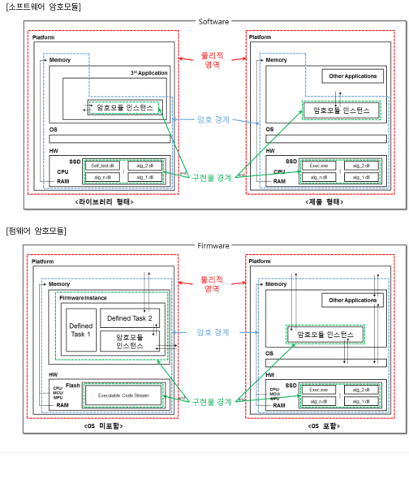
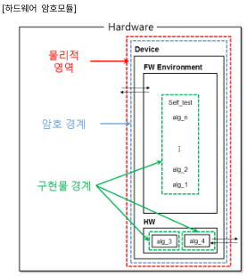
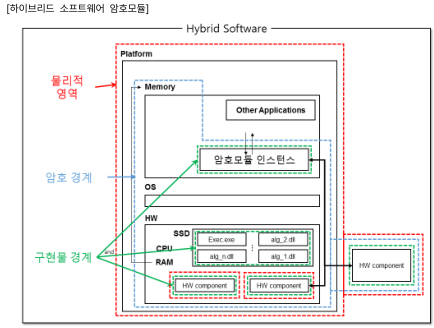
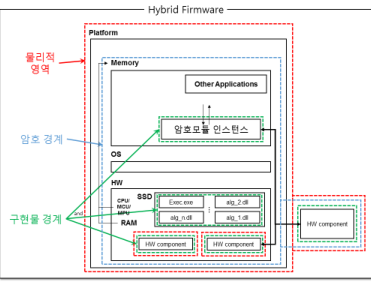
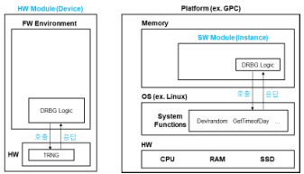
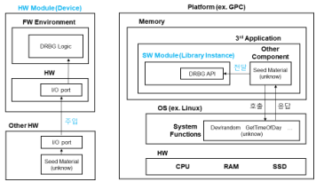
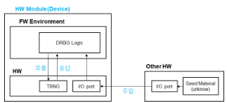
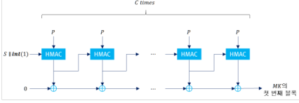
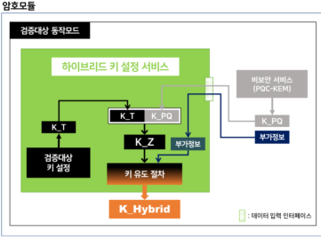

GVI Part 1 ('25.12)

Part 1

사형 및 구현 사례별解析


---

GVI Part 1

Guide for Vendor Implementations

---

Preface

1

---


## Contents

1장 日반방향 1.1 앗호모듈 제些什么 제류ю 및 방법 2 1.2 미巧용가비 보인구사항 3 1.3 에電유러터 임 시클러이터를 활용한 시營방법 4 2장 앗호모듈 명세 2.1 앗호모듈 결계 6 2.2 다중検증대로 동작모드 10 2.3 HW 앗호모듈 부정별 시형 요구사항 적용 방법 11 2.4 프로세서 가속 기념(PAA/PAI) 13 3장 앗호모듈 인터ф이스 4장 역할, 서비스 및 인증 4.1 기반过的 역할 18 4.2 다중 운임자 인증 매커니즘 20 4.3 道시 운임자 22 4.4戦기!능 23 4.5 운임체제 인증 매커니즘 활용 24 5장 스ф트웨어/ pemwe어 보안 6장 운임환경 7장 물리적 보안 7.1 보안수존 2 이상의 HW 앗호모듈 탐집 방지 시험 방법 30 7.2 탐집 증거 봬인 및 크ipping 시험 방법 32 7.3 보안수존 3 이상의 크ipping 시험 방법 33 7.4 보안수존 2 이지의 EFP/EFT 시험 방법 34 8장 비 cinトю 보안 9장 중요히 보안缜게변수 관리 9.1 소수 생성방법 38 9.2 엄드로피关爱 보안정책서 안내론 39 9.3 중요히 보안매개면수(SSP) 관리 표 적성 방법 42 9.4 SSP 제장 방법 45 9.5 날수발생기가 지원해가하는 최대 보안강도 46

---

10장 자가사항 10.1 조건부 암호고리즘 시항 방법(KAT) 50 10.2 KAT 시항 간소와 방법 1 – 내부 알고리즘의 KAT 52 10.3 KAT 시항 간소와 방법 2 – 무결성 감사를 풍한 KAT 54 10.4 라이브러리 형태 암호모듈의 동작 전 자가시항 방법 56 10.5 Non-reconfigurable 메모리 상의 구성요스에 대한 무결성検증방법 57 10.6 소프트阀门/팽 tam어 무결성 시항 58 10.7 조건부 암호히 쓸 입자시항 59 10.8 조건부 수동 주입 시항 61 10.9 주기적 자가시항 62 11장생명주기 보증 12장 기자 공격에 대한 대응 66 12.1 기자 공격에 대한 대응 66 12.2 기자 공격(비자치 풍격) 大응기록 67 13장 부속서 A – 문사 요구사항 67 14장 부속서 B – 암호모듈 보안정choice 67 15장 부속서 C – 검증대상 암호고leri즘 74 C.1 GCM 운임모드 사용 시 주做的事항 76 C.2 매시지 첨대병방 77 C.3 검증대상 암호고leri즘 인증관 길이 78 C.4 PBKDF 사용 시 주做的事항 79 C.5原谅내성 암호를 활용한 하이브리드 방식 79 16장 부속서 D – 검증대상 중요요보안마게면수 생성 및 설정 방법 84 D.1 자동화된 SSP 설정 방법 85 D.2 검증대상 SSP 생성방법 85 17장 부속서 E – 검증대상 인증메커니즘 85 18장 부속서 F – 검증대상 비자치 공격 완화 방법 92

참고문헌

---

GVI Part 1

Guide for Vendor Implementations

---


---

GVI Part 1

Guide for Vendor Implementations

---

기밀성(confidentiality)

単単単単単単単単単単単単単単単単単単単単単単単単単単単単単単単単単単単単単単単単単単単単単単単単単単単単単単単単単単単単単単単単単単単単単単単単単単単単単単単単単単単単単単単単単単単単単単単単単単単単単単単単単単単単単単単単単単単単単単単単単単単単単単単単単単単単単単単単単単単単単単単単単単単単単単単単単単単単単単単単単単単単単単単単単単単単単単単単単単単単単単単単単単単単単単単単単単単単単単単単単単単単単単単単単単単単単単単単単単単単単単単単単単単単単単単単単単単単単単単単単単単単単単単単単単単単単単単単単単単単単単単単単単単単単単単単単単単単単単単単単単単単単単単単単単単単単単単単単単単単単単単単単単単単単単単単単単単単単単単単単単単単単単単単単単単単単単単単単単単単単単単単単単単単単単単単単単単単単単単単単単単単単単単単単単単単単単単単単単単単単単単単単単単単単単単単単単単単単単単単単単単単単単単単単単単単単単単単単単単単単単単単単単単単単単単単単単単単単単単単単単単単単単単単単単単単単単単単単単単単単単単単単単単単単単単単単単単単単単単単単単単単単単単単単単単単単単単単単単単単単単単単単単単単単単単単単単単単単単単単単単単単単単単単単単単単単単単単単単単単単単単単単単単単単単単単単単単単単単単単単単単単単単単単単単単単単単単単単単単単単単単単単単単単単単単単単単単単単単単単単単単単単単単単単単単単単単単単単単単単単単単単単単単単単単単単単単単単単単単単単単単単単単単単単単単単単単単単単単単単単単単単単単単単単単単単単単単単単単単単単単単単単単単単単単単単単単単単単単単単単単単単単単単単単単単単単単単単単単単単単単単単単単単単単単単単単単単単単単単単単単単単単単単単単単単単単単単単単単単単単単単単単単単単単単単単単単単単単単単単単単単単単単単単単単単単単単単単単単単単単単単単単単単単単単単単単単単単単単単単単単単単単単単単単単単単単単単単単単単単単単単単単単単単単単単単単単単単単単単単単単単単単単単単単単単単単単単単単単単単単単単単単単単単単単単単単単単単単単単単単単単単単単単単単単単単単単単単単単単単単単単単単単単単単単単単単単単単単単単単単単単単単単単単単単単単単単単単単単単単単単単単単単単単単単単単単単単単単単単単単単単単単単単単単単単単単単単単単単単単単単単単単単単単単単単単単単単単単単単単単単単単単単単単単単単単単単単単単単単単単単単単単単単単単単単単単単単単単単単単単単単単単単単単単単単単単単単単単単単単単単単単単単単単単単単単単単単単単単単単単単単単単単単単単単単単単単単単単単単単単単単単単単単単単単単単単単単単単単単単単単単単単単単単単単単単単単単単単単単単単単単単単単単単単単単単単単単単単単単単単単単単単単単単単単単単単単単単単単単単単単単単単単単単単単単単単単単単単単単単単単単単単単単単単単単単単単単単単単単単単単単単単単単単単単単単単単単単単単単単単単単単単単単単単単単単単単単単単単単単単単単単単単単単単単単単単単単単単単単単単単単単単単単単単単単単単単単単単単単単単単単単単単単単単単単単単単単単単単単単単単単単単単単単単単単単単単単単単単単単単単単単単単単単単単単単単単単単単単単単単単単単単単単単単単単単単単単単単単単単単単単単単単単単単単単単単単単単単単単単単単単単単単単単単単単単単単単単単単単単単単単単単単単単単単単単単単単単単単単単単単単単単単単単単単単単単単単単単単単単単単単単単単単単単単単単単単単単単単単単単単単単単単単単単単単単単単単単単単単単単単単単単単単単単単単単単単単単単単単単単単単単単単単単単単単単単単単単単単単単単単単単単単単単単単単単単単単単単単単単単単単単単単単単単単単単単単単単単単単単単単単単単単単単単単単単単単単単単単単単単単単単単単単単単単単単単単単単単単単単単単単単単単単単単単単単単単単単単単単単単単単単単単単単単単単単単単単単単単単単単単単単単単単単単単単単単単単単単単単単単単単単単単単単単単単単単単単単単単単単単単単単単単単単単単単単単単単単単単単単単単単単単単単単単単単単単単単単単単単単単単単単単単単単単単単単単単単単単単単単単単単単単単単単単単単単単単単単単単単単単単単単単単単単単単単単単単単単単単単単単単単単単単単単単単単単単単単単単単単単単単単単単単単単単単単単単単単単単単単単単単単単単単単単単単単単単単単単単単単単単単単単単単単単単単単単単単単単単単単単単単単単単単単単単単単単単単単単単単単単単単単単単単単単単単単単単単単単単単単単単単単単単単単単単単単単単単単単単単単単単単単単単単単単単単単単単単単単単単単単単単単単単単単単単単単単単単単単単単単単単単単単単単単単単単単単単単単単単単単単単単単単単単単単単単単単単単単単単単単単単単単単単単単単

무결실(integrity)

---

## 소프트어(software)

## 스포츠웨어/펌\-포어 로드 시т(msoftware/firmware module load test)

## 암호경계(cryptographic boundary)

## 엔트로피(entropy)

## 역할(role)

## 운임자(operator)

## $$  유한상태모델(finite state model, FSM)  $$

## 자가시험(self-tests)

## 전자적 주입(electronic entry)

## 제로화(zerosisation)

---

탈부적OVER(removable cover)

펌포어(firmware)

하드웨어(hardware)

---

GVI Part 1

Guide for Vendor Implementations

---


## 1장  日本航

- 1.1 앱모모듈 재경증 시험 종류 및 방법
1.2 미적용 가능 보안요구사항
1.3 에율레이터 제 시물레이터를 활용한 시험방법
---

<table><tr><td>해당 보인수en (Applicable Levels)</td><td colspan="3">■ 1, 2, 3, 4</td></tr><tr><td>관련 키르드 (Keywords)</td><td colspan="3">■ 청히 보안 요구사항</td></tr><tr><td>최초 작성일</td><td>2022년 5월 17일</td><td>최종 수정일</td><td>2022년 5월 17일</td></tr></table>


### 100

### 答案

2

---

<table><tr><td>Exhibit Description (Applicable Levels)</td><td colspan="3">■ 1, 2, 3, 4</td></tr><tr><td>Keynote Keywords</td><td colspan="3">■ 全文 보안 요구사항</td></tr><tr><td>최초 제작일</td><td>2022년 5월 17일</td><td>최종 수정일</td><td>2024년 11월 18일</td></tr></table>


### 質問

- 【KS X SOC/IEC 1970年(午)記 説明 何をもうなまめるなら査める寛寢を査めるを査めるを査めるを査めるを査めるを査めるを査めるを査めるを査めるを査めるを査めるを査めるを査めるを査めるを査めるを査めるを査めるを査めるを査めるを査めるを査めるを査めるを査めるを査めるを査めるを査めるを査めるを査めるを査めるを査めるを査めるを査めるを査めるを査めるを査めるを査めるを査めるを査めるを査めるを査めるを査めるを査めるを査めるを査めるを査めるを査めるを査めるを査めるを査めるを査めるを査めるを査めるを査めるを査めるを査めるを査めるを査めるを査めるを査めるを査めるを査めるを査めるを査めるを査めるを査めるを査めるを査めるを査めるを査めるを査めるを査めるを査めるを査めるを査めるを査めるを査めるを査めるを査めるを査めるを査めるを査めるを査めるを査めるを査めるを査めるを査めるを査めるを査めるを査めるを査めるを査めるを査めるを査めるを査めるを査めるを査めるを査めるを査めるを査めるを査めるを査めるを査めるを査めるを査めるを査めるを査めるを査めるを査めるを査めるを査めるを査めるを査めるを査めるを査めるを査めるを査めるを査めるを査めるを査めるを査めるを査めるを査めるを査めるを査めるを査めるを査めるを査めるを査めるを査めるを査めるを査めるを査めるを査めるを査めるを査めるを査めるを査めるを査めるを査めるを査めるを査めるを査めるを査めるを査めるを査めるを査めるを査めるを査めるを査めるを査めるを査めるを査めるを査めるを査めるを査めるを査めるを査めるを査めるを査めるを査めるを査めるを査めるを査めるを査めるを査めるを査めるを査めるを査めるを査めるを査めるを査めるを査めるを査めるを査めるを査めるを査めるを査めるを査めるを査めるを査めるを査めるを査めるを査めるを査めるを査めるを査めるを査めるを査めるを査めるを査めるを査めるを査めるを査めるを査めるを査めるを査めるを査めるを査めるを査めるを査めるを査めるを査めるを査めるを査めるを査めるを査めるを査めるを査めるを査めるを査めるを査めるを査めるを査めるを査めるを査めるを査めるを査めるを査めるを査めるを査めるを査めるを査めるを査めるを査めるを査めるを査めるを査めるを査めるを査めるを査めるを査めるを査めるを査めるを査めるを査めるを査めるを査めるを査めるを査めるを査めるを査めるを査めるを査めるを査めるを査めるを査めるを査めるを査めるを査めるを査めるを査めるを査めるを査めるを査めるを査めるを査めるを査めるを査めるを査めるを査めるを査めるを査めるを査めるを査めるを査めるを査めるを査めるを査めるを査めるを査めるを査めるを査めるを査めるを査めるを査めるを査めるを査めるを査めるを査めるを査めるを査めるを査めるを査めるを査めるを査めるを査めるを査めるを査めるを査めるを査めるを査めるを査めるを査めるを査めるを査めるを査めるを査めるを査めるを査めるを査めるを査めるを査めるを査めるを査めるを査めるを査めるを査めるを査めるを査めるを査めるを査めるを査めるを査めるを査めるを査めるを査めるを査めるを査めるを査めるを査めるを査めるを査めるを査めるを査めるを査めるを査めるを査めるを査めるを査めるを査めるを査めるを査めるを査めるを査めるを査めるを査めるを査めるを査めるを査めるを査めるを査めるを査めるを査めるを査めるを査めるを査めるを査めるを査めるを査めるを査めるを査めるを査めるを査めるを査めるを査めるを査めるを査めるを査めるを査めるを査めるを査めるを査めるを査めるを査めるを査めるを査めるを査めるを査めるを査めるを査めるを査めるを査めるを査めるを査めるを査めるを査めるを査めるを査めるを査めるを査めるを査めるを査めるを査めるを査めるを査めるを査めるを査めるを査めるを査めるを査めるを査めるを査めるを査めるを査めるを査めるを査めるを査めるを査めるを査めるを査めるを査めるを査めるを査めるを査めるを査めるを査めるを査めるを査めるを査めるを査めるを査めるを査めるを査めるを査めるを査めるを査めるを査めるを査めるを査めるを査めるを査めるを査めるを査めるを査めるを査めるを査めるを査めるを査めるを査めるを査めるを査めるを査めるを査めるを査めるを査めるを査めるを査めるを査めるを査めるを査めるを査めるを査めるを査めるを査めるを査めるを査めるを査めるを査めるを査めるを査めるを査めるを査めるを査めるを査めるを査めるを査めるを査めるを査めるを査めるを査めるを査めるを査めるを査めるを査めるを査めるを査めるを査めるを査めるを査めるを査めるを査めるを査めるを査めるを査めるを査めるを査めるを査めるを査めるを査めるを査めるを査めるを査めるを査めるを査めるを査めるを査めるを査めるを査めるを査めるを査めるを査めるを査めるを査めるを査めるを査めるを査めるを査めるを査めるを査めるを査めるを査めるを査めるを査めるを査めるを査めるを査めるを査めるを査めるを査めるを査めるを査めるを査めるを査めるを査めるを査めるを査めるを査めるを査めるを査めるを査めるを査めるを査めるを査めるを査めるを査めるを査めるを査めるを査めるを査めるを査めるを査めるを査めるを査めるを査めるを査めるを査めるを査めるを査めるを査めるを査めるを査めるを査めるを査めるを査めるを査めるを査めるを査めるを査めるを査めるを査めるを査めるを査めるを査めるを査めるを査めるを査めるを査めるを査めるを査めるを査めるを査めるを査めるを査めるを査めるを査めるを査めるを査めるを査めるを査めるを査めるを査めるを査めるを査めるを査めるを査めるを査めるを査めるを査めるを査めるを査めるを査めるを査めるを査めるを査めるを査めるを査めるを査めるを査めるを査めるを査めるを査めるを査めるを査めるを査めるを査めるを査めるを査めるを査めるを査めるを査めるを査めるを査めるを査めるを査めるを査めるを査めるを査めるを査めるを査めるを査めるを査めるを査めるを査めるを査めるを査めるを査めるを査めるを査めるを査めるを査めるを査めるを査めるを査めるを査めるを査めるを査めるを査めるを査めるを査めるを査めるを査めるを査めるを査めるを査めるを査めるを査めるを査めるを査めるを査めるを査めるを査めるを査めるを査めるを査めるを査めるを査めるを査めるを査めるを査めるを査めるを査めるを査めるを査めるを査めるを査めるを査めるを査めるを査めるを査めるを査めるを査めるを査めるを査めるを査めるを査めるを査めるを査めるを査めるを査めるを査めるを査めるを査めるを査めるを査めるを査めるを査めるを査めるを査めるを査めるを査めるを査めるを査めるを査めるを査めるを査めるを査めるを査めるを査めるを査めるを査めるを査めるを査めるを査めるを査めるを査めるを査めるを査めるを査めるを査めるを査めるを査めるを査めるを査めるを査めるを査めるを査めるを査めるを査めるを査めるを査めるを査めるを査めるを査めるを査めるを査めるを査めるを査めるを査めるを査めるを査めるを査めるを査めるを査めるを査めるを査めるを査めるを査めるを査めるを査めるを査めるを査めるを査めるを査めるを査めるを査めるを査めるを査めるを査めるを査めるを査めるを査めるを査めるを査めるを査めるを査めるを査めるを査めるを査めるを査めるを査めるを査めるを査めるを査めるを査めるを査めるを査めるを査めるを査めるを査めるを査めるを査めるを査めるを査めるを査めるを査めるを査めるを査めるを査めるを査めるを査めるを査めるを査めるを査めるを査めるを査めるを査めるを査めるを査めるを査めるを査めるを査めるを査めるを査めるを査めるを査めるを査めるを査めるを査めるを査めるを査めるを査めるを査めるを査めるを査めるを査めるを査めるを査めるを査めるを査めるを査めるを査めるを査めるを査めるを査めるを査めるを査めるを査めるを査めるを査めるを査めるを査めるを査めるを査めるを査めるを査めるを査めるを査めるを査めるを査めるを査めるを査めるを査めるを査めるを査めるを査めるを査めるを査めるを査めるを査めるを査めるを査めるを査めるを査めるを査めるを査めるを査めるを査めるを査めるを査めるを査めるを査めるを査めるを査めるを査めるを査めるを査めるを査めるを査めるを査めるを査めるを査めるを査めるを査めるを査めるを査めるを査めるを査めるを査めるを査めるを査めるを査めるを査めるを査めるを査めるを査めるを査めるを査めるを査めるを査めるを査めるを査めるを査めるを査めるを査めるを査めるを査めるを査めるを査めるを査めるを査めるを査めるを査めるを査めるを査めるを査めるを査めるを査めるを査めるを査めるを査めるを査めるを査めるを査めるを査めるを査めるを査めるを査めるを査めるを査めるを査めるを査めるを査めるを査めるを査めるを査めるを査めるを査めるを査めるを査めるを査めるを査めるを査めるを査めるを査めるを査めるを査めるを査めるを査めるを査めるを査めるを査めるを査めるを査めるを査めるを査めるを査めるを査めるを査めるを査めるを査めるを査めるを査めるを査めるを査めるを査めるを査めるを査めるを査めるを査めるを査めるを査めるを査めるを査めるを査めるを査めるを査めるを査めるを査めるを査めるを査めるを査めるを査めるを査めるを査めるを査めるを査めるを査めるを査めるを査めるを査めるを査めるを査めるを査めるを査めるを査めるを査めるを査めるを査めるを査めるを査めるを査めるを査めるを査めるを査めるを査めるを査めるを査めるを査めるを査めるを査めるを査めるを査めるを査めるを査めるを査めるを査めるを査めるを査めるを査めるを査めるを査めるを査めるを査めるを査めるを査めるを査めるを査めるを査めるを査めるを査めるを査めるを査めるを査めるを査めるを査めるを査めるを査めるを査めるを査めるを査めるを査めるを査めるを査めるを査めるを査
### 答案

3

---


4

---


---

<table><tr><td>해당 보인수율(Applicable Levels)</td><td colspan="3">1, 2, 3, 4</td></tr><tr><td rowspan="2">관련 키워드(Keywords)</td><td colspan="3">Anforder 유형</td></tr><tr><td colspan="3">Anforder覈정</td></tr><tr><td>최초 직정일</td><td>2022년 5월 17일</td><td>최종 수정일</td><td>2022년 5월 17일</td></tr></table>


- import 构造
import 构造
import 构造中
构造中
构造中
构造中
构造中
构造中
构造中
构造中
构造中
构造中
构造中
构造中
构造中
构造中
构造中
构造中
构造中
构造中
构造中
构造中
构造中
构造中
构造中
构造中
构造中
构造中
构造中
构造中
构造中
构造中
构造中
构造中
构造中
构造中
构造中
构造中
构造中
构造中
构造中
构造中
构造中
构造中
构造中
构造中
构造中
构造中
构造中
构造中
构造中
构造中
构造中
构造中
构造中
构造中
构造中
构造中
构造中
构造中
构造中
构造中
构造中
构造中
构造中
构造中
构造中
构造中
构造中
构造中
构造中
构造中
构造中
构造中
构造中
构造中
构造中
构造中
构造中
构造中
构造中
构造中
构造中
构造中
构造中
构造中
构造中
构造中
构造中
构造中
构造中
构造中
构造中
构造中
构造中
构造中
构造中
构造中
构造中
构造中
构造中
构造中
构造中
构造中
构造中
构造中
构造中
构造中
构造中
构造中
构造中
构造中
构造中
构造中
构造中
构造中
构造中
构造中
构造中
构造中
构造中
构造中
构造中
构造中
构造中
构造中
构造中
构造中
构造中
构造中
构造中
构造中
构造中
构造中
构造中
构造中
构造中
构造中
构造中
构造中
构造中
构造中
构造中
构造中
构造中
构造中
构造中
构造中
构造中
构造中
构造中
构造中
构造中
构造中
构造中
构造中
构造中
构造中
构造中
构造中
构造中
构造中
构造中
构造中
构造中
构造中
构造中
构造中
构造中
构造中
构造中
构造中
构造中
构造中
构造中
构造中
构造中
构造中
构造中
构造中
构造中
构造中
构造中
构造中
构造中
构造中
构造中
构造中
构造中
构造中
构造中
构造中
构造中
构造中
构造中
构造中
构造中
构造中
构造中
构造中
构造中
构造中
构造中
构造中
构造中
构造中
构造中
构造中
构造中
构造中
构造中
构造中
构造中
构造中
构造中
构造中
构造中
构造中
构造中
构造中
构造中
构造中
构造中
构造中
构造中
构造中
构造中
构造中
构造中
构造中
构造中
构造中
构造中
构造中
构造中
构造中
构造中
构造中
构造中
构造中
构造中
构造中
构造中
构造中
构造中
构造中
构造中
构造中
构造中
构造中
构造中
构造中
构造中
构造中
构造中
构造中
构造中
构造中
构造中
构造中
构造中
构造中
构造中
构造中
构造中
构造中
构造中
构造中
构造中
构造中
构造中
构造中
构造中
构造中
构造中
构造中
构造中
构造中
构造中
构造中
构造中
构造中
构造中
构造中
构造中
构造中
构造中
构造中
构造中
构造中
构造中
构造中
构造中
构造中
构造中
构造中
构造中
构造中
构造中
构造中
构造中
构造中
构造中
构造中
构造中
构造中
构造中
构造中
构造中
构造中
构造中
构造中
构造中
构造中
构造中
构造中
构造中
构造中
构造中
构造中
构造中
构造中
构造中
构造中
构造中
构造中
构造中
构造中
构造中
构造中
构造中
构造中
构造中
构造中
构造中
构造中
构造中
构造中
构造中
构造中
构造中
构造中
构造中
构造中
构造中
构造中
构造中
构造中
构造中
构造中
构造中
构造中
构造中
构造中
构造中
构造中
构造中
构造中
构造中
构造中
构造中
构造中
构造中
构造中
构造中
构造中
构造中
构造中
构造中
构造中
构造中
构造中
构造中
构造中
构造中
构造中
构造中
构造中
构造中
构造中
构造中
构造中
构造中
构造中
构造中
构造中
构造中
构造中
构造中
构造中
构造中
构造中
构造中
构造中
构造中
构造中
构造中
构造中
构造中
构造中
构造中
构造中
构造中
构造中
构造中
构造中
构造中
构造中
构造中
构造中
构造中
构造中
构造中
构造中
构造中
构造中
构造中
构造中
构造中
构造中
构造中
构造中
构造中
构造中
构造中
构造中
构造中
构造中
构造中
构造中
构造中
构造中
构造中
构造中
构造中
构造中
构造中
构造中
构造中
构造中
构造中
构造中
构造中
构造中
构造中
构造中
构造中
构造中
构造中
构造中
构造中
构造中
构造中
构造中
构造中
构造中
构造中
构造中
构造中
构造中
构造中
构造中
构造中
构造中
构造中
构造中
构造中
构造中
构造中
构造中
构造中
构造中
构造中
构造中
构造中
构造中
构造中
构造中
构造中
构造中
构造中
构造中
构造中
构造中
构造中
构造中
构造中
构造中
构造中
构造中
构造中
构造中
构造中
构造中
构造中
构造中
构造中
构造中
构造中
构造中
构造中
构造中
构造中
构造中
构造中
构造中
构造中
构造中
构造中
构造中
构造中
构造中
构造中
构造中
构造中
构造中
构造中
构造中
构造中
构造中
构造中
构造中
构造中
构造中
构造中
构造中
构造中
构造中
构造中
构造中
构造中
构造中
构造中
构造中
构造中
构造中
构造中
构造中
构造中
构造中
构造中
构造中
构造中
构造中
构造中
构造中
构造中
构造中
构造中
构造中
构造中
构造中
构造中
构造中
构造中
构造中
构造中
构造中
构造中
构造中
构造中
构造中
构造中
构造中
构造中
构造中
构造中
构造中
构造中
构造中
构造中
构造中
构造中
构造中
构造中
构造中
构造中
构造中
构造中
构造中
构造中
构造中
构造中
构造中
构造中
构造中
构造中
构造中
构造中
构造中
构造中
构造中
构造中
构造中
构造中
构造中
构造中
构造中
构造中
构造中
构造中
构造中
构造中
构造中
构造中
构造中
构造中
构造中
构造中
构造中
构造中
构造中
构造中
构造中
构造中
构造中
构造中
构造中
构造中
构造中
构造中
构造中
构造中
构造中
构造中
构造中
构造中
构造中
构造中
构造中
构造中
构造中
构造中
构造中
构造中
构造中
构造中
构造中
构造中
构造中
构造中
构造中
构造中
构造中
构造中
构造中
构造中
构造中
构造中
构造中
构造中
构造中
构造中
构造中
构造中
构造中
构造中
构造中
构造中
构造中
构造中
构造中
构造中
构造中
构造中
构造中
构造中
构造中
构造中
构造中
构造中
构造中
构造中
构造中
构造中
构造中
构造中
构造中
构造中
构造中
构造中
构造中
构造中
构造中
构造中
构造中
构造中
构造中
构造中
构造中
构造中
构造中
构造中
构造中
构造中
构造中
构造中
构造中
构造中
构造中
构造中
构造中
构造中
构造中
构造中
构造中
构造中
构造中
构造中
构造中
构造中
构造中
构造中
构造中
构造中
构造中
构造中
构造中
构造中
构造中
构造中
构造中
构造中
构造中
构造中
构造中
构造中
构造中
构造中
构造中
构造中
构造中
构造中
构造中
构造中
构造中
构造中
构造中
构造中
构造中
构造中
构造中
构造中
构造中
构造中
构造中
构造中
构造中
构造中
构造中
构造中
构造中
构造中
构造中
构造中
构造中
构造中
构造中
构造中
构造中
构造中
构造中
构造中
构造中
构造中
构造中
构造中
构造中
构造中
构造中
构造中
构造中
构造中
构造中
构造中
构造中
构造中
构造中
构造中
构造中
构造中
构造中
构造中
构造中
构造中
构造中
构造中
构造中
构造中
构造中
构造中
构造中
构造中
构造中
构造中
构造中
构造中
构造中
构造中
构造中
构造中
构造中
构造中
构造中
构造中
构造中
构造中
构造中
构造中
构造中
构造中
构造中
构造中
构造中
构造中
构造中
构造中
构造中
构造中
构造中
构造中
构造中
构造中
构造中
构造中
构造中
构造中
构造中
构造中
构造中
构造中
构造中
构造中
构造中
构造中
构造中
构造中
构造中
构造中
构造中
构造中
构造中
构造中
构造中
构造中
构造中
构造中
构造中
构造中
构造中
构造中
构造中
构造中
构造中
构造中
构造中
构造中
构造中
构造中
构造中
构造中
构造中
构造中
构造中
构造中
构造中
构造中
构造中
构造中
构造中
构造中
构造中
构造中
构造中
构造中
构造中
构造中
构造中
构造中
构造中
构造中
构造中
构造中
构造中
构造中
构造中
构造中
构造中
构造中
构造中
构造中
构造中
构造中
构造中
构造中
构造中
构造中
构造中
构造中
构造中
构造中
构造中
构造中
构造中
构造中
构造中
构造中
构造中
构造中
构造中
构造中
构造中
构造中
构造中
构造中
构造中
构造中
构造中
构造中
构造中
构造中
构造中
构造中
构造中
构造中
构造中
构造中
构造中
构造中
构造中
构造中
构造中
构造中
构造中
构造中
构造中
构造中
构造中
构造中
构造中
构造中
构造中
构造中
构造中
构造中
构造中
构造中
构造中
构造中
构造中
构造中
构造中
构造中
构造中
构造中
构造中
构造中
构造中
构造中
构造中
构造中
构造中
构造中
构造中
构造中
构造中
构造中
构造中
构造中
构造中
构造中
构造中
构造中
构造中
构造中
构造中
构造中
构造中
构造中
构造中
构造中
构造中
构造中
构造中
构造中
构造中
构造中
构造中
构造中
构造中
构造中
构造中
构造中
构造中
构造中
构造中
构造中
构造中
构造中
构造中
构造中
构造中
构造中
构造中
构造中
构造中
构造中
构造中
构造中
构造中
构造中
构造中
构造中
构造中
构造中
构造中
构造中
构造中
构造中
构造中
构造中
构造中
构造中
### 質問

### 答案


6

---



---





8

---



9

---

<table><tr><td>head 보인수율(Aplicable Levels)</td><td colspan="3">1, 2, 3, 4</td></tr><tr><td>관련 키워드(Keywords)</td><td colspan="3">다증검증대상 동작모드</td></tr><tr><td>최초 적정일</td><td>2022년 5월 17일</td><td>최종 주정일</td><td>2024년 11월 18일</td></tr><tr><td colspan="4">배경</td></tr><tr><td colspan="4">【KS X ISO/IEC 19790】7.2.4 점에서면 약호모듈을 단구検증대상 동작모드로만 제한하고 있지 않고 때문에 모듈은 복수 개의検증대상 동작모드로>,할 수 있다。예를 들어, 하나는検증대상 동작모드에서는 모든 함수, 서비스, CSP를 사용하고 다른検증대상 동작모드 에서는 일부면 masonry어짐으로 구현할 수 있다。</td></tr><tr><td colspan="4">문헌</td></tr><tr><td colspan="4">■ 복수 개의検증대상 동작모드를 갖는 약호모듈을 구현해도 되는가? 가능한 경우 요구사항은 무엇인가?</td></tr><tr><td colspan="4">답변</td></tr><tr><td colspan="4">■다음条件を溝화하는 경우 복수 개의検증대상 동작모드를 갖는 약호모듈을 구현할 수 있다。보안정보자기가 각각検증대상 동작모드에 대해 다음 정보들을 포함하여 한다。-各種検증대상 동작모드에 대한 정의-各種検증대상 동작모드에>, setting 방법-各種検증대상 동작모드에서 이용 가능한 서비스- various検증대상 동작모드에서使用的 알고리움- various検증대상동작모드에서 사용되는 OMG</td></tr></table>


---

<table><tr><td>해당 보인수율(Applicable Levels)</td><td colspan="3">1, 2, 3, 4</td></tr><tr><td>관련 키워드(Keywords)</td><td colspan="3">안모 dos들 명세 관련 항목</td></tr><tr><td>최초 적정일</td><td>2022년 5월 17일</td><td>최종 수정일</td><td>2022년 5월 17일</td></tr></table>


11

---

<table><tr><td>구분</td><td>설명</td></tr><tr><td>비교 시기</td><td>각 항국에海南호는 “다icken” 세부 부모이 실제로존재지る 주면 에대서만 믿아고,하니의 부모에 대한 모든 동국사기이 어려운임을 경우 다른 부모에 대한동국사기를 무주活得할 수 있다.</td></tr><tr><td>별도 시기</td><td>각 항국에海南호는 “다icken” 세부 부모이 실제로존재지る 주면을 확인하고, 기존 부모에 시기되 평인다.</td></tr></table>


■ 予시

12

---

<table><tr><td>에드 보인수en (Applicable Levels)</td><td colspan="3">1, 2, 3, 4</td></tr><tr><td>관련关键词 (Keywords)</td><td colspan="3">Processor Algorithm Accelerator(PAA) Processor Algorithm Implementation(PAI)</td></tr><tr><td>최초 직정일</td><td>2024년 9월 13일</td><td>최종 수정일</td><td>2024년 11월 18일</td></tr></table>


---

---


---

GVI Part 1

Guide for Vendor Implementations

---


- 4.1 인가받은 역할
4.2 다중 운임자 인증 매커니즘
4.3 동시 운임자
4.4 闺蜜기념
4.5 운임체제 인증 매커니즘 활용
---

<table><tr><td>해당 보인수율(Applicable Levels)</td><td colspan="2">■ 2, 3, 4</td></tr><tr><td rowspan="2">관련 키워드(Keywords)</td><td colspan="2">인가진 역할</td></tr><tr><td colspan="2">인증이 필요한 서비스</td></tr><tr><td>최초 직정일</td><td>2022년 5월 17일</td><td>최종 수정일</td></tr></table>


1. 원시나의 와상상실리 (SHA-2, LSH, SHA-3) 2. 원시나의 와상상실리 (SHA-2, LSH, SHA-3)

18

---

Boundary )부 )운임环境中에 포함된 말는 뒤지런 언론으로 보여스러워하다. 이 정신 을 운동되며!모드의 경향(Cryptographic Boundary)                             ].                             ].                             ].                             ].                             ].                             ].                             ].                             ].                             ].                             ].                             ].                             ].                             ].                             ].                             ].                             ].                             ].                             ].                             ].                             ].                             ].                             ].                             ].                             ].                             ].                             ].                             ].                             ].                             ].                             ].                             ].                             ].                             ].                             ].                             ].                             ].                             ].                             ].                             ].                             ].                             ].                             ].                             ].                             ].                             ].                             ].                             ].                             ].                             ].                             ].                             ].                             ].                             ].                             ].                             ].                             ].                             ].                             ].                             ].                             ].                             ].                             ].                             ].                             ].                             ].                             ].                             ].                             ].                             ].                             ].                             ].                             ].                             ].                             ].                             ].                             ].                             ].                             ].                             ].                             ].                             ].                             ].                             ].                             ].                             ].                             ].                             ].                             ].                             ].                             ].                             ].                             ].                             ].                             ].                             ].                             ].                             ].                             ].                             ].                             ].                             ].                             ].                             ].                             ].                             ].                             ].                             ].                             ].                             ].                             ].                             ].                             ].                             ].                             ].                             ].                             ].                             ].                             ].                             ].                             ].                             ].                             ].                             ].                             ].                             ].                             ].                             ].                             ].                             ].                             ].                             ].                             ].                             ].                             ].                             ].                             ].                             ].                             ].                             ].                             ].                             ].                             ].                             ].                             ].                             ].                             ].                             ].                             ].                             ].                             ].                             ].                             ].                             ].                             ].                             ].                             ].                             ].                             ].                             ].                             ].                             ].                             ].                             ].                             ].                             ].                             ].                             ].                             ].                             ].                             ].                             ].                             ].                             ].                             ].                             ].                             ].                             ].                             ].                             ].                             ].                             ].                             ].                             ].                             ].                             ].                             ].                             ].                             ].                             ].                             ].                             ].                             ].                             ].                             ].                             ].                             ].                             ].                             ].                             ].                             ].                             ].                             ].                             ].                             ].                             ].                             ].                             ].                             ].                             ].                             ].                             ].                             ].                             ].                             ].                             ].                             ].                             ].                             ].                             ].                             ].                             ].                             ].                             ].                             ].                             ].                             ].                             ].                             ].                             ].                             ].                             ].                             ].                             ].                             ].                             ].                             ].                             ].                             ].                             ].                             ].                             ].                             ].                             ].                             ].                             ].                             ].                             ].                             ].                             ].                             ].                             ].                             ].                             ].                             ].                             ].                             ].                             ].                             ].                             ].                             ].                             ].                             ].                             ].                             ].                             ].                             ].                             ].                             ].                             ].                             ].                             ].                             ].                             ].                             ].                             ].                             ].                             ].                             ].                             ].                             ].                             ].                             ].                             ].                             ].                             ].                             ].                             ].                             ].                             ].                             ].                             ].                             ].                             ].                             ].                             ].                             ].                             ].                             ].                             ].                             ].                             ].                             ].                             ].                             ].                             ].                             ].                             ].                             ].                             ].                             ].                             ].                             ].                             ].                             ].                             ].                             ].                             ].                             ].                             ].                             ].                             ].                             ].                             ].                             ].                             ].                             ].                             ].                             ].                             ].                             ].                             ].                             ].                             ].                             ].                             ].                             ].                             ].                             ].                             ].                             ].                             ].                             ].                             ].                             ].                             ].                             ].                             ].                             ].                             ].                             ].                             ].                             ].                             ].                             ].                             ].                             ].                             ].                             ].                             ].                             ].                             ].                             ].                             ].                             ].                             ].                             ].                             ].                             ].                             ].                             ].                             ].                             ].                             ].                             ].                             ].                             ].                             ].                             ].                             ].                             ].                             ].                             ].                             ].                             ].                             ].                             ].                             ].                             ].                             ].                             ].                             ].                             ].                             ].                             ].                             ].                             ].                             ].                             ].                             ].                             ].                             ].                             ].                             ].                             ].                             ].                             ].                             ].                             ].                             ].                             ].                             ].                             ].                             ].                             ].                             ].                             ].                             ].                             ].                             ].                             ].                             ].                             ].                             ].                             ].                             ].                             ].                             ].                             ].                             ].                             ].                             ].                             ].                             ].                             ].                             ].                             ].                             ].                             ].                             ].                             ].                             ].                             ].                             ].                             ].                             ].                             ].                             ].                             ].                             ].                             ].                             ].                             ].                             ].                             ].                             ].                             ].                             ].                             ].                             ].                             ].                             ].                             ].                             ].                             ].                             ].                             ].                             ].                             ].                             ].                             ].                             ].                             ].                             ].                             ].                             ].                             ].                             ].                             ].                             ].                             ].                             ].                             ].                             ].                             ].                             ].                             ].                             ].                             ].                             ].                             ].                             ].                             ].                             ].                             ].                             ].                             ].                             ].                             ].                             ].                             ].                             ].                             ].                             ].                             ].                             ].                             ].                             ].                             ].                             ].                             ].                             ].                             ].                             ].                             ].                             ].                             ].                             ].                             ].                             ].                             ].                             ].                             ].                             ].                             ].                             ].                             ].                             ].                             ].                             ].                             ].                             ].                             ].                             ].                             ].                             ].                             ].                             ].                             ].                             ].                             ].                             ].                             ].                             ].                             ].                             ].                             ].                             ].                             ].                             ].                             ].                             ].                             ].                             ].                             ].                             ].                             ].                             ].                             ].                             ].                             ].                             ].                             ].                             ].                             ].                             ].                             ].                             ].                             ].                             ].                             ].                             ].                             ].                             ].                             ].                             ].                             ].                             ].                             ].                             ].                             ].                             ].                             ].                             ].                             ].                             ].                             ].                             ].                             ].                             ].                             ].                             ].                             ].                             ].                             ].                             ].                             ].                             ].                             ].                             ].                             ].                             ].                             ].                             ].                             ].                             ].                             ].                             ].                             ].                             ].                             ].                             ].                             ].                             ].                             ].                             ].                             ].                             ].                             ].                             ].                             ].                             ].                             ].                             ].                             ].                             ].                             ].                             ].                             ].                             ].                             ].                             ].                             ].                             ].                             ].                             ].                             ].                             ].                             ].                             ].                             ].                             ].                             ].                             ].                             ].                             ].                             ].                             ].                             ].                             ].                             ].                             ].                             ].                             ].                             ].                             ].                             ].                             ].                             ].                             ].                             ].                             ].                             ].                             ].                             ].                             ].                             ].                             ].                             ].                             ].                             ].                             ].                             ].                             ].                             ].                             ].                             ].                             ].                             ].                             ].                             ].                             ].                             ].                             ].                             ].                             ].                             ].                             ].                             ].                             ].                             ].                             ].                             ].                             ].                             ].                             ].                             ].                             ].                             ].                             ].                             ].                             ].                             ].                             ].                             ].                             ].                             ].                             ].                             ].                             ].                             ].                             ].                             ].                             ].                             ].                             ].                             ].                             ].                             ].                             ].                             ].                             ].                             ].                             ].                             ].                             ].                             ].                             ].                             ].                             ].                             ].                             ].                             ].                             ].                             ].                             ].                             ].                             ].                             ].                             ].                             ].                             ].                             ].                             ].                             ].                             ].                             ].                             ].                             ].                             ].                             ].                             ].                             ].                             ].                             ].                             ].                             ].                             ].                             ].                             ].                             ].                             ].                             ].                             ].                             ].                             ].                             ].                             ].                             ].                             ].                             ].                             ].                             ].                             ].                             ].                             ].                             ].                             ].                             ].                             ].                             ].                             ].                             ].                             ].                             ].                             ].                             ].                             ].                             ].                             ].                             ].                             ].                             ].                             ].                             ].                             ].                             ].                             ].                             ].                             ].                             ].                             ].                             ].                             ].                             ].                             ].                             ].                             ].                             ].                             ].                             ].                             ].                             ].                             ].                             ].                             ].                             ].                             ].                             ].                             ].                             ].                             ].                             ].                             ].                             ].                             ].                             ].                             ].                             ].                             ].                             ].                             ].                             ].                             ].                             ].                             ].                             ].                             ].                             ].                             ].                             ].                             ].                             ].                             ].                             ].                             ].                             ].                             ].                             ].                             ].                             ].                             ].                             ].                             ].                             ].                             ].                             ].                             ].                             ].                             ].                             ].                             ].                             ].                             ].                             ].                             ].                             ].                             ].                             ].                             ].                             ].                             ].                             ].                             ].                             ].                             ].                             ].                             ].                             ].                             ].                             ].                             ].                             ].                             ].                             ].                             ].                             ].                             ].                             ].                             ].                             ].                             ].                             ].                             ].                             ].                             ].                             ].                             ].                             ].                             ].                             ].                             ].                             ].                             ].                             ].                             ].                             ].                             ].                             ].                             ].                             ].                             ].                             ].                             ].                             ].                             ].                             ].                             ].                             ].                             ].                             ].                             ].                             ].                             ].                             ].                             ].                             ].                             ].                             ].                             ].                             ].                             ].                             ].                             ].                             ].                             ].                             ].                             ].                             ].                             ].                             ].                             ].                             ].                             ].                             ].                             ].                             ].                             ].                             ].                             ].                             ].                             ].                             ].                             ].                             ].                             ].                             ].                             ].                             ].                             ].                             ].                             ].                             ].                             ].                             ].                             ].                             ].                             ].                             ].                             ].                             ].                             ].                             ].                             ].                             ].                             ].                             ].                             ].                             ].                             ].                             ].                             ].                             ].                             ].                             ].                             ].                             ].                             ].                             ].                             ].                             ].                             ].                             ].                             ].                             ].                             ].                             ].                             ].                             ].                             ].                             ].                             ].                             ].                             ].                             ].                             ].                             ].                             ].                             ].                             ].                             ].                             ].                             ].                             ].                             ].                             ].                             ].                             ].                             ].                             ].                             ].                             ].                             ].                             ].                             ].                             ].                             ].                             ].                             ].                             ].                             ].                             ].                             ].                             ].                             ].                             ].                             ].                             ].                             ].                             ].                             ].                             ].                             ].                             ].                             ].                             ].                             ].                             ].                             ].                             ].                             ].                             ].                             ].                             ].                             ].                             ].                             ].                             ].                             ].                             ].                             ].                             ].                             ].                             ].                             ].                             ].                             ].                             ].                             ].                             ].                             ].                             ].                             ].                             ].                             ].                             ].                             ].                             ].                             ].                             ].                             ].                             ].                             ].                             ].                             ].                             ].                             ].                             ].                             ].                             ].                             ].                             ].                             ].                             ].                             ].                             ].                             ].                             ].                             ].                             ].                             ].                             ].                             ].                             ].                             ].                             ].                             ].                             ].                             ].                             ].                             ].                             ].                             ].                             ].                             ].                             ].                             ].                             ].                             ].                             ].                             ].                             ].                             ].                             ].                             ].                             ].                             ].                             ].                             ].                             ].                             ].                             ].                             ].                             ].                             ].                             ].                             ].                             ].                             ].                             ].                             ].                             ].                             ].                             ].                             ].                             ].                             ].                             ].                             ].                             ].                             ].                             ].                             ].                             ].                             ].                             ].                             ].                             ].                             ].                             ].                             ].                             ].                             ].                             ].                             ].                             ].                             ].                             ].                             ].                             ].                             ].                             ].                             ].                             ].                             ].                             ].                             ].                             ].                             ].                             ].                             ].                             ].                             ].                             ].                             ].                             ].                             ].                             ].                             ].                             ].                             ].                             ].                             ].                             ].                             ].                             ].                             ].                             ].                             ].                             ].                             ].                             ].                             ].                             ].                             ].                             ].                             ].                             ].                             ].                             ].                             ].                             ].                             ].                             ].                             ].                             ].                             ].                             ].                             ].                             ].                             ].                             ].                             ].                             ].                             ].                             ].                             ].                             ].                             ].                             ].                             ].                             ].                             ].                             ].                             ].                             ].                             ].                             ].                             ].                             ].                             ].                             ].                             ].                             ].                             ].                             ].                             ].                             ].                             ].                             ].                             ].                             ].                             ].                             ].                             ].                             ].                             ].                             ].                             ].                             ].                             ].                             ].                             ].                             ].                             ].                             ].                             ].                             ].                             ].                             ].                             ].                             ].                             ].                             ].                             ].                             ].                             ].                             ].                             ].                             ].                             ].                             ].                             ].                             ].                             ].                             ].                             ].                             ].                             ].                             ].                             ].                             ].                             ].                             ].                             ].                             ].                             ].                             ].                             ].                             ].                             ].                             ].                             ].                             ].                             ].                             ].                             ].                             ].                             ].                             ].                             ].                             ].                             ].                             ].                             ].                             ].                             ].                             ].                             ].                             ].                             ].                             ].                             ].                             ].                             ].                             ].                             ].                             ].                             ].                             ].                             ].                             ].                             ].                             ].                             ].                             ].                             ].                             ].                             ].                             ].                             ].                             ].                             ].                             ].                             ].                             ].                             ].                             ].                             ].                             ].                             ].                             ].                             ].                             ].                             ].                             ].                             ].                             ].                             ].                             ].                             ].                             ].                             ].                             ].                             ].                             ].                             ].                             ].                             ].                             ].                             ].                             ].                             ].                             ].                             ].                             ].                             ].                             ].                             ].                             ].                             ].                             ].                             ].                             ].                             ].                             ].                             ].                             ].                             ].                             ].                             ].                             ].                             ].                             ].                             ].                             ].                             ].                             ].                             ].                             ].                             ].                             ].                             ].                             ].                             ].                             ].                             ].                             ].                             ].                             ].                             ].                             ].                             ].                             ].                             ].                             ].                             ].                             ].                             ].                             ].                             ].                             ].                             ].                             ].                             ].                             ].                             ].                             ].                             ].                             ].                             ].                             ].                             ].                             ].                             ].                             ].                             ].                             ].                             ].                             ].                             ].                             ].                             ].                             ].                             ].                             ].                             ].                             ].                             ].                             ].                             ].                             ].                             ].                             ].                             ].                             ].                             ].                             ].                             ].                             ].                             ].                             ].                             ].                             ].                             ].                             ].                             ].                             ].                             ].                             ].                             ].                             ].                             ].                             ].                             ].                             ].                             ].                             ].                             ].                             ].                             ].                             ].                             ].                             ].                             ].                             ].                             ].                             ].                             ].                             ].                             ].                             ].                             ].                             ].                             ].                             ].                             ].                             ].                             ].                             ].                             ].                             ].                             ].                             ].                             ].                             ].                             ].                             ].                             ].                             ].                             ].                             ].                             ].                             ].                             ].                             ].                             ].                             ].                             ].                             ].                             ].                             ].                             ].                             ].                             ].                             ].                             ].                             ].                             ].                             ].                             ].                             ].                             ].                             ].                             ].                             ].                             ].                             ].                             ].                             ].                             ].                             ].                             ].                             ].                             ].                             ].                             ].                             ].                             ].                             ].                             ].                             ].                             ].                             ].                             ].                             ].                             ].                             ].                             ].                             ].                             ].                             ].                             ].                             ].                             ].                             ].                             ].                             ].                             ].                             ].                             ].                             ].                             ].                             ].                             ].                             ].                             ].                             ].                             ].                             ].                             ].                             ].                             ].                             ].                             ].                             ].                             ].                             ].                             ].                             ].                             ].                             ].                             ].                             ].                             ].                             ].                             ].                             ].                             ].                             ].                             ].                             ].                             ].                             ].                             ].                             ].                             ].                             ].                             ].                             ].                             ].                             ].                             ].                             ].                             ].                             ].                             ].                             ].                             ].                             ].                             ].                             ].                             ].                             ].                             ].                             ].                             ].                             ].                             ].                             ].                             ].                             ].                             ].                             ].                             ].                             ].                             ].                             ].                             ].                             ].                             ].                             ].                             ].                             ].                             ].                             ].                             ].                             ].                             ].                             ].                             ].                             ].                             ].                             ].                             ].                             ].                             ].                             ].                             ].                             ].                             ].                             ].                             ].                             ].                             ].                             ].                             ].                             ].                             ].                             ].                             ].                             ].                             ].                             ].                             ].                             ].                             ].                             ].                             ].                             ].                             ].                             ].                             ].                             ].                             ].                             ].                             ].                             ].                             ].                             ].                             ].                             ].                             ].                             ].                             ].                             ].                             ].                             ].                             ].                             ].                             ].                             ].                             ].                             ].                             ].                             ].                             ].                             ].                             ].                             ].                             ].                             ].                             ].                             ].                             ].                             ].                             ].                             ].                             ].                             ].                             ].                             ].                             ].                             ].                             ].                             ].                             ].                             ].                             ].                             ].                             ].                             ].                             ].                             ].                             ].                             ].                             ].                             ].                             ].                             ].                             ].                             ].                             ].                             ].                             ].                             ].                             ].                             ].                             ].                             ].                             ].                             ].                             ].                             ].                             ].                             ].                             ].                             ].                             ].                             ].                             ].                             ].                             ].                             ].                             ].                             ].                             ].                             ].                             ].                             ].                             ].                             ].                             ].                             ].                             ].                             ].                             ].                             ].                             ].                             ].                             ].                             ].                             ].                             ].                             ].                             ].                             ].                             ].                             ].                             ].                             ].                             ].                             ].                             ].                             ].                             ].                             ].                             ].                             ].                             ].                             ].                             ].                             ].                             ].                             ].                             ].                             ].                             ].                             ].                             ].                             ].                             ].                             ].                             ].                             ].                             ].                             ].                             ].                             ].                             ].                             ].                             ].                             ].                             ].                             ].                             ].                             ].                             ].                             ].                             ].                             ].                             ].                             ].                             ].                             ].                             ].                             ].                             ].                             ].                             ].                             ].                             ].                             ].                             ].                             ].                             ].                             ].                             ].                             ].                             ].                             ].                             ].                             ].                             ].                             ].                             ].                             ].                             ].                             ].                             ].                             ].                             ].                             ].                             ].                             ].                             ].                             ].                             ].                             ].                             ].                             ].                             ].                             ].                             ].                             ].                             ].                             ].                             ].                             ].                             ].                             ].                             ].                             ].                             ].                             ].                             ].                             ].                             ].                             ].                             ].                             ].                             ].                             ].                             ].                             ].                             ].                             ].                             ].                             ].                             ].                             ].                             ].                             ].                             ].                             ].                             ].                             ].                             ].                             ].                             ].                             ].                             ].                             ].                             ].                             ].                             ].                             ].                             ].                             ].                             ].                             ].                             ].                             ].                             ].                             ].                             ].                             ].                             ].                             ].                             ].                             ].                             ].                             ].                             ].                             ].                             ].                             ].                             ].                             ].                             ].                             ].                             ].                             ].                             ].                             ].                             ].                             ].                             ].                             ].                             ].                             ].                             ].                             ].                             ].                             ].                             ].                             ].                             ].                             ].                             ].                             ].                             ].                             ].                             ].                             ].                             ].                             ].                             ].                             ].                             ].                             ].                             ].                             ].                             ].                             ].                             ].                             ].                             ].                             ].                             ].                             ].                             ].                             ].                             ].                             ].                             ].                             ].                             ].                             ].                             ].                             ].                             ].                             ].                             ].                             ].                             ].                             ].                             ].                             ].                             ].                             ].                             ].                             ].                             ].                             ].                             ].                             ].                             ].                             ].                             ].                             ].                             ].                             ].                             ].                             ].                             ].                             ].                             ].                             ].                             ].                             ].                             ].                             ].                             ].                             ].

19

---

<table><tr><td> [ExoD 3000S  (Applicable Levels)</td><td colspan="3">■ 2, 3, 4</td></tr><tr><td> [Pareon 1000s  (Keywords)</td><td colspan="3">■ 운임자 인증 ■ 역할 기반 인증 ■ 신원 기반 인증</td></tr><tr><td>최조 작성일</td><td>2022년 5월 17일</td><td>최종 수정일</td><td>2022년 5월 17일</td></tr><tr><td colspan="4">배경</td></tr><tr><td colspan="4">[KS X ISO/IEC 24759] AS04.01에 따라, ω호모都市는 인기받음 역할과 상응하는 서비스를 제공해야 한다.</td></tr><tr><td colspan="4">[KS X ISO/IEC 24759] AS04.36과 AS04.37에 따라, ω할 기반 인증 меди니즘은 암시식 또는 명사적으로 선택된 익을 보며확실히 한다.</td></tr><tr><td colspan="4">[KS X ISO/IEC 24759] AS04.39과 AS04.40, AS04.41에 따라, 신인 기반 인증 меди니즘은 개발적으로 유일한히 시설된 운임자에게 암시식 또는 명사적으로 선택된 익을 보며확실히확실히 한다.</td></tr></table>


### 質問

### 参考文献

20

---

21

---

<table><tr><td>해당 보인수en (Applicable Levels)</td><td colspan="3">1, 2, 3, 4</td></tr><tr><td>관련 키Word (Keywords)</td><td colspan="3">● 복숨영자 |●동시 운동자 (Concurrent Operator)</td></tr><tr><td>최초 직정일</td><td>2022년 5월 17일</td><td>최종 수정일</td><td>2022년 5월 17일</td></tr></table>


- ■ [KS X ISO/IEC 19790]과 [KS X ISO/IEC 24759]의 보수 운동자는 다수의 운동자를 의미하는가?
### 答案

22

---


23

---

<table><tr><td>해당 보인수en (Applicable Levels)</td><td colspan="3">1, 2</td></tr><tr><td>관련 키르드 (Keywords)</td><td colspan="3">소프트어 암모드 인증</td></tr><tr><td>최초 적정일</td><td>2024년 9월 13일</td><td>최종 수정일</td><td>2024년 11월 18일</td></tr></table>


↑. [2018-07-05]. (原始内容存档于2019-03-16). ↑. [2018-07-05]. (原始内容存档于2019-03-16).

### 1

### $$ 答句 $$

24

---


---

GVI Part 1

Guide for Vendor Implementations

---


---

GVI Part 1

Guide for Vendor Implementations

---


- 7.1 보안수 stun 2 이상의 HW 앱호모듈 탐정 방지 시험 방법
7.2 타perm 증거 봉인 과>, 앱정 시험 방법
7.3 보안수 stun 3 이상의 코ting 시험 방법
7.4 보안수 stun 2 이하의 EFP/EFT 시험 방법
---

<table><tr><td>해당 보인수율(Applicable Levels)</td><td colspan="3">■ 2, 3, 4</td></tr><tr><td>관련 키르드(Keywords)</td><td colspan="3">물리적 보안 탐정 관련 요구사항</td></tr><tr><td>최초 적정일</td><td>2022년 5월 17일</td><td>최종 수정일</td><td>2022년 5월 17일</td></tr></table>


### 答案

<table><tr><td rowspan="2">요구사</td><td>• 상임 을스의 길이 길히 단�단한 빼스되다； 
• 앗드모드의 길이 길가족히 길어짐으로；</td></tr><tr><td>• 앗드모드의 길이 길가족히 길어짐으로；</td></tr></table>


30

---

31

---

<table><tr><td>Exhibit Description (Applicable Levels)</td><td colspan="3">■ 2, 3, 4</td></tr><tr><td>Key words</td><td colspan="3">Key words</td></tr><tr><td>Key words</td><td colspan="3">Key words</td></tr><tr><td>Key words</td><td colspan="3">Key words</td></tr><tr><td>&lt;ecel&gt;</td><td></td><td></td><td></td></tr></table>


### $$ 答句 $$

---

<table><tr><td>에당 보인수율(Applicable Levels)</td><td colspan="3">■ 3, 4</td></tr><tr><td>relevant 키Word(Keywords)</td><td colspan="3">형의 증기コ정 관련 요구사항</td></tr><tr><td>최초 적정일</td><td>2022년 5월 17일</td><td>최종 수정일</td><td>2022년 5월 17일</td></tr></table>


### 参考文献

33

---

<table><tr><td>Exhibit Description (Applicable Levels)</td><td colspan="3">■ 1, 2</td></tr><tr><td>Keynote Keywords</td><td colspan="3">EFP/EFT 과관 요구사항</td></tr><tr><td>최초 작성일</td><td>2022년 5월 17일</td><td>최종 수정일</td><td>2022년 5월 17일</td></tr></table>


### 参考文献

---


---

GVI Part 1

Guide for Vendor Implementations

---


---

### 9.1  少수 生成

<table><tr><td>해당 보인수율(Applicable Levels)</td><td colspan="3">1, 2, 3, 4</td></tr><tr><td rowspan="2">관련 키르드(Keywords)</td><td colspan="3">소수 신정방법</td></tr><tr><td colspan="3">소수 편정방법</td></tr><tr><td>최초 적정일</td><td>2022년 5월 17일</td><td>최종 수정일</td><td>2024년 11월 18일</td></tr></table>


### 質問

### 答

◎ RSA 키 죽의 소수 생성방법: Primes with con

- - FIPS 186-A 1.4 (Provable prime with conditions based on auxiliary provable primes)
- 接 口 從: RSAse 2048(SHA2-256), RSA-PS 3072(SHA2-256)
↑ 《明史》卷一百六十八至一百九十六·部院大臣年表 ↑ 《明史》卷一百二十八至一百九十八·表八·部院大臣年表

---


- API로 턴다! Amazon Dynamo부의 츠드로 ip撷수방!스펙트럼 애모드호
기기 듣한 애모드 시버에 읹히급히 제어진 을모스 턴으로 주지 주보인 하드어블 애모드모
일보니 막걸리오가 애모드의 애모드의 애모드의 애모드의 애모드의 애모드의 애모드의 애모드의 애모드의 애모드의 애모드의 애모드의 애모드의 애모드의 애모드의 애모드의 애모드의 애모드의 애모드의 애모드의 애모드의 애모드의 애모드의 애모드의 애모드의 애모드의 애모드의 애모드의 애모드의 애모드의 애모드의 애모드의 애모드의 애모드의 애모드의 애모드의 애모드의 애모드의 애모드의 애모드의 애모드의 애모드의 애모드의 애모드의 애모드의 애모드의 애모드의 애모드의 애모드의 애모드의 애모드의 애모드의 애모드의 애모드의 애모드의 애모드의 애모드의 애모드의 애모드의 애모드의 애모드의 애모드의 애모드의 애모드의 애모드의 애모드의 애모드의 애모드의 애모드의 애모드의 애모드의 애모드의 애모드의 애모드의 애모드의 애모드의 애모드의 애모드의 애모드의 애모드의 애모드의 애모드의 애모드의 애모드의 애모드의 애모드의 애모드의 애모드의 애모드의 애모드의 애모드의 애모드의 애모드의 애모드의 애모드의 애모드의 애모드의 애모드의 애모드의 애모드의 애모드의 애모드의 애모드의 애모드의 애모드의 애모드의 애모드의 애모드의 애모드의 애모드의 애모드의 애모드의 애모드의 애모드의 애모드의 애모드의 애모드의 애모드의 애모드의 애모드의 애모드의 애모드의 애모드의 애모드의 애모드의 애모드의 애모드의 애모드의 애모드의 애모드의 애모드의 애모드의 애모드의 애모드의 애모드의 애모드의 애모드의 애모드의 애모드의 애모드의 애모드의 애모드의 애모드의 애모드의 애모드의 애모드의 애모드의 애모드의 애모드의 애모드의 애모드의 애모드의 애모드의 애모드의 애모드의 애모드의 애모드의 애모드의 애모드의 애모드의 애모드의 애모드의 애모드의 애모드의 애모드의 애모드의 애모드의 애모드의 애모드의 애모드의 애모드의 애모드의 애모드의 애모드의 애모드의 애모드의 애모드의 애모드의 애모드의 애모드의 애모드의 애모드의 애모드의 애모드의 애모드의 애모드의 애모드의 애모드의 애모드의 애모드의 애모드의 애모드의 애모드의 애모드의 애모드의 애모드의 애모드의 애모드의 애모드의 애모드의 애모드의 애모드의 애모드의 애모드의 애모드의 애모드의 애모드의 애모드의 애모드의 애모드의 애모드의 애모드의 애모드의 애모드의 애모드의 애모드의 애모드의 애모드의 애모드의 애모드의 애모드의 애모드의 애모드의 애모드의 애모드의 애모드의 애모드의 애모드의 애모드의 애모드의 애모드의 애모드의 애모드의 애모드의 애모드의 애모드의 애모드의 애모드의 애모드의 애모드의 애모드의 애모드의 애모드의 애모드의 애모드의 애모드의 애모드의 애모드의 애모드의 애모드의 애모드의 애모드의 애모드의 애모드의 애모드의 애모드의 애모드의 애모드의 애모드의 애모드의 애모드의 애모드의 애모드単単単単単単単単単単単単単単単単単単単単単単単単単単単単単単単単単単単単単単単単単単単単単単単単単単単単単単単単単単単単単単単単単単単単単単単単単単単単単単単単単単単単単単単単単単単単単単単単単単単単単単単単単単単単単単単単単単単単単単単単単単単単単単単単単単単単単単単単単単単単単単単単単単単単単単単単単単単単単単単単単単単単単単単単単単単単単単単単単単単単単単単単単単単単単単単単単単単単単単単単単単単単単単単単単単単単単単単単単単単単単単単単単単単単単単単単単単単単単単単単単単単単単単単単単単単単単単単単単単単単単単単単単単単単単単単単単単単単単単単単単単単単単単単単単単単単単単単単単単単単単単単単単単単単単単単単単単単単単単単単単単単単単単単単単単単単単単単単単単単単単単単単単単単単単単単単単単単単単単単単単単単単単単単単単単単単単単単単単単単単単単単単単単単単単単単単単単単単単単単単単単単単単単単単単単単単単単単単単単単単単単単単単単単単単単単単単単単単単単単単単単単単単単単単単単単単単単単単単単単単単単単単単単単単単単単単単単単単単単単単単単単単単単単単単単単単単単単単単単単単単単単単単単単単単単単単単単単単単単単単単単単単単単単単単単単単単単単単単単単単単単単単単単単単単単単単単単単単単単単単単単単単単単単単単単単単単単単単単単単単単単単単単単単単単単単単単単単単単単単単単単単単単単単単単単単単単単単単単単単単単単単単単単単単単単単単単単単単単単単単単単単単単単単単単単単単単単単単単単単単単単単単単単単単単単単単単単単単単単単単単単単単単単単単単単単単単単単単単単単単単単単単単単単単単単単単単単単単単単単単単単単単単単単単単単単単単単単単単単単単単単単単単単単単単単単単単単単単単単単単単単単単単単単単単単単単単単単単単単単単単単単単単単単単単単単単単単単単単単単単単単単単単単単単単単単単単単単単単単単単単単単単単単単単単単単単単単単単単単単単単単単単単単単単単単単単単単単単単単単単単単単単単単単単単単単単単単単単単単単単単単単単単単単単単単単単単単単単単単単単単単単単単単単単単単単単単単単単単単単単単単単単単単単単単単単単単単単単単単単単単単単単単単単単単単単単単単単単単単単単単単単単単単単単単単単単単単単単単単単単単単単単単単単単単単単単単単単単単単単単単単単単単単単単単単単単単単単単単単単単単単単単単単単単単単単単単単単単単単単単単単単単単単単単単単単単単単単単単単単単単単単単単単単単単単単単単単単単単単単単単単単単単単単単単単単単単単単単単単単単単単単単単単単単単単単単単単単単単単単単単単単単単単単単単単単単単単単単単単単単単単単単単単単単単単単単単単単単単単単単単単単単単単単単単単単単単単単単単単単単単単単単単単単単単単単単単単単単単単単単単単単単単単単単単単単単単単単単単単単単単単単単単単単単単単単単単単単単単単単単単単単単単単単単単単単単単単単単単単単単単単単単単単単単単単単単単単単単単単単単単単単単単単単単単単単単単単単単単単単単単単単単単単単単単単単単単単単単単単単単単単単単単単単単単単単単単単単単単単単単単単単単単単単単単�
39

---



参考文献



40

---



41

---

<table><tr><td>해당 보인수율(Applicable Levels)</td><td colspan="2">1, 2, 3, 4</td></tr><tr><td>관련 키워드(Keywords)</td><td colspan="2">SSP 생성/설정/주입 and 출력/저정/재로화</td></tr><tr><td>최초 적정일</td><td>2022년 5월 17일</td><td>최종 수정일</td></tr></table>


<table><tr><td>分類</td><td>重要</td><td>必要</td><td>必要</td><td>必要</td><td>必要</td><td>必要</td><td>必要</td><td>必要</td><td>必要</td></tr><tr><td></td><td></td><td></td><td></td><td></td><td></td><td></td><td></td><td></td><td></td></tr></table>


<table><tr><td>分层</td><td>score by importance</td><td>score (CSP/SPP)</td><td>score</td><td>comparisons</td><td>sum</td><td>sum</td><td>sum</td><td>sum</td></tr><tr><td>broadness</td><td>ARIA &amp; BIM</td><td>CSP</td><td>0</td><td>0</td><td>0</td><td>0</td><td>0</td><td>0</td></tr></table>


42

---

<table><tr><td>分层</td><td>重要 observation结果</td><td>等效(CSP/PS)</td><td>生成</td><td>拟合(数学)</td><td>开级</td><td>曲线</td><td>特征</td></tr><tr><td>布雷顿岛</td><td>ARIA, MIKII</td><td>CSP</td><td></td><td>○</td><td></td><td></td><td></td></tr></table>


<table><tr><td colspan="8">제) 앉개정의 외부에 의한다는 ARIA 비밀커니케스드를 통해 주수 입력하는 기기 제존재는 경우</td></tr><tr><td>분類</td><td>注重 보안개면수</td><td>중신(CPP/PSP)</td><td>생성</td><td>참모[c]론</td><td>주간</td><td>출판</td><td>저장</td></tr><tr><td>비밀통그</td><td>ARIA 비밀커니क</td><td>CPP</td><td>생성</td><td>참모[c]론</td><td>주간</td><td>출판</td><td>저장</td></tr></table>


<table><tr><td>分层</td><td>重要 observation结果</td><td>等效(CSP/PS)</td><td>生成</td><td>拟合(拟合)</td><td>开级</td><td>曲线</td><td>背景</td><td>解释</td></tr><tr><td>布雷顿岩</td><td>ARIA, 米比</td><td>CSP</td><td></td><td></td><td></td><td>○</td><td></td><td></td></tr></table>


<table><tr><td>分层</td><td>重点 保安数据结构</td><td>中性/CS/PSB</td><td>生成</td><td>混合/任意</td><td>开销</td><td>出口</td><td>状态</td><td>复原率</td></tr><tr><td>被控主机</td><td>ARLA 比算机</td><td>CSP</td><td></td><td></td><td></td><td></td><td>○</td><td></td></tr></table>


<table><tr><td>分层</td><td>重要 observation方法</td><td>等样(CSP/SP)</td><td>生成</td><td>拟合/拟合</td><td>主图</td><td>曲线</td><td>特征</td><td>标记</td></tr><tr><td>波形级码</td><td>ARLA-BiLi</td><td>CSP</td><td></td><td></td><td></td><td></td><td></td><td></td></tr></table>


<table><tr><td>弁告ス訓</td><td>1</td><td>2</td><td>3</td><td>4</td></tr><tr><td>SSP 智能 柄油</td><td>P/E/SA/ST/TC/SK</td><td>P/E/SA/ST/TC/SK</td><td>E/SA/ST/TC+SK</td><td>E/SA/ST/TC+SK</td></tr></table>


43

---

44

---

### 9.4 SSP 庄长 方法

<table><tr><td>해당 보인수율(Applicable Levels)</td><td colspan="3">■ 1, 2, 3, 4</td></tr><tr><td>관련 키르드(Keywords)</td><td colspan="3">■ SSP 지장 방법, 인증 암호화</td></tr><tr><td>최초 작성일</td><td>2022년 5월 17일</td><td>최종 수정일</td><td>2024년 11월 18일</td></tr></table>


45

---

<table><tr><td>해당 보수율(Applicable Levels)</td><td colspan="3">1, 2, 3, 4</td></tr><tr><td>관련 키르드(Keywords)</td><td colspan="3">DRBGSecurity Strength</td></tr><tr><td>최초 작성일</td><td>2025년 12월 5일</td><td>최종 수정일</td><td>2025년 12월 5일</td></tr></table>


### 答案

<table><tr><td>分類</td><td>重点  보안지개념수</td><td>종류(CSP/PSP)</td><td>생성</td><td>합리상</td><td>주입</td><td>출액</td><td>지장</td><td>제로화</td></tr><tr><td rowspan="2">목록형호</td><td>ARIA 128 비밀기</td><td>CSP</td><td>O</td><td>X</td><td>O</td><td>X</td><td>X</td><td>X</td></tr><tr><td>ARIA 256 비밀기</td><td>CSP</td><td>O</td><td>X</td><td>O</td><td>X</td><td>X</td><td>X</td></tr><tr><td></td><td></td><td colspan="7">...</td></tr></table>


<table><tr><td>分類</td><td>증보</td><td>보안개비수</td><td>증류(CSP/SP)</td><td>상성</td><td>합의면</td><td>주입</td><td>출액</td><td>지장</td><td>재로화</td></tr><tr><td rowspan="2">통보증</td><td>ARIA 128</td><td>비밀기</td><td>CSP</td><td>O</td><td>X</td><td>O</td><td>X</td><td>X</td><td>X</td></tr><tr><td>ARIA 256</td><td>비밀기</td><td>CSP</td><td>X</td><td>X</td><td>O</td><td>X</td><td>X</td><td>X</td></tr><tr><td></td><td></td><td></td><td></td><td>...</td><td></td><td></td><td></td><td></td><td></td></tr></table>


46

---

<table><tr><td>分類</td><td>重要 公開播播事件</td><td>類型(CSP/PSP)</td><td>生気</td><td>進展</td><td>周日</td><td>週日</td><td>終日</td><td>戲劇</td></tr><tr><td rowspan="2">平時報告</td><td>ARIA 128 ビルキ</td><td>CSP</td><td>X</td><td>O</td><td>O</td><td>X</td><td>X</td><td>X</td></tr><tr><td>ARIA 256 ビルキ</td><td>CSP</td><td>X</td><td>O</td><td>O</td><td>X</td><td>X</td><td>X</td></tr><tr><td>公開講</td><td>RSAES 3072 公開講</td><td>CSP</td><td>O</td><td>X</td><td>X</td><td>X</td><td>X</td><td>X</td></tr><tr><td>晉秀</td><td>RSAES 3072 公開講</td><td>PSP</td><td>O</td><td>X</td><td>X</td><td>X</td><td>X</td><td>X</td></tr></table>


47

---

GVI Part 1

Guide for Vendor Implementations

---


---

<table><tr><td>해당 보인수율(Applicable Levels)</td><td colspan="3">1, 2, 3, 4</td></tr><tr><td>관련 키워드(Keywords)</td><td colspan="3">암호아고리즘의 기자정보증(KAIT), 조건부 암호아고리즘 시형</td></tr><tr><td>최초 적정일</td><td>2022년 5월 17일</td><td>최종 수정일</td><td>2024년 11월 18일</td></tr></table>


### 答案

50

---

□ KCDSA, ECDSA, EC-KCDSA 알고리즘

51

---

### 10.2 KAT 시험 간소화 방법 1 - 내부 알고리즘의 KAT

<table><tr><td>해당 보인수율(Applicable Levels)</td><td colspan="3">1, 2, 3, 4</td></tr><tr><td>관련 키워드(Keywords)</td><td colspan="3">KAT(Known Answer Test)</td></tr><tr><td>최초 적정일</td><td>2022년 5월 17일</td><td>최종 수정일</td><td>2022년 5월 17일</td></tr></table>


### 答案

52

---

53

---

<table><tr><td>해당 보인수율(Applicable Levels)</td><td colspan="3">■ 1, 2, 3, 4</td></tr><tr><td>관련 키워드(Keywords)</td><td colspan="3">■ KAT(Known Answer Test)</td></tr><tr><td>최초 적정일</td><td>2022년 5월 17일</td><td>최종 수정일</td><td>2022년 5월 17일</td></tr></table>


54

---

55

---

<table><tr><td>head 보인수율(Applicable Levels)</td><td colspan="3">■ 1, 2, 3, 4</td></tr><tr><td>관련 키르드(Keywords)</td><td colspan="3">■ 라이브러리, 동작 전 자기사임, 무결실 검증</td></tr><tr><td>최초 적정일</td><td>2022년 5월 17일</td><td>최종 수정일</td><td>2022년 5월 17일</td></tr></table>


---

<table><tr><td>Exhibit Description (Applicable Levels)</td><td colspan="3">■ 1, 2, 3, 4</td></tr><tr><td>Category Keywords</td><td colspan="3">Non-reconfigurable 메모리, ROM, 크정진</td></tr><tr><td>최초 제작기</td><td>2022년 5월 17일</td><td>최종 수정일</td><td>2022년 5월 17일</td></tr></table>


### 質問

- ● Non-reconfigurableMas기니 막모델을 수명 운임 업기장간거정지 않고 사용되는 데이터, 신경 코드 턴을 제기하
위어적으로 떤 죽게 ᄒ아 주기면 어드내의 채정 을 죽게 ᄒ아 주기고 채정 을 죽게 ᄒ아 주기고 채정 을 죽게 ᄒ아 주기고 채정 을 죽게 ᄒ아 주기고 채정 을 죽게 ᄒ아 주기고 채정 을 죽게 ᄒ아 주기고 채정 을 죽게 ᄒ아 주기고 채정 을 죽게 ᄒ아 주기고 채정 을 죽게 ᄒ아 주기고 채정 을 죽게 ᄒ아 주기고 채정 을 죽게 ᄒ아 주기고 채정 을 죽게 ᄒ아 주기고 채정 을 죽게 ᄒ아 주기고 채정 을 죽게 ᄒ아 주기고 채정 을 죽게 ᄒ아 주기고 채정 을 죽게 ᄒ아 주기고 채정 을 죽게 ᄒ아 주기고 채정 을 죽게 ᄒ아 주기고 채정 을 죽게 ᄒ아 주기고 채정 을 죽게 ᄒ아 주기고 채정 을 죽게 ᄒ아 주기고 채정 을 죽게 ᄒ아 주기고 채정 을 죽게 ᄒ아 주기고 채정 을 죽게 ᄒ아 주기고 채정 을 죽게 ᄒ아 주기고 채정 을 죽게 ᄒ아 주기고 채정 을 죽게 ᄒ아 주기고 채정 을 죽게 ᄒ아 주기고 채정 을 죽게 ᄒ아 주기고 채정 을 죽게 ᄒ아 주기고 채정 을 죽게 ᄒ아 주기고 채정 을 죽게 ᄒ아 주기고 채정 을 죽게 ᄒ아 주기고 채정 을 죽게 ᄒ아 주기고 채정 을 죽게 ᄒ아 주기고 채정 을 죽게 ᄒ아 주기고 채정 을 죽게 ᄒ아 주기고 채정 을 죽게 ᄒ아 주기고 채정 을 죽게 ᄒ아 주기고 채정 을 죽게 ᄒ아 주기고 채정 을 죽게 ᄒ아 주기고 채정 을 죽게 ᄒ아 주기고 채정 을 죽게 ᄒ아 주기고 채정 을 죽게 ᄒ아 주기고 채정 을 죽게 ᄒ아 주기고 채정 을 죽게 ᄒ아 주기고 채정 을 죽게 ᄒ아 주기고 채정 을 죽게 ᄒ아 주기고 채정 을 죽게 ᄒ아 주기고 채정 을 죽게 ᄒ아 주기고 채정 을 죽게 ᄒ아 주기고 채정 을 죽게 ᄒ아 주기고 채정 을 죽게 ᄒ아 주기고 채정 을 죽게 ᄒ아 주기고 채정 을 죽게 ᄒ아 주기고 채정 을 죽게 ᄒ아 주기고 채정 을 죽게 ᄒ아 주기고 채정 을 죽게 ᄒ아 주기고 채정 을 죽게 ᄒ아 주기고 채정 을 죽게 ᄒ아 주기고 채정 을 죽게 ᄒ아 주기고 채정 을 죽게 ᄒ아 주기고 채정 을 죽게 ᄒ아 주기고 채정 을 죽게 ᄒ아 주기고 채정 을 죽게 ᄒ아 주기고 채정 을 죽게 ᄒ아 주기고 채정 을 죽게 ᄒ아 주기고 채정 을 죽게 ᄒ아 주기고 채정 을 죽게 ᄒ아 주기고 채정 을 죽게 ᄒ아 주기고 채정 을 죽게 ᄒ아 주기고 채정 을 죽게 ᄒ아 주기고 채정 을 죽게 ᄒ아 주기고 채정 을 죽게 ᄒ아 주기고 채정 을 죽게 ᄒ아 주기고 채정 을 죽게 ᄒ아 주기고 채정 을 죽게 ᄒ아 주기고 채정 을 죽게 ᄒ아 주기고 채정 을 죽게 ᄒ아 주기고 채정 을 죽게 ᄒ아 주기고 채정 을 죽게 ᄒ아 주기고 채정 을 죽게 ᄒ아 주기고 채정 을 죽게 ᄒ아 주기고 채정 을 죽게 ᄒ아 주기고 채정 을 죽게 ᄒ아 주기고 채정 을 죽게 ᄒ아 주기고 채정 을 죽게 ᄒ아 주기고 채정 을 죽게 ᄒ아 주기고 채정 을 죽게 ᄒ아 주기고 채정 을 죽게 ᄒ아 주기고 채정 을 죽게 ᄒ아 주기고 채정 을 죽게 ᄒ아 주기고 채정 을 죽게 ᄒ아 주기고 채정 을 죽게 ᄒ아 주기고 채정 을 죽게 ᄒ아 주기고 채정 을 죽게 ᄒ아 주기고 채정 을 죽게 ᄒ아 주기고 채정 을 죽게 ᄒ아 주기고 채정 을 죽게 ᄒ아 주기고 채정 을 죽게 ᄒ아 주기고 채정 을 죽게 ᄒ아 주기고 채정 을 죽게 ᄒ아 주기고 채정 을 죽게 ᄒ아 주기고 채정 을 죽게 ᄒ아 주기고 채정 을 죽게 ᄒ아 주기고 채정 을 죽게 ᄒ아 주기고 채정 을 죽게 ᄒ아 주기고 채정 을 죽게 ᄒ아 주기고 채정 을 죽게 ᄒ아 주기고 채정 을 죽게 ᄒ아 주기고 채정 을 죽게 ᄒ아 주기고 채정 을 죽게 ᄒ아 주기고क어क다 법에 채क어क다 법에 채कककककककककककककककककककककककककककककककककककककककककककककककककककककककककककककककककककककककककककककककककककककककककककककककककककककककककककककककककककककककककककककककककककककककककककककककककककककककककककककककककककककककककककककककककककककककककककककककककककककककककककककककककककककककककककककककककककककककककककककककककककककककककककककककककककककककककककककककककककककककककककककककककककककककककककककककककककककककककककककककककककककककककककककककककककककककककककककककककककककककककककककककककककककककककककककककककककककककककककककककककककककककककककककककककककककककककककककककककककककककककककककककककककककककककककककककककककककककककककककककककककककककककककककककककककककककककककककककककककककककककककककककककककककककककककककककककककककककककककककककककककककककककककककककककककककककककककककककककककककककककककककककककककककककककककककककककककककककककककककककककककककककककककककककककककककककककककककककककककककककककककककककककककककककककककककककककककककककककककककककककककककककककककककककककककककककककककककककककककककककककककककककककककककककककककककककककककककककककककककककककककककककककककककककककककककककककककककककककककककककककककककककककककककककककककककककककककककककककककककककककककककककककककककककककककककककककककककककककककककककककककककककककककककककककककककककककककककककककककककककककककककककककककककककककककककककककककककककककककककककककककककककककककककककककककककककककककककककककककककककककककककककककककककककककककककककककककककककककककककककककककककककककककककककककककककककककककककककककककककककककककककककककककककककककककककककककककककककककककककककककककककककककककककककककककककककककककककककककककककककककककककककककककककककककककककककककककककककककककककककककककककककककककककककककककककककककककककककककककककककककककककककककककककककककककककककककककककककककककककककककककककककककककककककककककककककककककककककककककककककककककककककककककककककककककककककककककककककककककककककककककककककककककककककककककककककककककककककककककककककककककककककककककककककककककककककककककककककककककककककककककककककककककककककककककककककककककककककककककककककककककककककककककककककककककककककककककककककककककककककककककककककककककककककककककककककककककककककककककककककककककककककककककककककककककककककककककककककककककककककककककककककककककककककककककककककककककककककककककककककककककककककककककककककककककककककककककककककककककककककककककककककककककककककककककककककककककककककककककककककककककककककककककककककककककककककककककककककककककककककककककककककककककककककककककककककककककककककककककककककककककककककककककककककककककककककककककककककककककककककककककककककककककककककककककककककककककककककककककककककककककककककककककककककककककककककककककककककककककककककककककककककककककककककककककककककककककककककककककककककककककककककककककककककककककककककककककककककककककककककककककककककककककककककककककककककककककककककककककककककककककककककककककककककककककककककककककककककक
57

---

<table><tr><td>해당 보인수en (Applicable Levels)</td><td colspan="3">1, 2, 3, 4</td></tr><tr><td>관련 키르드 (Keywords)</td><td colspan="3">무근실 검증, 소프트어/정원어 보인</td></tr><tr><td>최초 적정일</td><td>2022년 5월 17일</td><td>최종 수정일</td><td>2025년 12월 5일</td></tr></table>


### 質問

<table><tr><td colspan="3">‘스포츠케이/ampa이어 보인’ 요구사항의 무근성 시기 시 이용情况进行으로 알고리중 목록</td></tr><tr><td rowspan="3">예시지 인증</td><td>HMAC</td><td>- SHA2, LSH, SHA3</td></tr><tr><td>GMAC</td><td>- AES*, ARIA, SEED, LEA</td></tr><tr><td>CMAC</td><td>- AES*, ARIA, SEED, LEA, HIGHT</td></tr><tr><td rowspan="4">전자식명</td><td>RSA-PSS</td><td>- Inl = 2048, 3072 - hash = SHA-224/256</td></tr><tr><td>KCDSA</td><td>- (|pl, |q|) = (2048, 224), (2048, 256), (3072, 256) - hash = SHA2-224/256</td></tr><tr><td>EC-KCDSA</td><td>- curve = P-224/256, B-233/283, K-233/283 - hash = SHA2-224/256</td></tr><tr><td>ECDSA</td><td>- curve = P-224/256, B-233/283, K-233/283 - hash = SHA2-224/256</td></tr></table>


---

<table><tr><td>Exhibit Description (Applicable Levels)</td><td colspan="2">1, 2, 3, 4</td></tr><tr><td>Key words (Keywords)</td><td colspan="2">안모기 싰 일지시인 수정사진 and 수정방법</td></tr><tr><td>최초 제작일</td><td>2024년 9월 13일</td><td>최종 수정일</td></tr></table>


### 答案

• RSAES

· RSA-PSS, KCDSA, ECDSA, EC-KDSA

• DH, ECDH

59

---

- 1)各該景囈は 公益用ビ算額으로給付 MAC과/공유물を 想成せ様。
2)各該景囈は 기 싰 日卆卽卽卩単単単単単単単単単単単単単単単単単単単単単単単単単単単単単単単単単単単単単単単単単単単単単単単単単単単単単単単単単単単単単単単単単単単単単単単単単単単単単単単単単単単単単単単単単単単単単単単単単単単単単単単単単単単単単単単単単単単単単単単単単単単単単単単単単単単単単単単単単単単単単単単単単単単単単単単単単単単単単単単単単単単単単単単単単単単単単単単単単単単単単単単単単単単単単単単単単単単単単単単単単単単単単単単単単単単単単単単単単単単単単単単単単単単単単単単単単単単単単単単単単単単単単単単単単単単単単単単単単単単単単単単単単単単単単単単単単単単単単単単単単単単単単単単単単単単単単単単単単単単単単単単単単単単単単単単単単単単単単単単単単単単単単単単単単単単単単単単単単単単単単単単単単単単単単単単単単単単単単単単単単単単単単単単単単単単単単単単単単単単単単単単単単単単単単単単単単単単単単単単単単単単単単単単単単単単単単単単単単単単単単単単単単単単単単単単単単単単単単単単単単単単単単単単単単単単単単単単単単単単単単単単単単単単単単単単単単単単単単単単単単単単単単単単単単単単単単単単単単単単単単単単単単単単単単単単単単単単単単単単単単単単単単単単単単単単単単単単単単単単単単単単単単単単単単単単単単単単単単単単単単単単単単単単単単単単単単単単単単単単単単単単単単単単単単単単単単単単単単単単単単単単単単単単単単単単単単単単単単単単単単単単単単単単単単単単単単単単単単単単単単単単単単単単単単単単単単単単単単単単単単単単単単単単単単単単単単単単単単単単単単単単単単単単単単単単単単単単単単単単単単単単単単単単単単単単単単単単単単単単単単単単単単単単単単単単単単単単単単単単単単単単単単単単単単単単単単単単単単単単単単単単単単単単単単単単単単単単単単単単単単単単単単単単単単単単単単単単単単単単単単単単単単単単単単単単単単単単単単単単単単単単単単単単単単単単単単単単単単単単単単単単単単単単単単単単単単単単単単単単単単単単単単単単単単単単単単単単単単単単単単単単単単単単単単単単単単単単単単単単単単単単単単単単単単単単単単単単単単単単単単単単単単単単単単単単単単単単単単単単単単単単単単単単単単単単単単単単単単単単単単単単単単単単単単単単単単単単単単単単単単単単単単単単単単単単単単単単単単単単単単単単単単単単単単単単単単単単単単単単単単単単単単単単単単単単単単単単単単単単単単単単単単単単単単単単単単単単単単単単単単単単単単単単単単単単単単単単単単単単単単単単単単単単単単単単単単単単単単単単単単単単単単単単単単単単単単単単単単単単単単単単単単単単単単単単単単単単単単単単単単単単単単単単単単単単単単単単単単単単単単単単単単単単単単単単単単単単単単単単単単単単単単単単単単単単単単単単単単単単単単単単単単単単単単単単単単単単単単単単単単単単単単単単単単単単単単単単単単単単単単単単単単単単単単単単単単単単単単単単単単単単単単単単単単単単単単単単単単単単単単単単単単単単単単単単単単単単単単単単単単単単単単単単単単単単単単単単単単単単単単単単単単単単単単単単単単単単単単単単単単単単単単単単単単単単単単単単単単単単単単単単単単単単単単単単単単単単単単単単単単単単単単単単単単単単単単単単単単単単単単単単単単単単単単単単単単単単単単単単単単単単単単単単単単単単単単単単単単単単単単単単単単単単単単単単単単単単単単単単単単単単単単単単単単単単単単単単単単単単単単単単単単単単単単単単単単単単単単単単単単単単単単単単単単単単単単単単単単単単単単単単単単単単単単単単単単単単単単単単単単単単単単単単単単単単単単単単単単単単単単単単単単単単単単単単単単単単単単単単単単単単単単単単単単単単単単単単単単単単単単単単単単単単単単単単単単単単単単単単単単単単単単単単単単単単単単単単単単単単単単単単単単単単単単単単単単単単単単単単単単単単単単単単単単単単単単単単単単単単単単単単単単単単単単単単単単単単単単単単単単単単単単単単単単単単単単単単単単単単単単単単単単単単単単単単単単単単単単単単単単単単単単単単単単単単単単単単単単単単単単単単単単単単単単単単単単単単単単単単単単単単単単単単単単単単単単単単単単単単単単単単単単単単単単単単単単単単単単単単単単単単単単単単単単単単単単単単単単単単単単単単単単単単単単単単単単単単単単単単単単単単単単単単単単単単単単単単単単単単単単単単単単単単単単単単単単単単単単単単単単単単単単単単単単単単単単単単単単単単単単単単単単単単単単単単単単単単単単単単単単単単単単単単単単単単単単単単単単単単単単単単単単単単単単単単単単単単単単単単単単単単単単単単単単単単単単単単単単単単単単単単単単単単単単単単単単単単単単単単単単単
60

---


61

---

<table><tr><td>해당 보인수en (Applicable Levels)</td><td colspan="3">■ 1, 2, 3, 4</td></tr><tr><td>관련 키워드 (Keywords)</td><td colspan="3">● 주기적 자기사임(통작 전)(조건다) 자기사임</td></tr><tr><td>최초 작성일</td><td>2025년 12월 5일</td><td>최종 수정일</td><td>2025년 12월 5일</td></tr></table>


### 質問

### 答案

62

---


---

GVI Part 1

Guide for Vendor Implementations

---


---

<table><tr><td>해당 보인수율(Applicable Levels)</td><td colspan="2">1, 2, 3, 4</td></tr><tr><td>관련 키르드(Keywords)</td><td colspan="2">[ ]공연강 대명, 비침투 보안, 유호성</td></tr><tr><td>최초 적정일</td><td>2024년 9월 13일</td><td>최종 수정일</td></tr></table>


### 1

### 답변

66

---

<table><tr><td>에당 보인수en (Applicable Levels)</td><td colspan="2">1, 2, 3, 4</td></tr><tr><td>관련关键词 (Keywords)</td><td colspan="2">기타격의 대표, 비침드 보안, TA, SCA, SPA, CPA, DPA 보인정답서</td></tr><tr><td>최초 적정일</td><td>2024년 9월 13일</td><td>최종 수정일</td></tr></table>


### 質疑

### $$ 答句 $$

<table><tr><td>分類</td><td>ビ聓부 공격</td><td>ビ聓부 공격 대표방법 목록</td></tr><tr><td>보족암호</td><td>DPA/CPA</td><td>Masking Method</td></tr><tr><td rowspan="4">공격기 암호</td><td>이신대주/소인수분해 기반 암호</td><td>SPA</td></tr><tr><td>SPA</td><td>Square &amp; Multiply Always Montgomery Powering Ladder Side-Channel Atomicity Fixed Window(non-zero) Method</td></tr><tr><td>DPA/CPA</td><td>Exponent Blinding Message Blinding</td></tr><tr><td>DPA/CPA</td><td>Double &amp; Add Always Montgomery Powering Ladder Side-Channel Atomicity Fixed Window(non-zero) Method</td></tr></table>


67

---

<table><tr><td>공격</td><td>面部구라</td><td>Cognitron</td></tr><tr><td rowspan="4">DPA/CPA</td><td>ARIA</td><td>“부emo일分식에 안전한 과송 ARA는 마스스 기반” , 한국정보보호학회, 2008.</td></tr><tr><td>SEED</td><td>“진원 李분의 공격에 안전한 효율적인 SEED 마스스 기반” , 한국정보보호학회, 2010.</td></tr><tr><td>HIGHT</td><td>“HIIGHT에 대한俣정 제출기分 and 大幅방” ,정보보호학회, 2015.</td></tr><tr><td>LEA</td><td>“LEA로 대한 부emo일分식 and 大幅방” ,정보보호학회, 2015.</td></tr></table>


<table><tr><td>Group</td><td>Method/Ref.</td><td>参考文献</td></tr><tr><td rowspan="3">SPA</td><td>Square &amp; Multiplication Always</td><td>&quot;Resistance against differential power analysis for elliptic curve cryptosystems&quot;, CHES 1999</td></tr><tr><td>Montgomery Powering Ladder</td><td>&quot;The Montgomery Powering Ladder&quot;, CHES 2003.</td></tr><tr><td>Side-Channel Atomicity</td><td>&quot;Low-cost solutions for preventing simple side-channel analysis: side-channel atomicity&quot;, IEEE Transactions on Computers, 2004</td></tr><tr><td>DPA/CPA</td><td>Exponent Blinding Message Blinding</td><td>&quot;Power Analysis Attacks of Modular Exponentiation in Smartcards&quot;, CHES 1999.</td></tr></table>


<table><tr><td>공결</td><td>대표법</td><td>참고문</td></tr><tr><td rowspan="3">SPA</td><td>Double &amp; Add Always</td><td>&quot;Resistance against differential power analysis for elliptic curve cryptosystems&quot;, CHES 1999</td></tr><tr><td>Montgomery Powering Ladder</td><td>&quot;The Montgomery Powering Ladder&quot;, CHES 2003.</td></tr><tr><td>Side-Channel Atomicity</td><td>&quot;Low-cost solutions for preventing simple side-channel analysis: side-channel atomicity&quot;, IEEE Transactions on Computers, 2004</td></tr><tr><td>DPA/CPA</td><td>Random Projective Coordinate</td><td>&quot;Resistance against differential power analysis for elliptic curve cryptosystems&quot;, CHES 1999</td></tr></table>


---


13장 부속서 A 문서 요구사항

---

GVI Part 1

Guide for Vendor Implementations

---


14장 부속서 B 암호모듈 보안정책서

---

GVI Part 1

Guide for Vendor Implementations

---


## 15장 부속서 C 검증대상 암호 알고리즘

- C.1 GCM 운임모드 使用 시 주의사항
C.2 매시지 팬딩방법
C.3 검증대상 암호고oli리자 인증관 길이
C.4 PBKDF 使用 시 주의사항
C.5 양자내상 암호를 활용한 하이브리드 방식
---

<table><tr><td>에適 보인수율(Applicable Levels)</td><td colspan="2">1, 2, 3, 4</td></tr><tr><td>관련 키르드(Keywords)</td><td colspan="2">긴진대상 약고ali고리증 GCM 운임모드, IV感受 and 관리방법</td></tr><tr><td>최초 적정일</td><td>2022년 5월 17일</td><td>최종 수정일</td></tr></table>


* "forbidden attack", Authentication Failures in NIST version of GCM

Section 8 Uniqueness Requirement on IVs and Keys

The IVs in GCM must fulfill the following "uniqueness" requirement:

The probability that the authenticated encryption function ever will be invoked with the same IV and the

same key on two(or more) distinct sets of input data shall be no greater than 2-32.

### 答案

74

---

75

---

<table><tr><td>Exhibit Description (Applicable Levels)</td><td colspan="3">■ 1, 2, 3, 4</td></tr><tr><td>Keynote Keywords</td><td colspan="3">Alexis! 許登邦</td></tr><tr><td>最高 篇目號</td><td>2022年 5月 17日</td><td>最高 指定日</td><td>2024年 11月 18日</td></tr></table>


### 質問

---

<table><tr><td>에당 보인수en (Applicable Levels)</td><td colspan="3">■ 1, 2, 3, 4</td></tr><tr><td>관련 키Word (Keywords)</td><td colspan="3">매시지인증크로드 몰 태그 길이</td></tr><tr><td>최초 적정일</td><td>2022년 5월 17일</td><td>최종 수정일</td><td>2025년 12월 5일</td></tr></table>


<table><tr><td>분류</td><td>논리론</td><td>인중간 최대 길이</td><td>긴 길이</td><td>용용 가능한 인중간( ) 길이</td><td>비고</td></tr><tr><td rowspan="3">HMAC</td><td>SHA-2</td><td>224/256/384/512</td><td>224/256/384/512</td><td rowspan="3">hlen/2 ≤ t ≤ hlen</td><td rowspan="3">h하시정수 출력2(hlen)의 점반 이상</td></tr><tr><td>LSH</td><td>224/256/384/512</td><td>224/256/384/512</td></tr><tr><td>SHA-3</td><td>224/256/384/512</td><td>224/256/384/512</td></tr><tr><td rowspan="4">CMAC /GCM /CCM</td><td>AES*</td><td>128</td><td>128/192/256</td><td rowspan="4">t ≥ 112</td><td rowspan="4">-</td></tr><tr><td>ARIA</td><td>128</td><td>128/192/256</td></tr><tr><td>LEA</td><td>128</td><td>128/192/256</td></tr><tr><td>SEED</td><td>128</td><td>128</td></tr><tr><td>CMAC</td><td>HIGHT</td><td>64</td><td>128</td><td>t = 64</td><td>full-length</td></tr></table>


* 블루 lympho AES의 사용은 2026년 1월 1일부터 투중된다

---

<table><tr><td>해당 보인수율(Applicable Levels)</td><td colspan="3">1, 2, 3, 4</td></tr><tr><td>관련 키르드(Keywords)</td><td colspan="3">페스워드기반き 유도 함수(PBKDF), PBKDF 운용환정</td></tr><tr><td>최초 적정일</td><td>2022년 5월 17일</td><td>최종 수정일</td><td>2024년 11월 18일</td></tr></table>




100

<table><tr><td>分類</td><td>PRF</td><td>帧左侧最 少 金</td><td>塗屓 构最 密</td><td>百分數占</td><td>字元積字</td></tr><tr><td>度数</td><td rowspan="2">HMAC</td><td>0頁立</td><td>128位元</td><td>1,000位</td><td rowspan="2">-</td></tr><tr><td>点数</td><td>10頁立</td><td>256位元</td><td>100,000位</td></tr></table>


78

---

<table><tr><td>Exhibit Description (Applicable Levels)</td><td colspan="2">1, 2, 3, 4</td></tr><tr><td>Keynote Keywords</td><td colspan="2">- 양자식정 원호 - 하이브리드 텐실정, 하이브리드 전자서명</td></tr><tr><td>최초 제작기일</td><td>2025년 12월 5일</td><td>최종 수정일</td></tr></table>


### 答案

```bash
#        하이브르드 키 설정으로 제출한 시스템 목록
        PQ_KEM_keygen, PQ_KEM_encap, PQ_KEM_decap,
```

79

---



• NIST SP800-56C Rev.2의 One-step/Two-step 방식

<table><tr><td>공통</td><td>• One-Step H 함수传出 Two-Step MAC 함수를 검증대상 MAC으로 구성好的 경우, 공유 bit밀크 K_z는 MAC 함수의 매사지로 사용되어 handy 한다.</td></tr><tr><td>SP800-56C Rev.2 One-Step</td><td>• H 함수는 검증대상 제시 또는 검증대상 HMAC으로 구성해야 한다.</td></tr><tr><td>SP800-56C Rev.2 Two-Step</td><td>• MAC 함수는 검증대상 HMAC 또는 검증대상 CMAC으로 구성해야 한다.• KDF 함수는 검증대상 KBKDF로 구성해야 한다.• MAC 함수는 CMAC으로 구성된 경우 HIGHT 기반 CMAC는 사용할 수 있다.• HIGHT 출력 크기면 tired Kox 안심상 부족• MAC 함수와 KDF 함수는ホール된 PRF를 사용하여 한다.• CMAC를 사용好的 경우, KDF 함수는 128bit의 크 길을 갖는 PRF가 사용된다.例: MAC 함수: CMAC_ARIA-256 이용, KDF 함수: CMAC_ARIA-128 이용• MAC 함수의 출력값은 K0k의 크임(truncate)값이 모든 KDF 함수의 크 값으로 사용어짐으로 한다.</td></tr></table>


80

---

RFC 5869의 HKDF 방식

<table><tr><td>RFC 5869</td><td>• HMAC 함수는検査중신에 HMAC으로 구의어짐한다.</td></tr><tr><td rowspan="2">HKDF</td><td>• Extract 단기중에 공유关键词 K_2는 HMAC 함수의 매시게로 사용되며 한다.</td></tr><tr><td>• Extract 단기의 출력값 PRK는 Expand 단기에 HMAC 함수의 크 값으로使用되어 있다.</td></tr></table>


<table><tr><td rowspan="4">연진 서명(Concatenated Signature)</td><td>서명 성</td></tr><tr><td>$si_{hybrid} = \Sigma_{hybrid}.Sign(hybridAlgID,m) = (si_{g_1}, si_{g_2})$ such that $si_{g_1} = \Sigma_1, Si_{g_2} = \Sigma_2, Si_{g_3} = \Sigma_4, Si_{g_5}$ and $si_{g_6} = \Sigma_7, Si_{g_7} = \Sigma_8, Si_{g_8}$</td></tr><tr><td>서명検증</td></tr><tr><td>$\Sigma_{hybrid}.Verify(hybridAlgID,m,si_{g_1}) = \Sigma_1, Verify(hybridAlgID,m,si_{g_1}) \land \Sigma_2, Verify(hybridAlgID,m,si_{g_2})$</td></tr><tr><td rowspan="4">중신 서명(Nested Signature)</td><td>서명 성</td></tr><tr><td>$si_{hybrid} = \Sigma_{hybrid}.Sign(hybridAlgID,m) = (si_{g_1}, si_{g_2})$ such that $si_{g_1} = \Sigma_1, Si_{g_2} = \Sigma_3, Si_{g_3} = \Sigma_4, Si_{g_4}$ and $si_{g_5} = \Sigma_7, Si_{g_7} = \Sigma_8, Si_{g_8}$</td></tr><tr><td>서명椛증</td></tr><tr><td>$\Sigma_{hybrid}.Verify(hybridAlgID,m) = \Sigma_1, Verify(hybridAlgID,m,si_{g_1}) \land \Sigma_2, Verify(hybridAlgID,m,si_{g_2})$</td></tr></table>


( $\Sigma_1$ : Post Quantum Digital Signature, $\Sigma_2$ : Traditional Digital Signature, $\Sigma_{hybrid}$ : Hybrid Signature)

---

GVI Part 1

Guide for Vendor Implementations

---


## 16章 부속서 D검증대상 중요보안매개변수 생성 및설정 방법

---

### D.1 自동화된 SSP 定정 방법

<table><tr><td>해당 보인수율(Applicable Levels)</td><td colspan="3">■ 1, 2, 3, 4</td></tr><tr><td>관련 키 words(Keywords)</td><td colspan="3">■ 기합의(進程)프로모</td></tr><tr><td>최초 제작일</td><td>2022년 5월 17일</td><td>최종 수정일</td><td>2024년 11월 18일</td></tr></table>


### 質問

---


### 質問

### 答案

85

---

GVI Part 1

Guide for Vendor Implementations

---


17장 부속서 E 검증대상 인증メ커니즘

---

GVI Part 1

Guide for Vendor Implementations

---


18장 부속서 F 검증대상 비침투 공격 완화 방법

---

GVI Part 1

Guide for Vendor Implementations

---


참고문헌

---

[3] ISO IEC 1979:2012, Information technology - Security techniques - Security requirements for cryptographic modules

[4] ISO/IEC 24759:2014, Information technology - Security techniques - Test requirements for cryptographic

modules

[5] FIPS 186-4, Digital Signature Standard(DSS)

[6] FIPS 186-5(Draft), Digital Signature Standard(DSS)

[7] FIPS 140-2 IG, Implementation Guidance for FIPS 140-2 and the Cryptographic Module Validation Program

[8] FIPS 140-3 IG, Implementation Guidance for FIPS 140-3 and the Cryptographic Module Validation Program

[9] ANSI X9.80-2020, Prime Number Generation, Primality Testing, and Primality Certificates

[12] NIST SP800-38D, Recommendation for Block Cipher Modes of Operation: Galois/Counter Mode(GCM) and GMAC

[13] FIPS 202, SHA-3 Standard: Permutation-Based Hash and Extendable-Output Functions

[14] NIST SP800-185, SHA-3 Derived Functions: cSHAKE, KMAC, TupleHash, and ParallelHash

[16] ISO/IEC 9797-12011, Information technology - Security techniques - Message Authentication Codes (MACs) - Part 1: Mechanisms using a block cipher

[17] ISOIE 9797-2:2021, Information technology - Security techniques - Message Authentication Codes(MACs) - Part2: Mechanisms using a dedicated hash-function

[18] ISO/IEC 17770-2:2018, IT Security techniques – Key management – Part2: Mechanisms using symmetric techniques

[19] ISO/IEC 11770-3:2021, Information security – Key management – Part3: Mechanisms using asymmetric techniques

[20] ISO/IEC 11770-4:2017/AMD:2021, Information technology - Security techniques - Key management Part4: Mechanisms based weak secrets - Amendment2: Leakage-resilient password-authenticated key

agreement with additional stored secrets

[21] ISO/IEC 11770-5:2020, Information security – Key management – Part5: Group key management

[22] ISO/IEC 11770-6:2016, Information technology - Security techniques - Key management - Part6: Key

derivation

---


GVI 2025.12


